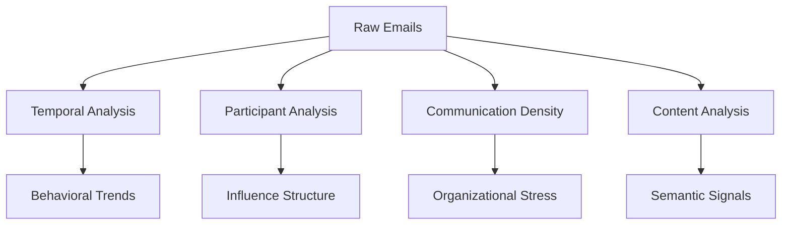

# Communication Intelligence Pipeline

```mermaid
flowchart TD
    A[Raw Emails]
    
    A --> B[Temporal Analysis]
    A --> C[Participant Analysis]
    A --> D[Communication Density]
    A --> E[Content Analysis]
    
    B --> F[Behavioral Trends]
    C --> G[Influence Structure]
    D --> H[Organizational Stress]
    E --> I[Semantic Signals]
```
