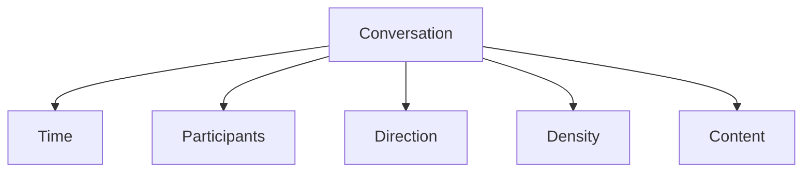

# Conversation Analysis Framework

```mermaid
flowchart TD
    A[Conversation]
    
    A --> B[Time]
    A --> C[Participants]
    A --> D[Direction]
    A --> E[Density]
    A --> F[Content]
```

This forms the basis of:

- communication graph analysis
    
- organizational intelligence systems
    
- social media analytics
    
- cybersecurity monitoring
