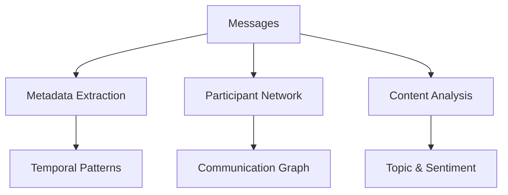

# Conversation Analysis Pipeline

```mermaid
flowchart TD
    A[Messages]
    
    A --> B[Metadata Extraction]
    A --> C[Participant Network]
    A --> D[Content Analysis]
    
    B --> E[Temporal Patterns]
    C --> F[Communication Graph]
    D --> G[Topic & Sentiment]
```
