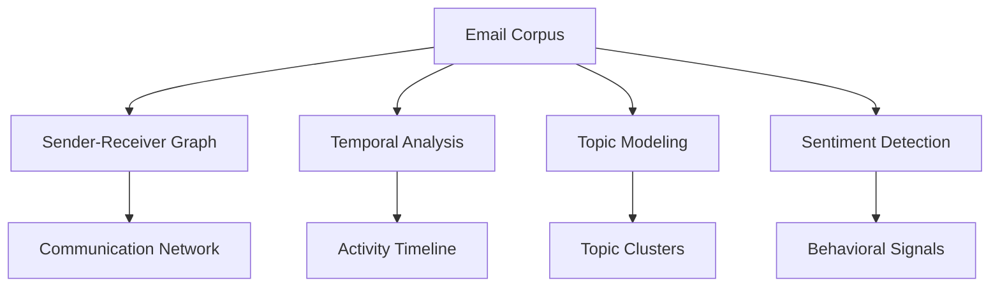

# Enron Analysis Pipeline

```mermaid
flowchart TD
    A[Email Corpus]
    
    A --> B[Sender-Receiver Graph]
    A --> C[Temporal Analysis]
    A --> D[Topic Modeling]
    A --> E[Sentiment Detection]
    
    B --> F[Communication Network]
    C --> G[Activity Timeline]
    D --> H[Topic Clusters]
    E --> I[Behavioral Signals]
```
