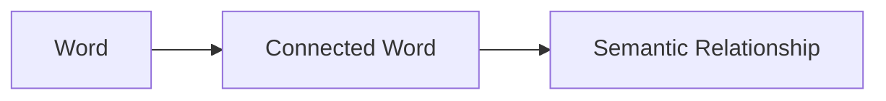

# Graph-Based NLP

```mermaid
flowchart LR
    A[Word]
    --> B[Connected Word]
    --> C[Semantic Relationship]
```

This concept underlies:

- knowledge graphs
    
- recommendation systems
    
- search engines
    
- semantic networks
    
- retrieval systems
