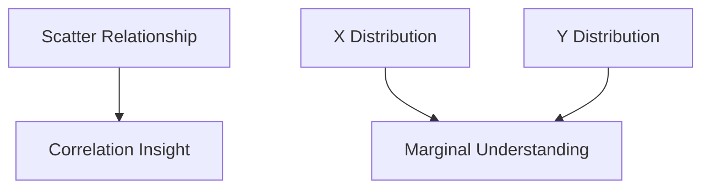

# Joint Plot Cognitive Structure

```mermaid
flowchart TD
    A[Scatter Relationship]
    
    A --> B[Correlation Insight]
    
    C[X Distribution]
    --> D[Marginal Understanding]
    
    E[Y Distribution]
    --> D
```

This is much richer than a simple scatter plot.
