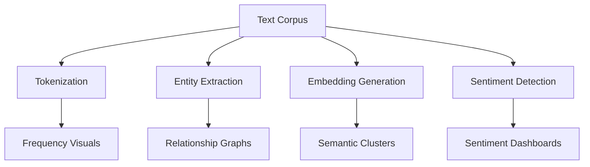

# Modern NLP Pipeline

```mermaid
flowchart TD
    A[Text Corpus]
    
    A --> B[Tokenization]
    A --> C[Entity Extraction]
    A --> D[Embedding Generation]
    A --> E[Sentiment Detection]
    
    B --> F[Frequency Visuals]
    C --> G[Relationship Graphs]
    D --> H[Semantic Clusters]
    E --> I[Sentiment Dashboards]
```
