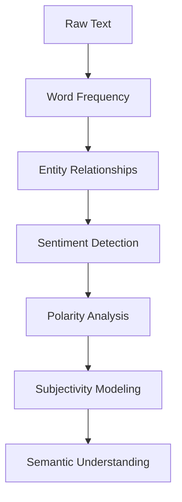

# NLP Evolution Hierarchy



This progression is extremely important.

Early text visualization asks:

```text
What words appear?
```

Advanced NLP asks:

```text
What emotional and semantic meaning does the language carry?
```
