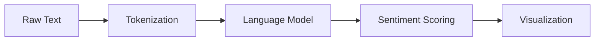

# Sentiment Analysis Pipeline

```mermaid
flowchart LR
    A[Raw Text]
    --> B[Tokenization]
    --> C[Language Model]
    --> D[Sentiment Scoring]
    --> E[Visualization]
```

The algorithm attempts to infer:

- emotional intensity
    
- positive/negative orientation
    
- overall narrative tone
