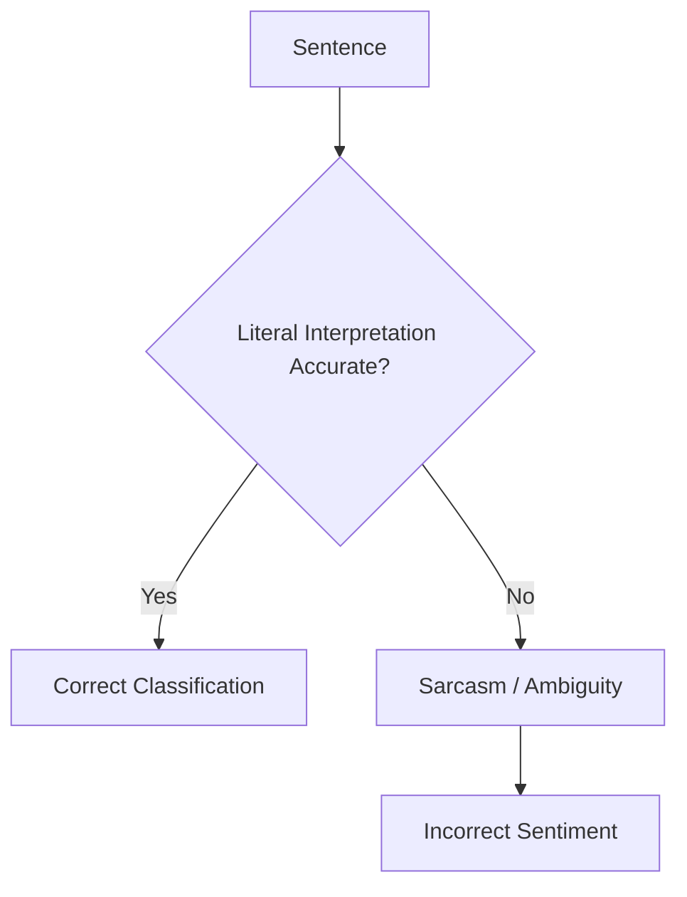

# Sentiment Failure Pipeline

```mermaid
flowchart TD
    A[Sentence]
    
    A --> B{Literal Interpretation Accurate?}
    
    B -->|Yes| C[Correct Classification]
    
    B -->|No| D[Sarcasm / Ambiguity]
    
    D --> E[Incorrect Sentiment]
```
