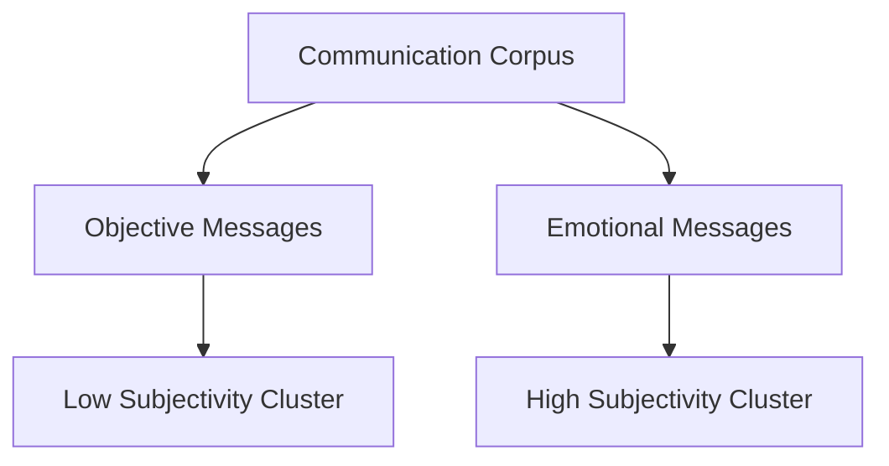

# Subjectivity Modes Example

```mermaid
flowchart TD
    A[Communication Corpus]
    
    A --> B[Objective Messages]
    A --> C[Emotional Messages]
    
    B --> D[Low Subjectivity Cluster]
    C --> E[High Subjectivity Cluster]
```

This creates multiple peaks instead of one smooth normal curve.
