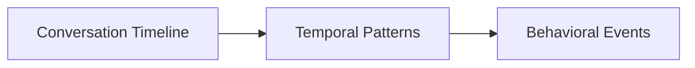

# Temporal Communication Analysis

```mermaid
flowchart LR
    A[Conversation Timeline]
    --> B[Temporal Patterns]
    --> C[Behavioral Events]
```

This becomes extremely important in:

- fraud detection
    
- crisis analysis
    
- market intelligence
    
- organizational audits
