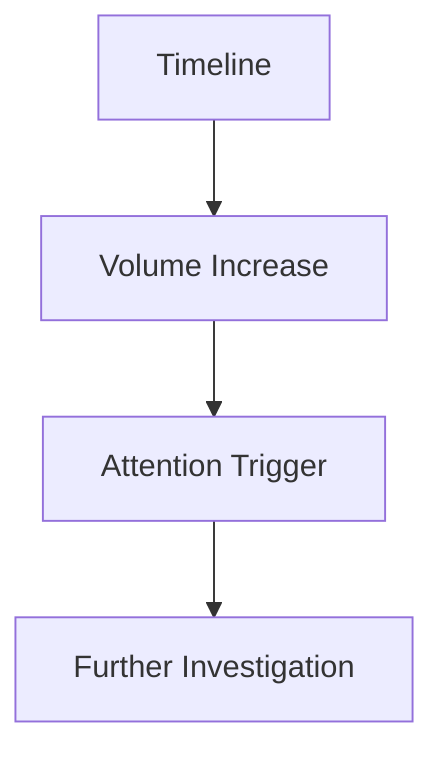

# Temporal Pattern Recognition


```mermaid
flowchart TD
    A[Timeline]
    --> B[Volume Increase]
    --> C[Attention Trigger]
    --> D[Further Investigation]
```

This demonstrates a core visualization principle:

```text
simple encodings often reveal critical insights more effectively than complex graphics
```
