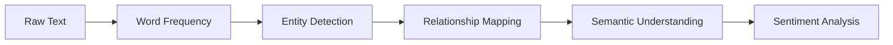

# The Evolution of Text Visualization

```mermaid
flowchart LR
    A[Raw Text]
    --> B[Word Frequency]
    --> C[Entity Detection]
    --> D[Relationship Mapping]
    --> E[Semantic Understanding]
    --> F[Sentiment Analysis]
```

The lecture progressively moves through this exact hierarchy.
