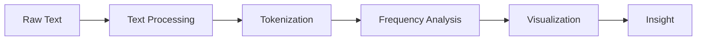

# The NLP Visualization Pipeline


```mermaid
flowchart LR
    A[Raw Text]
    --> B[Text Processing]
    --> C[Tokenization]
    --> D[Frequency Analysis]
    --> E[Visualization]
    --> F[Insight]
```

The lecture intentionally simplifies the preprocessing stage and focuses mainly on:

```text
how visualization extracts insight from textual data
```
