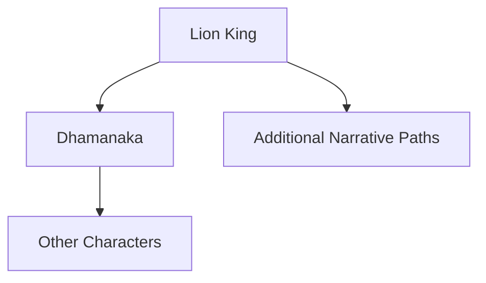

# Word Tree Structure


```mermaid
flowchart TD
    A[Lion King]
    
    A --> B[Dhamanaka]
    B --> C[Other Characters]
    
    A --> D[Additional Narrative Paths]
```

The lecture explains:

```text
Lion King connects strongly to Dhamanaka.
```

because they frequently appear together contextually.
