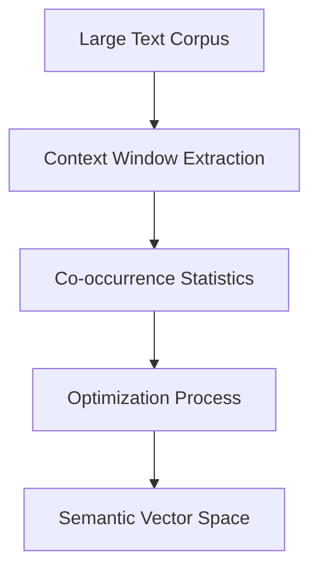

# Embedding Learning Pipeline

```mermaid
flowchart TD
    A[Large Text Corpus]
    
    A --> B[Context Window Extraction]
    --> C[Co-occurrence Statistics]
    --> D[Optimization Process]
    --> E[Semantic Vector Space]
```
