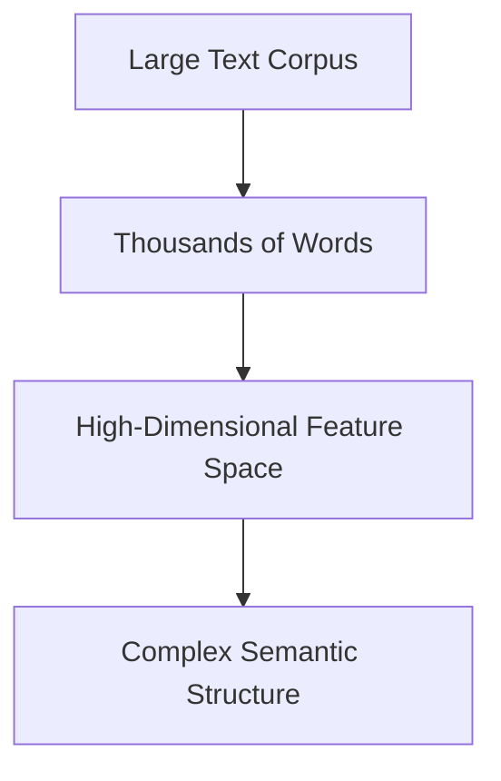

# High-Dimensional Text Space



Humans cannot visualize:

- 300-dimensional embeddings
    
- 1000-dimensional semantic vectors
    
- probabilistic topic distributions
    

Therefore NLP requires:

```text
dimensionality reduction
```
