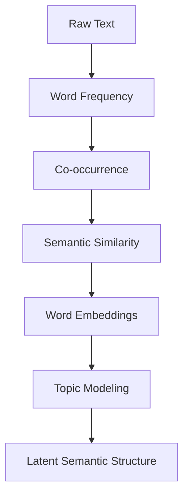

# NLP Complexity Hierarchy



This transition is massive.

Traditional text analytics asks:

```text
What words occur?
```

Modern NLP asks:

```text
What meanings are encoded in linguistic context?
```
