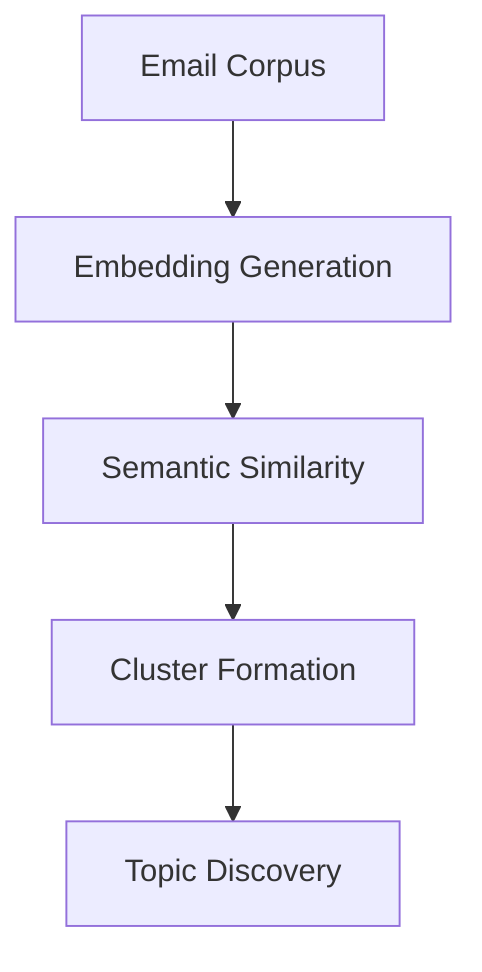

# Semantic Clustering Pipeline

```mermaid
flowchart TD
    A[Email Corpus]
    
    A --> B[Embedding Generation]
    --> C[Semantic Similarity]
    --> D[Cluster Formation]
    --> E[Topic Discovery]
```
