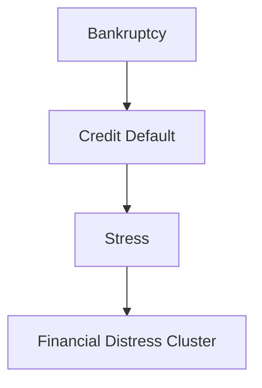

# Semantic Space Model


```mermaid
flowchart TD
    A[Bankruptcy]
    --> B[Credit Default]
    --> C[Stress]
    --> D[Financial Distress Cluster]
```

This forms the basis of:

```text
vector semantics
```
![[Word Embeddings.png]]
