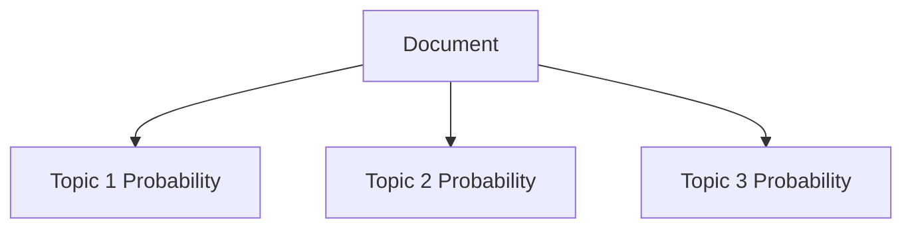

# Simplified LDA Idea

```mermaid
flowchart TD
    A[Document]
    
    A --> B[Topic 1 Probability]
    A --> C[Topic 2 Probability]
    A --> D[Topic 3 Probability]
```

Documents are treated as combinations of latent topics.
