![[Stories, Patterns & Meaning.png]]
# Chart Types for Text Data Visualization

# Panchatantra Story Text Analysis

This lesson marks an important transition in visualization design.

Until now, most discussions focused on:

- numerical data
    
- structured datasets
    
- categorical variables
    
- quantitative comparisons
    

Now the lesson introduces:

```text
unstructured textual data visualization
```

This is extremely important because modern analytics increasingly involves:

- documents
    
- social media
    
- customer reviews
    
- chat logs
    
- emails
    
- books
    
- transcripts
    
- search queries
    
- NLP pipelines
    

The challenge is:

```text
Text is not naturally numerical.
```

Therefore:

text must first be transformed into:

- patterns
    
- frequencies
    
- structures
    
- relationships
    

before visualization becomes meaningful.

# Why Text Visualization Matters

Human beings cannot efficiently read:

- millions of sentences
    
- thousands of reviews
    
- huge corpora of text
    

Visualization acts as:

```text
cognitive compression for language data
```

allowing us to rapidly identify:

- themes
    
- dominant entities
    
- patterns
    
- relationships
    
- semantic structures
    
![[NLP Visualization Pipeline.png]]
# The NLP Visualization Pipeline

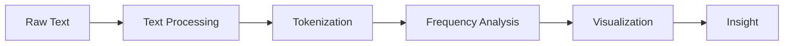

The lecture intentionally simplifies the preprocessing stage and focuses mainly on:

```text
how visualization extracts insight from textual data
```

# Panchatantra as a Text Dataset

The lesson uses the:

```text
Panchatanra stories corpus
```

as an example dataset.

The Panchatantra consists of:

- five strategic story collections
    
- narrative structures
    
- recurring characters
    
- repeated semantic themes
    

The lesson identifies themes such as:

|Theme|Meaning|
|---|---|
|Mitra Bheda|Separation of friends|
|Mitra Labha|Gain of friends|
|War and Peace|Conflict resolution|
|Loss of Gains|Strategic failure|
|Ill-Considered Actions|Poor decision-making|

This is important because:

```text
Text corpora often contain hidden thematic structures.
```

Visualization helps reveal those structures.

# Text Data as a Dataset

One of the most important conceptual shifts in the lecture is:

> Treating text as data.

This is foundational in:

- NLP
    
- text mining
    
- information retrieval
    
- computational linguistics
    
- search systems
    
- LLM pipelines
    

# Traditional View of Text

Text = language for humans.

# Computational View of Text

Text = analyzable structured signals.

# Text Processing Pipeline

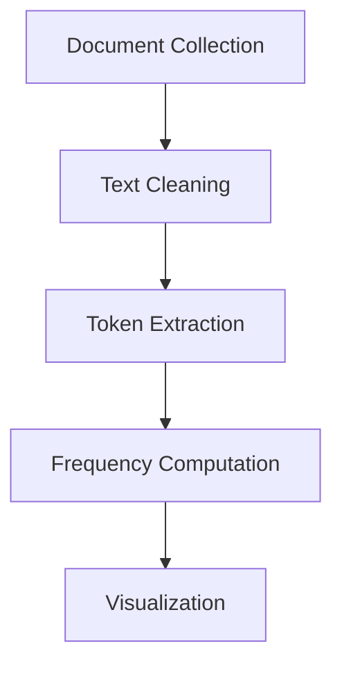

# Important Insight

Visualization is only possible after:

```text
language is converted into measurable structures
```

such as:

- frequencies
    
- co-occurrences
    
- embeddings
    
- semantic clusters
    
- topic distributions
    

# Word Clouds

# The Most Common Text Visualization

The lecture begins with:

```text
word clouds
```

which are one of the most recognizable forms of text visualization.

# What Is a Word Cloud?

A word cloud scales words visually according to:

- frequency
    
- importance
    
- weighting
    

Most commonly:

```text
larger word = higher frequency
```

# Word Cloud Pipeline

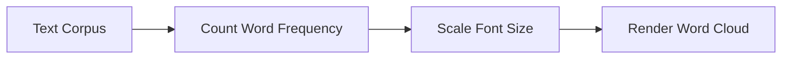

# Panchatantra Example

The lecture identifies dominant words such as:

- king
    
- friend
    
- lion
    
- jackal
    
- wife
    

The word:

```text
king
```

appears most frequently and therefore becomes visually dominant.

# Why Word Clouds Work

Word clouds leverage:

- pre-attentive processing
    
- size encoding
    
- salience detection
    

Humans immediately notice:

- largest words
    
- highest contrast
    
- central terms
    

without reading linearly.

# Cognitive Advantage

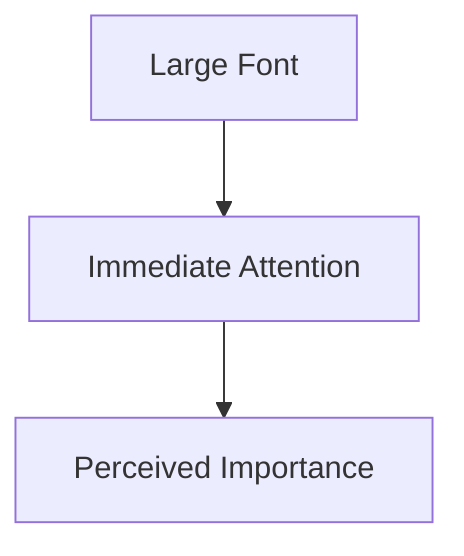

# Important Strengths of Word Clouds

## Fast Theme Recognition

Users quickly identify:

- dominant entities
    
- recurring topics
    
- narrative focus
    

## Visually Engaging

Word clouds are highly intuitive.

## Low Cognitive Barrier

Even non-technical audiences understand them.

# Major Weaknesses of Word Clouds

Despite popularity, word clouds have serious analytical limitations.

# Weakness 1: Poor Quantitative Precision

Humans cannot accurately estimate:

- exact frequency
    
- relative difference
    

from font size alone.

Example:

```text
Is "king" twice as common as "lion"?
```

Hard to determine precisely.

# Weakness 2: Spatial Arrangement Is Arbitrary

Word position usually lacks meaning.

# Weakness 3: Context Is Lost

Word clouds ignore:

- sentence structure
    
- semantic relationships
    
- syntax
    
- narrative order
    

# Important Visualization Principle

```text
Word clouds are excellent for thematic overview, weak for precise analysis.
```

# Why the Bar Chart Is Superior

The lecture places the word cloud beside a:

```text
bar chart of word frequencies
```

This is a very important comparison.

# Why Bar Charts Are Better

Bar charts support:

- precise ranking
    
- accurate comparison
    
- estimation
    

because humans compare:

```text
aligned lengths
```

very efficiently.

# Comparison of Word Cloud vs Bar Chart

| Property | Word Cloud | Bar Chart |  
|---|---|  
| Visual Appeal | High | Moderate |  
| Exact Comparison | Weak | Strong |  
| Ranking | Approximate | Precise |  
| Estimation | Weak | Strong |  
| Theme Recognition | Strong | Moderate |

# Perceptual Comparison

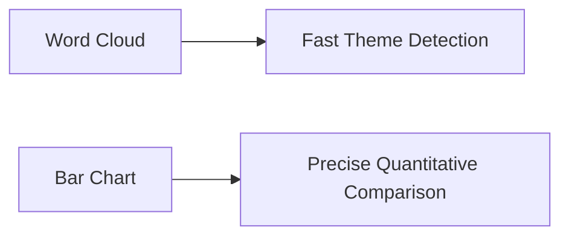

# Important Cognitive Insight

The lecture unintentionally demonstrates a deeper visualization principle:

```text
Decorative encodings are weaker than aligned positional encodings.
```

This directly aligns with:

- Cleveland & McGill
    
- Tufte
    
- perceptual encoding hierarchy
    

# Frequency Analysis

# The Foundation of Text Visualization

The lecture repeatedly references:

```text
frequency of word occurrence
```

This is one of the most basic NLP techniques.

# Frequency Analysis Workflow

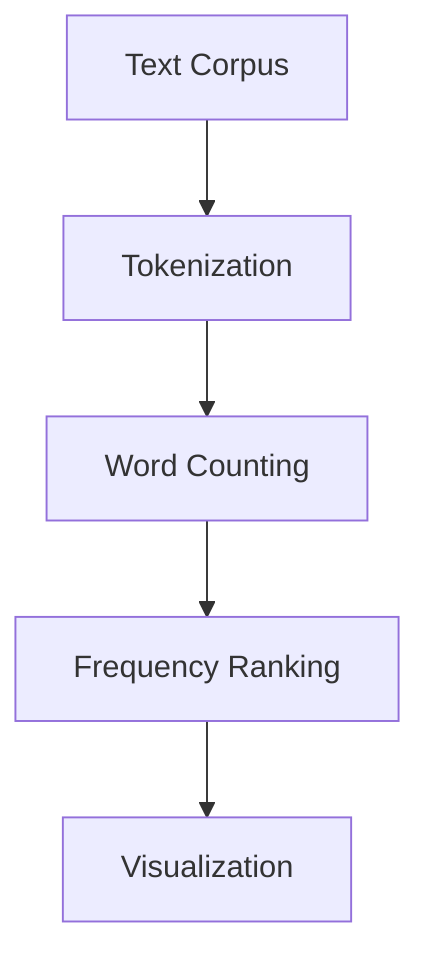

# Why Frequency Matters

Frequently occurring words often indicate:

- important entities
    
- narrative emphasis
    
- recurring concepts
    
- dominant themes
    

# Important Caveat

Frequency alone is insufficient for true semantic understanding.

Common words may dominate due to:

- grammar
    
- style
    
- repetition
    
- structural language artifacts
    

This is why NLP systems often use:

- stopword removal
    
- TF-IDF weighting
    
- lemmatization
    
- stemming
    

before visualization.

# Stopword Problem

Without filtering:

common words like:

- the
    
- is
    
- and
    
- of
    

would dominate visualizations.

# NLP Cleaning Pipeline

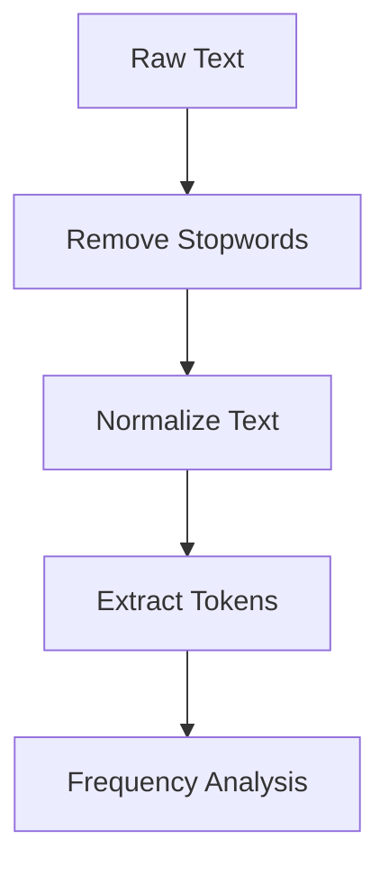

# Named Entity Dominance

The lecture notes:

```text
King appears most frequently.
```

This suggests:

- narrative centrality
    
- dominant character presence
    
- thematic leadership role
    

This introduces:

```text
entity-centric visualization
```
![[Pasted image 20260528154518.png]]
# Entity Analysis

Modern NLP systems often visualize:

- people
    
- organizations
    
- locations
    
- products
    

through:

- frequency charts
    
- networks
    
- co-occurrence graphs
    

# Semantic Importance vs Frequency

One subtle limitation:

Frequently occurring words are not always semantically important.

Example:

A villain appearing briefly may drive the entire narrative despite low frequency.

Therefore:

```text
frequency ≠ importance
```

necessarily.

# Word Clouds and Pre-Attentive Processing

Word clouds work largely because of:

- size variation
    
- color salience
    
- spatial density
    

These leverage:

- iconic memory
    
- pre-attentive attention
    
- perceptual hierarchy
    

# Word Cloud Perception Model

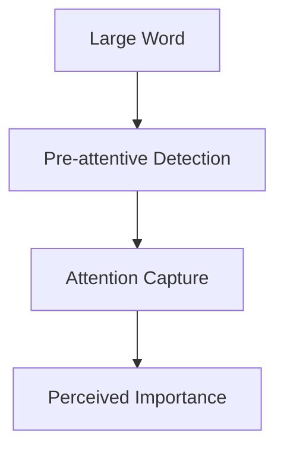

# Why Humans Like Word Clouds

They provide:

- immediate visual summary
    
- low-effort scanning
    
- aesthetic engagement
    

This makes them useful in:

- presentations
    
- exploratory analysis
    
- executive storytelling
    

# Why Analysts Must Be Careful

Word clouds can create:

- false emphasis
    
- misleading interpretation
    
- exaggerated importance
    

because:

visual prominence depends heavily on design parameters.

# Better Text Visualization Alternatives

Modern NLP systems often prefer:

|Visualization|Purpose|
|---|---|
|Bar charts|Precise frequencies|
|Heatmaps|Topic intensity|
|Network graphs|Co-occurrence|
|Topic maps|Semantic clusters|
|Embedding projections|Latent semantic structure|
|Sankey diagrams|Narrative flow|

# Advanced NLP Visualization Pipeline

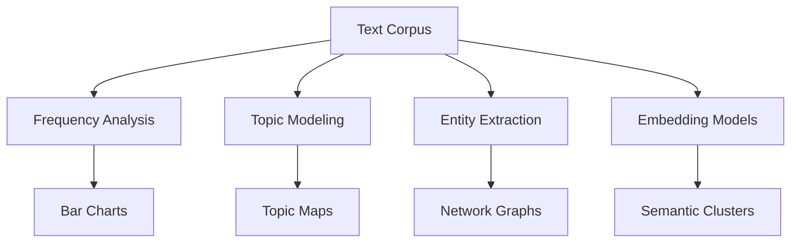

# Important Hidden Lesson

The lecture introduces something deeper than word clouds.

It demonstrates:

```text
unstructured data can be transformed into visual analytical structure
```

This is foundational to:

- search engines
    
- recommendation systems
    
- LLMs
    
- semantic analytics
    
- retrieval systems
    

# Connection to Modern AI Systems

Large Language Models also process text by converting language into:

- tokens
    
- embeddings
    
- vector spaces
    
- semantic relationships
    

Visualization helps humans inspect these transformations.

# Final Visualization Philosophy

Text visualization is fundamentally about:

```text
compressing linguistic complexity into perceptually efficient structures
```

# Final Mental Model

Think of text visualization as:

```text
making language visually computable for human cognition
```

rather than merely displaying words.


# Advanced Text Visualization

# Character Relationships, Semantic Structures, and Sentiment Analysis

This section expands text visualization beyond:

- simple word frequency
    
- word clouds
    
- token counting
    

and moves toward:

```text
semantic structure discovery
```

This is a major conceptual shift.

Earlier, the focus was:

```text
What words occur frequently?
```

Now the focus becomes:

```text
How are entities, meanings, and emotions connected?
```

This transition is extremely important because modern NLP systems are fundamentally concerned with:

- relationships
    
- context
    
- semantics
    
- sentiment
    
- narrative structure
    

rather than raw frequency alone.

# The Evolution of Text Visualization

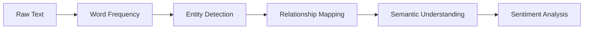

The lecture progressively moves through this exact hierarchy.

# Frequency Analysis Revisited

# Frequency Alone Is Not Meaning

The lecture first highlights an important nuance:

> Frequently occurring words and dominant characters are not always identical.

Example:

```text
"Friend" is dominant semantically,
but not necessarily the most frequent noun.
```

This is a subtle but extremely important distinction.

# Why This Matters

Simple frequency analysis can miss:

- narrative significance
    
- semantic importance
    
- contextual influence
    
- relational centrality
    

# Example

A character may appear:

- infrequently
    
- but drive the entire story
    

Another character may appear:

- constantly
    
- but contribute little meaningfully
    

# Important NLP Insight

```text
Frequency is a statistical property.
Importance is a semantic property.
```

The two are not always equivalent.

# Why Frequency Analysis Is Still Useful

Despite limitations, frequency analysis helps identify:

- dominant entities
    
- recurring themes
    
- lexical concentration
    
- topic emphasis
    

This is why:

- TF-IDF
    
- topic modeling
    
- keyword extraction
    

begin with frequency statistics.

# Frequency Analysis Pipeline

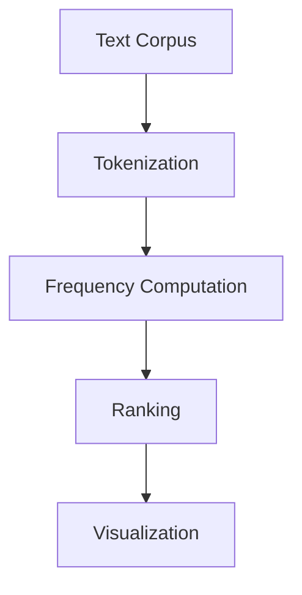

# Text Length Analysis

# Measuring Structural Complexity

The lecture then introduces another type of textual visualization:

```text
word count comparison across stories
```

Example:

|Story|Approximate Word Count|
|---|---|
|Mitra Veda|~14,000|
|Mitra Labha|~8,300|

# Why Word Count Matters

Word count often acts as a proxy for:

- narrative complexity
    
- thematic density
    
- structural depth
    
- information richness
    

# Important Caveat

Longer text does NOT automatically imply:

- better quality
    
- deeper meaning
    
- greater importance
    

However, length can reveal:

- narrative scale
    
- descriptive intensity
    
- storytelling complexity
    

# Word Count Visualization Pipeline

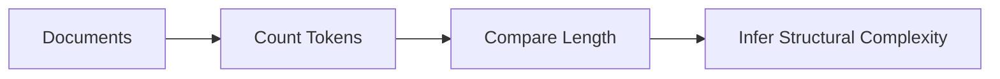

# Why Bar Charts Work Best Here

The lecture again uses:

```text
bar charts
```

because length comparison is cognitively efficient.

Humans compare:

- aligned lengths
    
- common baselines
    
- ordered magnitudes
    

extremely accurately.

This reinforces the perceptual hierarchy discussed earlier.

# Cognitive Principle

```text
Aligned position and length outperform decorative encodings.
```

# Word Trees

# Relationship Visualization in Text

The lecture then introduces:

```text
word trees
```

This is one of the first genuinely structural NLP visualizations discussed.

# What Is a Word Tree?

A word tree visualizes:

- relationships
    
- co-occurrences
    
- narrative connectivity
    
- semantic adjacency
    

between words or entities.

# Word Tree Structure

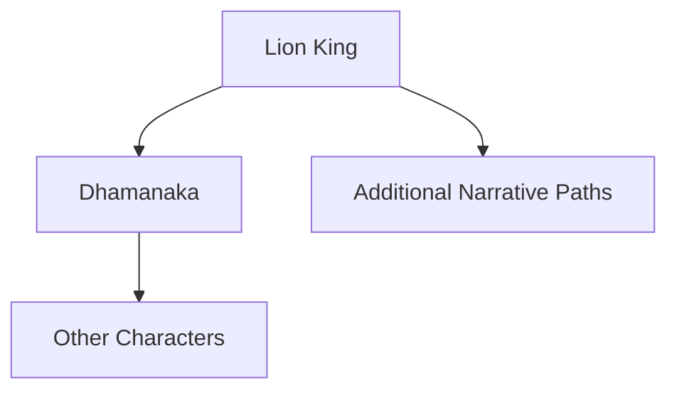

The lecture explains:

```text
Lion King connects strongly to Dhamanaka.
```

because they frequently appear together contextually.

# Why Word Trees Matter

Word trees reveal:

- entity relationships
    
- narrative flow
    
- contextual proximity
    
- semantic structure
    

This moves NLP from:

```text
frequency analysis
```

to:

```text
relationship analysis
```

# Transition From Tokens to Networks

This is a major conceptual leap.

Traditional text analysis:

- counts words
    

Advanced text analysis:

- maps relationships
    

# Word Trees as Graph Structures

Word trees are fundamentally:

```text
graph representations of language
```

where:

- nodes = entities/words
    
- edges = relationships/co-occurrences
    

# Graph-Based NLP

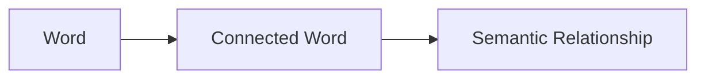

This concept underlies:

- knowledge graphs
    
- recommendation systems
    
- search engines
    
- semantic networks
    
- retrieval systems
    

# Why Relationships Matter More Than Frequency

Two words appearing together repeatedly often indicate:

- narrative linkage
    
- conceptual association
    
- causal relationship
    
- thematic similarity
    

# Example

If:

```text
King ↔ Lion
```

appears frequently,

the text likely contains:

- political symbolism
    
- hierarchy structures
    
- recurring narrative interactions
    

# Human Reading vs Computational Structure

The lecture makes an important observation:

Humans naturally infer relationships while reading.

But:

```text
text format hides structural connectivity
```

Visualization externalizes these hidden structures.

# Word Trees as Cognitive Compression

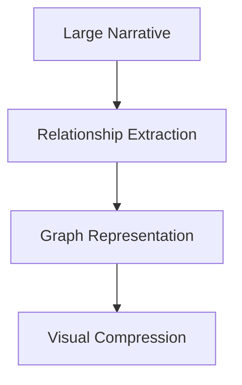

# Important Limitation of Word Trees

Word trees still simplify language heavily.

They often ignore:

- grammar
    
- chronology
    
- deeper semantics
    
- causality
    
- implicit meaning
    

Therefore:

```text
co-occurrence ≠ true semantic understanding
```

necessarily.

# Semantic Scores and Sentiment Analysis

# Emotional Structure in Text

The lecture then transitions into:

```text
sentiment analysis
```

This is one of the most commercially important NLP applications.

# Core Idea

Text contains emotional tone.

Examples:

|Type|Tone|
|---|---|
|Complaint|Negative|
|Praise|Positive|
|Administrative Message|Neutral|

# Why Sentiment Matters

Organizations analyze sentiment to understand:

- customer satisfaction
    
- brand perception
    
- emotional response
    
- service quality
    
- behavioral intention
    

# Sentiment Analysis Pipeline

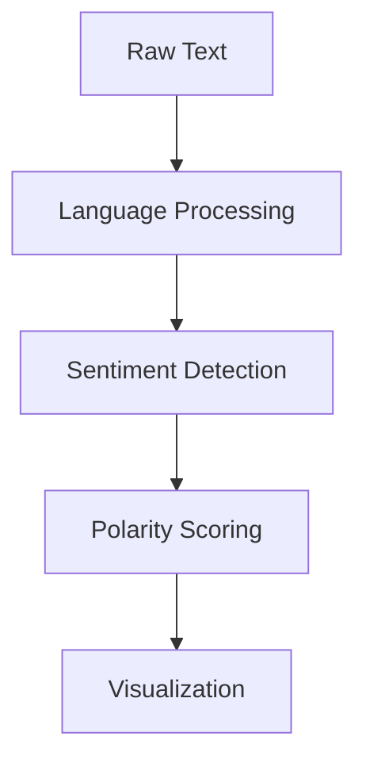

# Sentiment Categories

Most systems classify text into:

|Sentiment|Meaning|
|---|---|
|Positive|Favorable emotion|
|Neutral|Informational tone|
|Negative|Unfavorable emotion|

# Why Sentiment Analysis Became Important

Modern businesses process:

- millions of reviews
    
- support tickets
    
- social media posts
    
- surveys
    
- chat logs
    

Humans cannot manually interpret this volume.

Visualization enables:

```text
emotional pattern detection at scale
```

# Example Applications

|Domain|Use Case|
|---|---|
|E-commerce|Product review analysis|
|Banking|Complaint classification|
|Healthcare|Patient feedback|
|Social Media|Brand monitoring|
|Politics|Public opinion analysis|

# Semantic Scoring

# Quantifying Emotion

Sentiment systems often assign scores.

Example:

|Score|Meaning|
|---|---|
|+1|Positive|
|0|Neutral|
|-1|Negative|

Modern systems use:

- transformer embeddings
    
- probabilistic models
    
- deep learning
    
- lexical scoring
    

# Sentiment Visualization

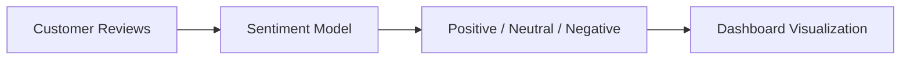

# Important NLP Insight

Sentiment analysis is fundamentally:

```text
semantic classification
```

rather than frequency counting.

# Why Administrative Messages Tend To Be Neutral

Administrative language is usually:

- procedural
    
- informational
    
- emotionally flat
    

Example:

```text
"Your account has been updated."
```

contains little emotional polarity.

# Why Complaints Become Negative

Complaint text often contains:

- frustration
    
- dissatisfaction
    
- urgency
    
- negative adjectives
    

Example:

```text
"The service was terrible."
```

# Important Limitation of Sentiment Analysis

Human language contains:

- sarcasm
    
- irony
    
- ambiguity
    
- context dependence
    

Therefore sentiment systems frequently fail.

# Example Failure

```text
"Great, another system crash."
```

contains positive wording but negative intent.

# Sentiment Analysis Limitation Pipeline

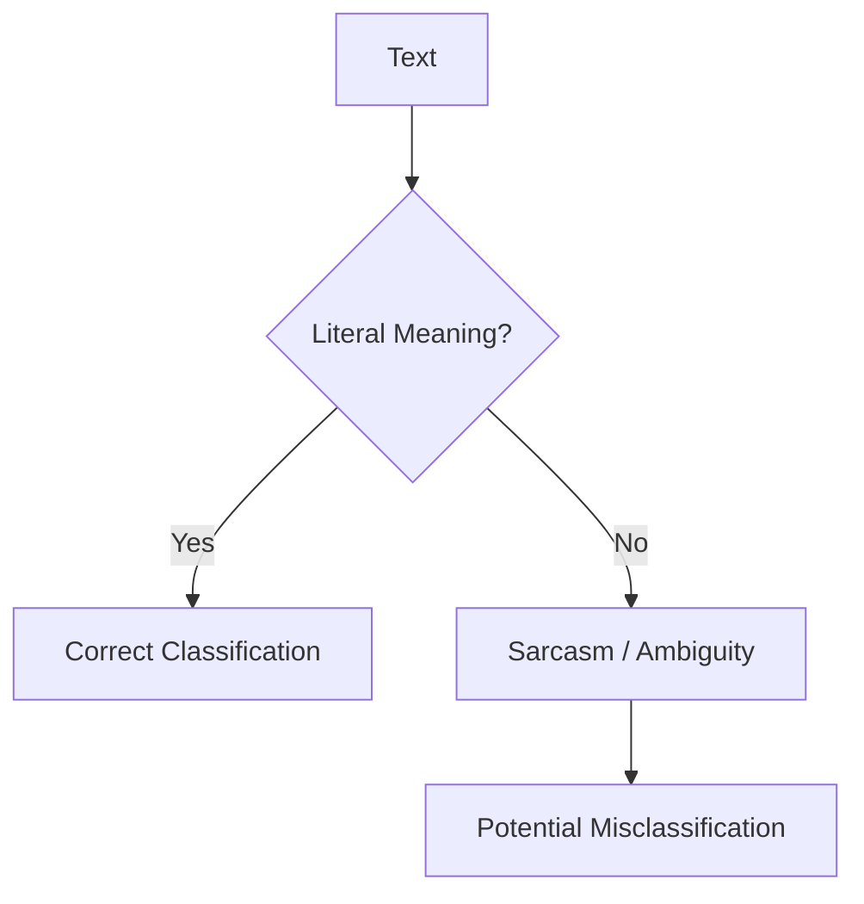

# Text Visualization as Information Reduction

A central hidden theme in this lecture is:

```text
Visualization reduces linguistic complexity into perceptual structure.
```

Without visualization:

- relationships remain buried
    
- sentiment remains implicit
    
- themes remain hidden
    

# Connection to Modern AI Systems

These visualization techniques connect directly to:

- search systems
    
- recommendation engines
    
- retrieval augmented generation
    
- LLMs
    
- semantic embeddings
    
- vector databases
    

# Modern NLP Pipeline

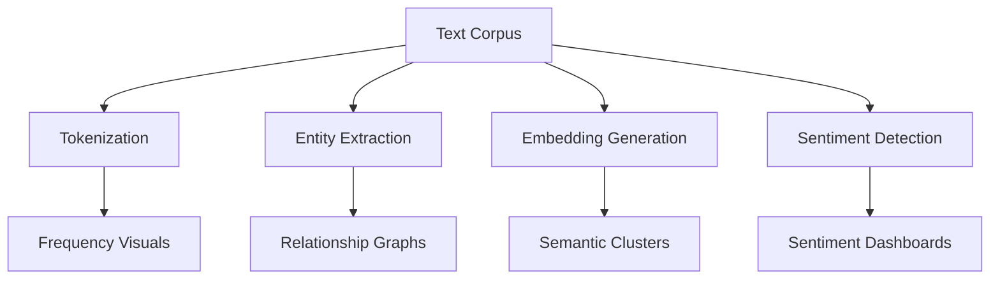

# Final Visualization Philosophy

This lecture demonstrates that text visualization evolves across layers:

|Layer|Purpose|
|---|---|
|Frequency|What appears often|
|Structure|What connects|
|Semantics|What means something|
|Sentiment|What feels emotional|

# Final Mental Model

Think of NLP visualization as:

```text
transforming language into visible cognitive structures
```

that humans can perceive rapidly.

# Sentiment Analysis, Joint Plots, and Semantic Emotion Modeling

# Advanced Text Analytics in Visualization

This section moves from:

- frequency analysis
    
- entity relationships
    
- word trees
    

into:

```text
computational emotional analysis of language
```

This is one of the most commercially important applications of Natural Language Processing (NLP).

The lecture introduces:

- sentiment scoring
    
- polarity analysis
    
- subjectivity analysis
    
- joint plots
    
- emotional structure visualization
    

These techniques form the backbone of:

- customer feedback analytics
    
- social media intelligence
    
- review mining
    
- political sentiment tracking
    
- brand perception systems
    
- recommendation engines
    

# The Evolution of Text Analytics

The lecture now transitions through increasingly sophisticated levels of text understanding.

# NLP Evolution Hierarchy

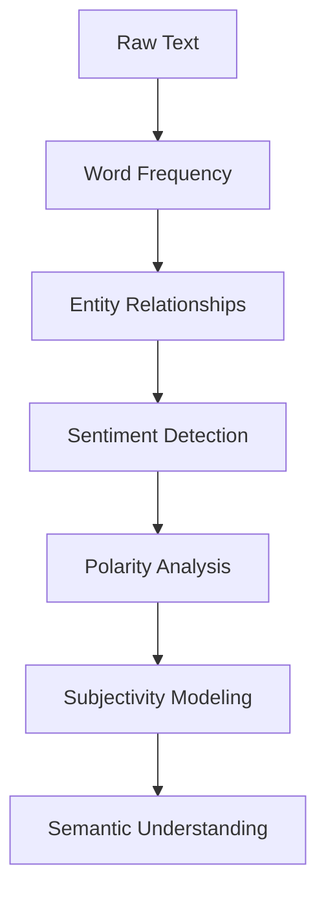

This progression is extremely important.

Early text visualization asks:

```text
What words appear?
```

Advanced NLP asks:

```text
What emotional and semantic meaning does the language carry?
```

# Sentiment Analysis

# Quantifying Emotional Tone

The lecture introduces:

```text
sentiment scores
```

which attempt to numerically estimate emotional tone within text.

# Core Idea

Every piece of language carries some emotional polarity:

|Type|Meaning|
|---|---|
|Positive|Favorable emotion|
|Neutral|Informational or balanced|
|Negative|Unfavorable emotion|

# Sentiment Analysis Pipeline

```mermaid
flowchart LR
    A[Raw Text]
    --> B[Tokenization]
    --> C[Language Model]
    --> D[Sentiment Scoring]
    --> E[Visualization]
```

The algorithm attempts to infer:

- emotional intensity
    
- positive/negative orientation
    
- overall narrative tone
    

# Sentiment Scores

# Numerical Representation of Emotion

The lecture describes sentiment scoring as typically ranging from:

-1 \leq Sentiment \leq 1

Where:

|Score|Interpretation|
|---|---|
|-1|Strongly negative|
|0|Neutral|
|+1|Strongly positive|

# Why Numerical Emotion Modeling Matters

Humans cannot manually analyze:

- millions of tweets
    
- customer reviews
    
- support tickets
    
- survey responses
    

Visualization and scoring systems compress this complexity.

# Emotion Compression Pipeline

```mermaid
flowchart TD
    A[Large Text Corpus]
    --> B[Sentiment Extraction]
    --> C[Score Aggregation]
    --> D[Dashboard Summary]
```

# Panchatantra Sentiment Example

The lecture applies sentiment analysis to the Panchatantra corpus.

Interesting result:

> Overall sentiment appears approximately neutral.

This happens because:

- positive and negative emotional segments cancel each other out statistically.
    

# Important Insight

Narratives often contain:

- emotional oscillation
    
- conflict resolution
    
- contrasting tones
    

Therefore average sentiment alone may hide:

```text
local emotional structure
```

# Segment-Level Sentiment

The lecture correctly points out:

Different chapters possess different emotional signatures.

# Example

|Chapter|Expected Tone|
|---|---|
|Mitra Labha (Gain of Friends)|Positive|
|Mitra Bheda (Separation of Friends)|Negative|

The sentiment model reflects this distinction.

# Important NLP Principle

```text
Contextual segmentation matters more than global averages.
```

This is extremely important in modern NLP systems.

# Why Aggregate Sentiment Can Be Misleading

Suppose:

- one chapter is highly positive
    
- another is highly negative
    

Average sentiment may appear neutral despite strong emotional intensity.

# Sentiment Aggregation Problem

```mermaid
flowchart TD
    A[Positive Segments]
    --> C[Average]
    
    B[Negative Segments]
    --> C
    
    C --> D[Potentially Neutral Result]
```

# Modern Real-World Applications

The lecture references:

- Twitter analysis
    
- Amazon reviews
    
- customer feedback systems
    

These are among the most important commercial NLP applications.

# Customer Feedback Analytics Pipeline

```mermaid
flowchart LR
    A[Customer Reviews]
    --> B[Sentiment Model]
    --> C[Score Aggregation]
    --> D[Summary Dashboard]
```

# Amazon Review Systems

Modern review systems combine:

- star ratings
    
- sentiment analysis
    
- text summarization
    
- keyword extraction
    

to generate statements like:

```text
"Most customers found this product valuable."
```

This is not manually written.

It emerges from:

- aggregated sentiment patterns
    
- semantic summarization
    
- review clustering
    

# Important Hidden Insight

Modern recommendation systems are fundamentally:

```text
large-scale text interpretation engines
```

# Why Sentiment Analysis Became Critical

Organizations increasingly rely on:

- behavioral intelligence
    
- customer voice analytics
    
- emotional trend monitoring
    

because emotional signals often predict:

- churn
    
- retention
    
- satisfaction
    
- purchasing behavior
    

# Sentiment Analysis Challenges

The lecture simplifies sentiment analysis significantly.

In reality, language is extremely difficult computationally.

# Major NLP Problems

|Problem|Example|
|---|---|
|Sarcasm|"Great, another outage."|
|Ambiguity|"This product is sick."|
|Context Dependence|"Cold" can be positive or negative|
|Irony|Literal meaning differs from intent|

# Sentiment Failure Pipeline

```mermaid
flowchart TD
    A[Sentence]
    
    A --> B{Literal Interpretation Accurate?}
    
    B -->|Yes| C[Correct Classification]
    
    B -->|No| D[Sarcasm / Ambiguity]
    
    D --> E[Incorrect Sentiment]
```

# Joint Plots

# Multivariate Text Analytics

The lecture then introduces:

```text
joint plots
```

This is a major conceptual advancement.

# What Is a Joint Plot?

A joint plot combines:

- scatter plot
    
- univariate distributions
    

simultaneously.

It visualizes:

- relationship between variables
    
- marginal distributions
    
- concentration density
    

# Joint Plot Structure

```mermaid
flowchart TD
    A[X Distribution]
    
    B[Scatter Relationship]
    
    C[Y Distribution]
```

Joint plots are extremely valuable because they reveal:

- global relationship
    
- local density
    
- variable spread
    

in one visualization.

# Why Joint Plots Are Powerful

Traditional scatter plots show:

- point relationships
    

Joint plots additionally show:

- distribution geometry
    

This provides much richer analytical context.

# Polarity and Subjectivity

# Two Different Semantic Dimensions

The lecture introduces:

1. Polarity
    
2. Subjectivity
    

These are related but fundamentally different.

# Polarity

# Emotional Direction

Polarity measures:

```text
how positive or negative language is
```

Range:

-1 \leq Polarity \leq 1

# Subjectivity

# Emotional vs Objective Language

Subjectivity measures:

```text
how opinion-based or emotionally driven a statement is
```

Range:

0 \leq Subjectivity \leq 1

# Interpretation

|Score|Meaning|
|---|---|
|0|Objective / factual|
|1|Highly emotional / opinionated|

# Examples

## Objective Statement

```text
"I receive salary."
```

Fact-based.

Low subjectivity.

# Subjective Statement

```text
"I feel rich."
```

Emotion-driven.

Higher subjectivity.

# Important Semantic Insight

Two sentences may share polarity but differ drastically in subjectivity.

# Example

|Sentence|Polarity|Subjectivity|
|---|---|---|
|"The service failed."|Negative|Moderate|
|"I absolutely hate this terrible service."|Negative|Very High|

# Subjectivity Modeling Pipeline

```mermaid
flowchart TD
    A[Sentence]
    --> B[Emotion Detection]
    --> C[Opinion Intensity]
    --> D[Subjectivity Score]
```

# Relationship Between Polarity and Subjectivity

The lecture observes:

> Strong polarity often corresponds with stronger subjectivity.

This is intuitively correct.

Highly emotional statements tend to be:

- more opinionated
    
- less factual
    
- more subjective
    

# Semantic Relationship Model

```mermaid
flowchart LR
    A[Extreme Positive/Negative Emotion]
    --> B[Higher Emotional Intensity]
    --> C[Higher Subjectivity]
```

# Distribution Analysis

The lecture notes:

Polarity distributions appear approximately normal.

This is an important statistical insight.

# Why Sentiment Often Approximates Normality

In large corpora:

- extreme emotions are relatively rare
    
- moderate expressions dominate
    

This creates bell-shaped distributions.

# Distribution Interpretation Pipeline

```mermaid
flowchart TD
    A[Sentiment Scores]
    --> B[Frequency Distribution]
    --> C[Behavioral Insight]
```

# Important Business Implication

Sentiment distribution reveals:

- customer mood stability
    
- brand perception consistency
    
- emotional volatility
    

# NLP Visualization as Behavioral Analytics

The lecture subtly demonstrates something much deeper:

```text
Language becomes measurable behavioral data.
```

This is foundational to:

- AI recommendation systems
    
- social media analytics
    
- political forecasting
    
- customer intelligence
    

# Modern AI Connection

Large Language Models internally encode:

- sentiment
    
- semantic proximity
    
- emotional tone
    
- contextual relationships
    

through:

- embeddings
    
- vector spaces
    
- attention mechanisms
    

Visualization helps humans interpret these latent structures.

# Advanced NLP Architecture

```mermaid
flowchart TD
    A[Raw Language]
    
    A --> B[Tokenization]
    A --> C[Embedding Space]
    A --> D[Sentiment Layer]
    A --> E[Semantic Analysis]
    
    B --> F[Frequency Visuals]
    C --> G[Semantic Clusters]
    D --> H[Sentiment Dashboards]
    E --> I[Relationship Graphs]
```

# Final Visualization Insight

This lecture demonstrates the progression from:

- surface-level text analysis
    
- toward semantic cognition modeling
    

# Final Mental Model

Think of sentiment visualization as:

```text
mapping emotional geometry hidden inside language
```

into perceptually interpretable structures.


# Joint Plot Distribution Analysis and Conversational Network Visualization

# From Sentiment Geometry to Communication Networks

This section introduces two major analytical ideas:

1. Distribution analysis in semantic NLP spaces
    
2. Conversation network visualization
    

The lecture now moves beyond:

- isolated text
    
- standalone sentiment
    
- individual entities
    

toward:

```text
interaction systems and communication structures
```

This is a major conceptual jump.

Text analytics is no longer only about:

```text
what language contains
```

but now about:

```text
how information flows between entities
```

This transition is foundational to:

- social network analysis
    
- communication intelligence
    
- fraud detection
    
- behavioral analytics
    
- organizational analysis
    
- cybersecurity monitoring
    
- influence propagation systems
    

# Part 1

# Joint Plot Interpretation

# Understanding Distribution Geometry

The lecture first continues discussion of:

- polarity
    
- subjectivity
    
- joint plots
    

and introduces a critical statistical observation:

> Subjectivity does not appear normally distributed.

This is very important analytically.

# Normal vs Non-Normal Distributions

The lecture observes:

|Variable|Distribution Shape|
|---|---|
|Polarity|Approximately normal|
|Subjectivity|Skewed / multimodal|

# Why This Matters

Distribution shape determines:

- interpretation
    
- statistical validity
    
- modeling assumptions
    
- anomaly detection behavior
    

# Distribution Analysis Pipeline

```mermaid
flowchart TD
    A[Semantic Scores]
    --> B[Distribution Analysis]
    --> C[Statistical Shape]
    --> D[Behavioral Interpretation]
```

# Polarity Distribution

# Why It Appears Approximately Normal

The lecture notes:

Most polarity scores cluster around neutral values.

This is expected because most natural language communication is:

- moderate
    
- informational
    
- emotionally restrained
    

Extreme emotional statements are relatively rare.

# Normal Distribution Intuition

```mermaid
flowchart LR
    A[Strongly Negative]
    --> B[Neutral Majority]
    --> C[Strongly Positive]
```

This creates approximately bell-shaped sentiment distributions.

# Subjectivity Distribution

# Why It Becomes Skewed or Multimodal

Subjectivity behaves differently because language often separates into distinct communication modes.

Examples:

|Mode|Characteristics|
|---|---|
|Objective communication|Factual, procedural|
|Subjective communication|Emotional, opinionated|

This creates:

- clustering
    
- skewness
    
- multiple peaks
    

# Multimodal Distribution Meaning

A multimodal distribution suggests:

```text
multiple latent behavioral states exist in the data
```

# Subjectivity Modes Example

```mermaid
flowchart TD
    A[Communication Corpus]
    
    A --> B[Objective Messages]
    A --> C[Emotional Messages]
    
    B --> D[Low Subjectivity Cluster]
    C --> E[High Subjectivity Cluster]
```

This creates multiple peaks instead of one smooth normal curve.

# Important Statistical Insight

The lecture indirectly introduces:

```text
distribution geometry reveals behavioral structure
```

This is extremely important in machine learning and analytics.

# Why Joint Plots Are Powerful

The lecture explains:

Joint plots reveal both:

- relationships between variables
    
- distributions of each variable independently
    

simultaneously.

# Joint Plot Cognitive Structure

```mermaid
flowchart TD
    A[Scatter Relationship]
    
    A --> B[Correlation Insight]
    
    C[X Distribution]
    --> D[Marginal Understanding]
    
    E[Y Distribution]
    --> D
```

This is much richer than a simple scatter plot.

# Hidden Insight in Joint Plots

The lecture observes:

> Stronger polarity corresponds with stronger subjectivity.

This is behaviorally intuitive.

Highly emotional language tends to become:

- less objective
    
- more opinion-driven
    
- more subjective
    

# Semantic Relationship Model

```mermaid
flowchart LR
    A[Emotional Intensity]
    --> B[Opinion Expression]
    --> C[Higher Subjectivity]
```

# Important NLP Principle

```text
Language variables often interact nonlinearly.
```

This is why multivariate visualization becomes essential.

# Part 2

# Conversation Visualization

# Modeling Communication Networks

The lecture now shifts into one of the most important concepts in modern text analytics:

```text
conversation as a network structure
```

This is a major advancement from:

- word-level analysis
    
- sentence-level sentiment
    

toward:

- communication topology
    
- interaction flow
    
- network dynamics
    

# Why Conversation Analysis Matters

Conversation systems contain hidden information about:

- hierarchy
    
- influence
    
- coordination
    
- authority
    
- collaboration
    
- fraud
    
- organizational behavior
    

# Conversation Is a Network

The lecture identifies five essential dimensions of conversations:

|Dimension|Meaning|
|---|---|
|When|Temporal structure|
|Who|Participants|
|From whom to whom|Directionality|
|Density|Communication intensity|
|What|Semantic content|

This is a remarkably important framework.

# Conversation Analysis Framework

```mermaid
flowchart TD
    A[Conversation]
    
    A --> B[Time]
    A --> C[Participants]
    A --> D[Direction]
    A --> E[Density]
    A --> F[Content]
```

This forms the basis of:

- communication graph analysis
    
- organizational intelligence systems
    
- social media analytics
    
- cybersecurity monitoring
    

# 1. Temporal Dimension

# When Did Communication Happen?

Time is fundamental because communication patterns evolve.

Questions include:

- When did activity spike?
    
- Were conversations clustered?
    
- Did communication intensify before events?
    

# Temporal Communication Analysis

```mermaid
flowchart LR
    A[Conversation Timeline]
    --> B[Temporal Patterns]
    --> C[Behavioral Events]
```

This becomes extremely important in:

- fraud detection
    
- crisis analysis
    
- market intelligence
    
- organizational audits
    

# 2. Participant Analysis

# Who Is Involved?

The lecture asks:

```text
Who are the parties involved?
```

This identifies:

- central actors
    
- peripheral participants
    
- isolated entities
    
- communication hubs
    

# Participant Network Model

```mermaid
flowchart TD
    A[Person A]
    --> B[Person B]
    
    A --> C[Person C]
    
    C --> D[Person D]
```

This forms the basis of:

```text
social network analysis
```

# 3. Directionality

# Who Communicates With Whom?

Communication is directional.

Questions include:

- Who initiates conversations?
    
- Who responds?
    
- Who receives most messages?
    

This reveals:

- hierarchy
    
- authority
    
- influence
    

# Communication Direction Model

```mermaid
flowchart LR
    A[Sender]
    --> B[Receiver]
```

# Why Direction Matters

A person sending messages to many others may represent:

- management
    
- coordination
    
- influence
    
- information dissemination
    

A person only receiving messages may occupy a different organizational role.

# 4. Communication Density

# Measuring Interaction Intensity

Density measures:

```text
how concentrated communication becomes
```

# Examples

|Pattern|Meaning|
|---|---|
|Sparse communication|Weak coordination|
|Dense communication|Strong interaction|
|Burst communication|Event-driven activity|

# Density Visualization

```mermaid
flowchart TD
    A[Network]
    
    A --> B[Low Density]
    A --> C[High Density]
```

# Important Organizational Insight

Dense communication clusters often indicate:

- teams
    
- departments
    
- influence groups
    
- hidden coalitions
    

# 5. Content Analysis

# What Is Being Discussed?

This introduces semantic analysis into network systems.

Now communication analysis combines:

- structure
    
- relationships
    
- meaning
    

# Conversation Analysis Pipeline

```mermaid
flowchart TD
    A[Messages]
    
    A --> B[Metadata Extraction]
    A --> C[Participant Network]
    A --> D[Content Analysis]
    
    B --> E[Temporal Patterns]
    C --> F[Communication Graph]
    D --> G[Topic & Sentiment]
```

# Enron Email Dataset

# One of the Most Famous Communication Datasets

The lecture introduces the:

```text
Enron email dataset
```

This dataset became historically important in:

- NLP research
    
- fraud analytics
    
- network science
    
- communication analysis
    

# Why Enron Matters

Before Enron’s collapse:

- executives exchanged massive email communications
    
- internal patterns revealed organizational dysfunction
    
- communication structures reflected hidden behavior
    

After investigation:

- fraud
    
- malfeasance
    
- manipulation
    

were uncovered.

# Important Analytical Insight

```text
Communication patterns often reveal organizational behavior before visible outcomes occur.
```

# Enron Analysis Pipeline

```mermaid
flowchart TD
    A[Email Corpus]
    
    A --> B[Sender-Receiver Graph]
    A --> C[Temporal Analysis]
    A --> D[Topic Modeling]
    A --> E[Sentiment Detection]
    
    B --> F[Communication Network]
    C --> G[Activity Timeline]
    D --> H[Topic Clusters]
    E --> I[Behavioral Signals]
```

# Why Network Visualization Is Powerful

Raw emails are impossible to mentally process at scale.

Visualization reveals:

- hidden clusters
    
- unusual activity
    
- central actors
    
- isolated nodes
    
- anomalous behavior
    

# Modern Applications

Conversation analytics now powers:

|Domain|Application|
|---|---|
|Cybersecurity|Insider threat detection|
|Finance|Fraud monitoring|
|HR Analytics|Collaboration analysis|
|Social Media|Influence networks|
|Politics|Propaganda tracking|
|CRM Systems|Customer interaction analysis|

# Hidden Insight

# Language Is Behavioral Data

The lecture quietly introduces one of the deepest ideas in computational social science:

```text
Conversations encode organizational and behavioral structure.
```

Text is not merely language.

It is:

- interaction
    
- coordination
    
- influence
    
- intent
    
- power structure
    

# Advanced Concept

# Conversation Networks as Graph Theory

Modern communication systems are modeled mathematically as:

- graphs
    
- adjacency matrices
    
- network topologies
    

Where:

|Graph Component|Meaning|
|---|---|
|Node|Person/entity|
|Edge|Communication|
|Weight|Interaction frequency|

# Communication Graph Model

```mermaid
flowchart LR
    A[Employee A]
    -->|12 Emails| B[Employee B]
    
    B -->|5 Emails| C[Employee C]
    
    A -->|2 Emails| D[Employee D]
```

# Final Conceptual Shift

This lecture transitions NLP from:

- language analysis
    
- toward behavioral system modeling
    

# Final Mental Model

Think of conversation visualization as:

```text
mapping invisible social and organizational structures hidden inside communication flows
```

through perceptual network representations.

# Temporal Communication Analysis and Organizational Behavior Visualization

# Enron Email Networks as Behavioral Signals

This final section brings together everything discussed earlier:

- text analytics
    
- sentiment analysis
    
- network visualization
    
- temporal analysis
    
- communication structures
    

and applies them to a real-world corporate failure case:

```text
The Enron email communication network
```

This is extremely important because it demonstrates a profound analytical idea:

> Communication patterns themselves contain behavioral intelligence.

Not merely:

- what people say
    

but:

- when they communicate
    
- how often
    
- with whom
    
- how communication density changes
    

can reveal hidden organizational dynamics.

# The Core Analytical Shift

Earlier sections focused on:

- text meaning
    
- sentiment
    
- relationships
    

This section focuses on:

```text
communication behavior over time
```

The central insight becomes:

```text
organizational stress leaves temporal signatures in communication systems
```

# Communication as Behavioral Telemetry

The lecture implicitly treats communication like:

- sensor data
    
- behavioral telemetry
    
- organizational heartbeat
    

This is an extremely modern analytical perspective.

# Communication Intelligence Pipeline

```mermaid
flowchart TD
    A[Raw Emails]
    
    A --> B[Temporal Analysis]
    A --> C[Participant Analysis]
    A --> D[Communication Density]
    A --> E[Content Analysis]
    
    B --> F[Behavioral Trends]
    C --> G[Influence Structure]
    D --> H[Organizational Stress]
    E --> I[Semantic Signals]
```

# Enron Bankruptcy Timeline

# Communication Before Collapse

The lecture explains:

Enron declared bankruptcy around:

```text
late 2001
```

Before the collapse:

- internal email traffic increased significantly.
    

# Why This Matters

Even without reading the content:

```text
the communication pattern itself reveals abnormal organizational behavior
```

This is one of the deepest insights in behavioral analytics.

# Temporal Spike Detection

```mermaid
flowchart LR
    A[Normal Communication]
    --> B[Rapid Increase]
    --> C[Behavioral Anomaly]
    --> D[Potential Crisis]
```

# Important Analytical Principle

Abnormal communication density often precedes:

- crises
    
- fraud exposure
    
- organizational instability
    
- market shocks
    
- security incidents
    

# Why Communication Spikes Occur

During organizational stress:

- coordination increases
    
- uncertainty rises
    
- management interactions intensify
    
- escalation chains activate
    

This naturally produces:

```text
communication amplification
```

# Communication Volume as a Signal

The lecture visualizes:

```text
number of emails across time
```

using a simple bar chart.

This is deceptively powerful.

# Why Simple Visualizations Work

Humans perceive temporal spikes immediately.

# Temporal Pattern Recognition

```mermaid
flowchart TD
    A[Timeline]
    --> B[Volume Increase]
    --> C[Attention Trigger]
    --> D[Further Investigation]
```

This demonstrates a core visualization principle:

```text
simple encodings often reveal critical insights more effectively than complex graphics
```

# Important Hidden Insight

The lecture emphasizes:

You do not initially need semantic understanding.

Even metadata alone reveals structure.

# Metadata vs Content

|Metadata|Content|
|---|---|
|Time|Meaning|
|Sender|Topics|
|Receiver|Sentiment|
|Volume|Intent|

Modern analytics frequently begins with metadata analysis because:

```text
behavioral structure often emerges before semantic interpretation
```

# Communication Density Analysis

The lecture effectively demonstrates:

```text
communication intensity as a proxy for organizational state
```

# Density Interpretation Model

```mermaid
flowchart TD
    A[Communication Density]
    
    A --> B{Stable?}
    
    B -->|Yes| C[Normal Operations]
    
    B -->|No| D[Potential Organizational Stress]
```

# Why This Matters in Real Systems

Modern organizations monitor communication patterns for:

- insider threats
    
- operational instability
    
- fraud risk
    
- cybersecurity events
    
- crisis escalation
    

# Example Applications

|Domain|Use Case|
|---|---|
|Finance|Fraud detection|
|Cybersecurity|Threat escalation|
|HR Analytics|Team collaboration|
|Intelligence Systems|Network monitoring|
|Social Platforms|Viral propagation|

# Organizational Network Analysis

# Who Sends the Most Communication?

The lecture then shifts from:

```text
when communication happens
```

to:

```text
who dominates communication
```

The example identifies:

```text
Derek, the CEO
```

as sending approximately:

```text
43% of all emails
```

# Why This Is Important

Communication concentration often reflects:

- hierarchy
    
- authority
    
- coordination responsibility
    
- crisis management
    

# Communication Centrality

In graph theory, this becomes:

```text
node centrality
```

# Centrality Concept

```mermaid
flowchart TD
    A[Central Actor]
    
    A --> B[Employee 1]
    A --> C[Employee 2]
    A --> D[Employee 3]
    A --> E[Employee 4]
```

Highly connected nodes often represent:

- executives
    
- coordinators
    
- influencers
    
- information hubs
    

# Important Limitation

High communication volume does NOT necessarily imply:

- wrongdoing
    
- influence
    
- leadership quality
    

Interpretation requires context.

# Communication Centrality Metrics

Modern network systems use measures such as:

|Metric|Meaning|
|---|---|
|Degree centrality|Number of direct connections|
|Betweenness centrality|Control over information flow|
|Closeness centrality|Communication reach|
|Eigenvector centrality|Influence through important nodes|

# Hidden Insight in the Lecture

The lecture quietly introduces:

```text
organizations are graph structures
```

rather than merely hierarchical charts.

# Organizational Graph Model

```mermaid
flowchart LR
    A[CEO]
    
    A --> B[Manager 1]
    A --> C[Manager 2]
    
    B --> D[Team]
    C --> E[Team]
```

But actual communication networks are usually far more complex.

# Temporal Communication Evolution

The lecture then asks:

```text
How many emails did Derek send each month?
```

This introduces:

```text
individual temporal behavioral profiling
```

# Behavioral Timeline Analysis

```mermaid
flowchart LR
    A[Person]
    --> B[Communication Timeline]
    --> C[Behavioral Pattern]
```

This is foundational in:

- insider threat systems
    
- fraud monitoring
    
- organizational diagnostics
    
- digital behavior analytics
    

# Why Temporal Profiles Matter

Changes in communication frequency may indicate:

- stress
    
- escalation
    
- crisis management
    
- role changes
    
- coordination breakdown
    

# Important Statistical Principle

Behavioral anomalies are often easier to detect through:

```text
change over time
```

rather than absolute values.

# Example

Sending 500 emails may be normal.

Suddenly increasing from:

- 50 → 500
    

may indicate:

```text
behavioral regime change
```

# Communication Analytics Architecture

```mermaid
flowchart TD
    A[Communication Data]
    
    A --> B[Temporal Analysis]
    A --> C[Participant Analysis]
    A --> D[Network Analysis]
    
    B --> E[Trend Detection]
    C --> F[Centrality Metrics]
    D --> G[Relationship Structure]
```

# The Deeper Computational Insight

The lecture ultimately demonstrates something profound:

```text
Human organizations leave detectable behavioral traces inside communication systems.
```

This is foundational to:

- computational social science
    
- network intelligence
    
- organizational analytics
    
- AI monitoring systems
    

# Modern AI and Communication Analysis

Modern systems now combine:

- NLP
    
- graph theory
    
- anomaly detection
    
- time-series analysis
    
- embeddings
    

to analyze communication ecosystems.

# Modern Enterprise Pipeline

```mermaid
flowchart TD
    A[Emails / Messages]
    
    A --> B[Text Processing]
    A --> C[Graph Construction]
    A --> D[Temporal Modeling]
    
    B --> E[Sentiment Analysis]
    C --> F[Network Analysis]
    D --> G[Behavioral Trends]
    
    E --> H[Risk Signals]
    F --> H
    G --> H
```

# Why This Matters Beyond Enron

The Enron example became historically important because it demonstrated:

```text
communication metadata itself contains predictive organizational intelligence
```

even before reading message content.

# Final Conceptual Integration

This lecture integrates multiple analytical layers simultaneously:

|Layer|Purpose|
|---|---|
|Frequency|What appears often|
|Sentiment|Emotional structure|
|Relationships|Entity connections|
|Time|Behavioral evolution|
|Networks|Organizational topology|

# Final Mental Model

Think of conversation visualization as:

```text
turning invisible organizational behavior into visible temporal and relational geometry
```

through analytical visualization systems.

Tags: #statistics #machine-learning #data-science #statistical-modelling