# Topic Models and Word Embeddings

# Semantic Structure Discovery in Text Analytics

This section marks one of the most important conceptual transitions in modern NLP:

> Moving from counting words to understanding meaning.

Earlier techniques focused on:

- frequency
    
- co-occurrence
    
- sentiment
    
- relationships
    
- communication flow
    

Now the lecture introduces:

```text
semantic representation learning
```

This is foundational to:

- search engines
    
- recommendation systems
    
- transformer models
    
- vector databases
    
- semantic retrieval
    
- Large Language Models
    

The core problem becomes:

```text
How can machines represent meaning mathematically?
```

# The Evolution of Text Analytics

The lecture now moves through increasingly sophisticated NLP stages.

# NLP Complexity Hierarchy

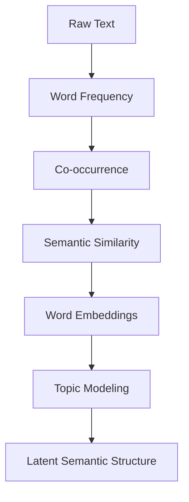

This transition is massive.

Traditional text analytics asks:

```text
What words occur?
```

Modern NLP asks:

```text
What meanings are encoded in linguistic context?
```

# The Central Hypothesis of Word Embeddings

The lecture introduces one of the most important ideas in NLP:

> Words used in similar contexts tend to have similar meanings.

This is called:

```text
the distributional hypothesis
```

# Distributional Hypothesis

Popularized by linguist J.R. Firth:

```text
"You shall know a word by the company it keeps."
```

This idea underlies:

- Word2Vec
    
- GloVe
    
- FastText
    
- transformer embeddings
    
- modern LLMs
    
![[Pasted image 20260528160622.png]]
# Why Context Matters

Words rarely carry meaning independently.

Meaning emerges through:

- neighboring words
    
- sentence structure
    
- usage patterns
    
- semantic context
    

# Contextual Meaning Model


# Example from the Lecture

The lecture references words such as:

- bankruptcy
    
- credit default
    
- stress
    

These words frequently occur together in financial contexts.

Therefore the algorithm infers:

```text
they belong to a similar semantic region
```

# Important Insight

Machines are not explicitly taught:

```text
"bankruptcy means financial distress"
```

Instead:

they infer meaning statistically from contextual usage.

# Semantic Similarity

# Meaning Through Proximity

The lecture introduces:

```text
semantic grouping
```

Words with similar usage patterns become mathematically close.

# Semantic Space Model

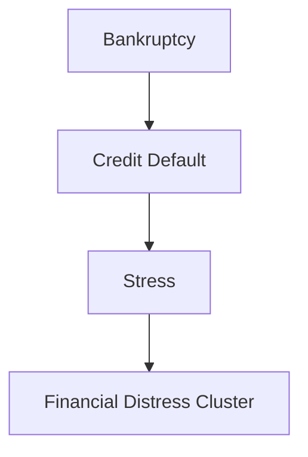

This forms the basis of:

```text
vector semantics
```
![[Word Embeddings.png]]
# Word Embeddings

# Mathematical Representation of Meaning

The lecture now introduces:

```text
word embeddings
```

This is one of the foundational ideas in modern AI.

# What Is a Word Embedding?

A word embedding converts a word into:

```text
a numerical vector representation
```

where semantic similarity corresponds to geometric proximity.

# Embedding Representation


# Why This Matters

Computers cannot directly understand language.

But they can process:

- vectors
    
- distances
    
- geometry
    
- probability distributions
    

Word embeddings transform:

```text
language into geometry
```

# Semantic Geometry

Words with similar meaning occupy nearby positions.

# Example

|Word|Semantic Neighborhood|
|---|---|
|King|Queen, Prince, Monarch|
|Bankruptcy|Debt, Default, Insolvency|
|Happy|Joyful, Excited, Glad|

# The Famous King-Man-Woman-Queen Example

The lecture references one of the most famous embedding examples:

```text
King relates to Man
Queen relates to Woman
```

Modern embeddings learn relationships such as:

King - Man + Woman \approx Queen

This is astonishing because:

- no explicit grammar rules were programmed
    
- the relationship emerges statistically
    

# Why This Happens

The model learns:

- gender relationships
    
- social hierarchy
    
- contextual similarity
    

through exposure to massive text corpora.

# Embedding Learning Pipeline

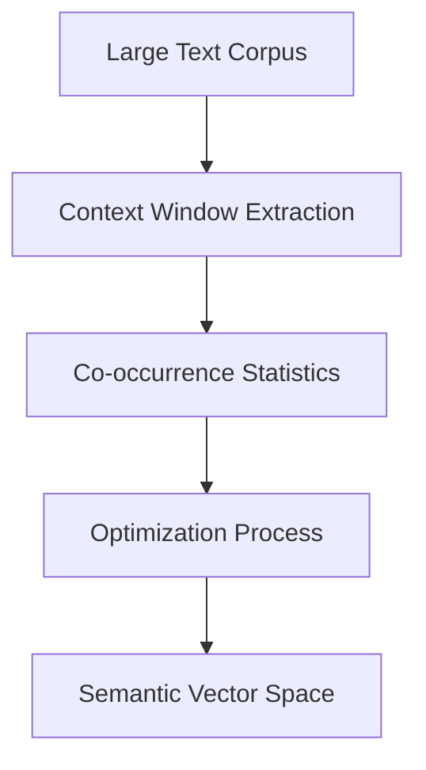

# Important Concept

# Similar Meaning = Nearby Vectors

In embedding spaces:

```text
distance represents semantic similarity
```

# Semantic Distance Model

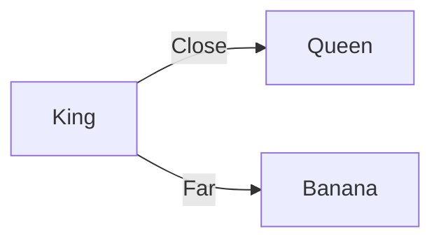

# Why Embeddings Changed NLP

Before embeddings:

language systems relied heavily on:

- keyword matching
    
- rigid rules
    
- symbolic processing
    

Embeddings introduced:

- semantic understanding
    
- contextual reasoning
    
- similarity learning
    

This revolutionized NLP.

# Enron Email Embeddings

# Discovering Hidden Communication Themes

The lecture applies embeddings to:

```text
Enron email communication
```

The algorithm discovers semantic clusters such as:

|Cluster|Semantic Meaning|
|---|---|
|Court proceedings|Legal communication|
|Internal communication|Organizational coordination|
|Destroy / transmit / distribute|Operational actions|
|Penalty / comply / protocol|Regulatory processes|

# Why This Is Important

The system discovers structure without explicit labels.

This is:

```text
unsupervised semantic organization
```

# Semantic Clustering Pipeline

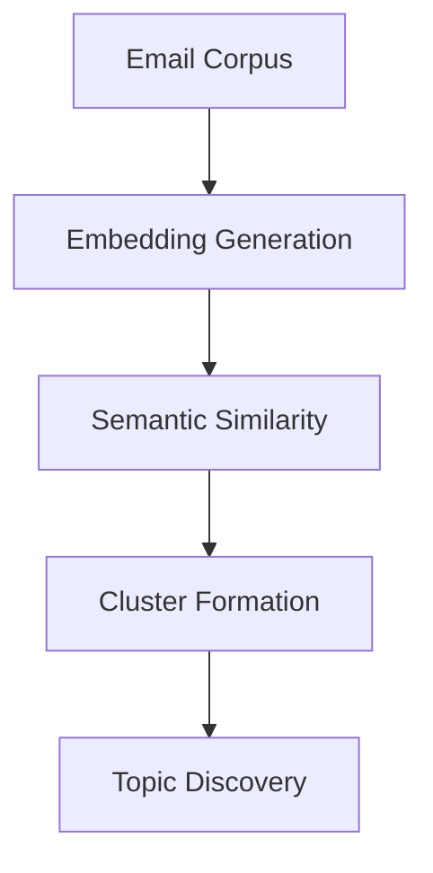

# Important Insight

The machine is not explicitly told:

```text
"This is legal communication."
```

It infers the grouping statistically.

# Hidden Meaning Discovery

This is one of the deepest capabilities in machine learning:

```text
latent structure discovery
```

The model uncovers hidden semantic organization inside raw text.

# Topic Modeling

# Discovering Latent Themes

The lecture now introduces:

```text
topic modeling
```

This is another major NLP milestone.

# What Is Topic Modeling?

Topic modeling attempts to identify:

```text
hidden thematic structures inside documents
```

without manual labeling.

# Topic Modeling Workflow

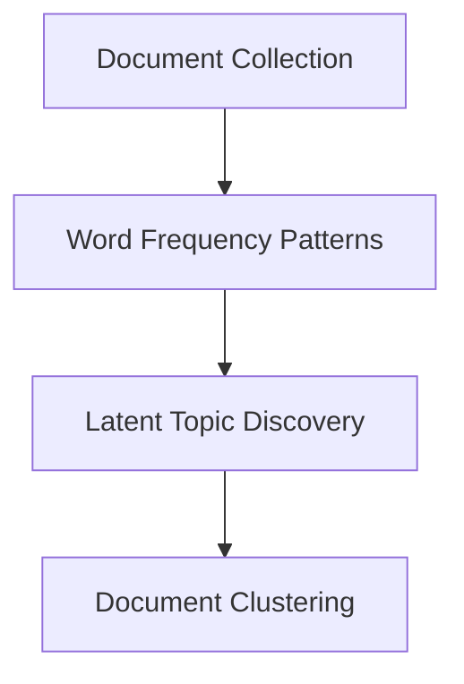

# Key Idea

Documents discussing similar themes tend to use similar vocabularies.

# Example

Emails containing words like:

- compliance
    
- regulation
    
- penalty
    
- audit
    

likely belong to a:

```text
regulatory topic
```
![[LSA & LDA.png]]
# LDA and LSA

# Unsupervised Topic Discovery

The lecture references:

- LDA
    
- LSA
    

without detail.

These are foundational topic modeling algorithms.

# LSA

# Latent Semantic Analysis

LSA uses:

- matrix factorization
    
- singular value decomposition (SVD)
    

to discover latent semantic structure.

# LDA

# Latent Dirichlet Allocation

LDA models documents probabilistically as mixtures of topics.

# Simplified LDA Idea

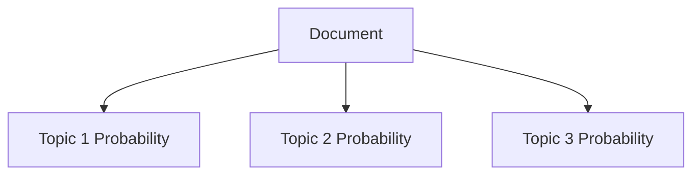

Documents are treated as combinations of latent topics.

# Important Insight

Topic models do not assign:

```text
one document = one topic
```

Instead:

documents contain mixtures of themes.

# Inter-Topic Distance

# Bubble Chart Visualization

The lecture discusses:

```text
bubble chart inter-topic distance
```

This is commonly seen in topic modeling tools like:

- pyLDAvis
    

# What Inter-Topic Distance Means

If topics appear close together:

- they share vocabulary
    
- they are semantically similar
    

If topics are distant:

- they discuss very different themes
    

# Topic Distance Visualization

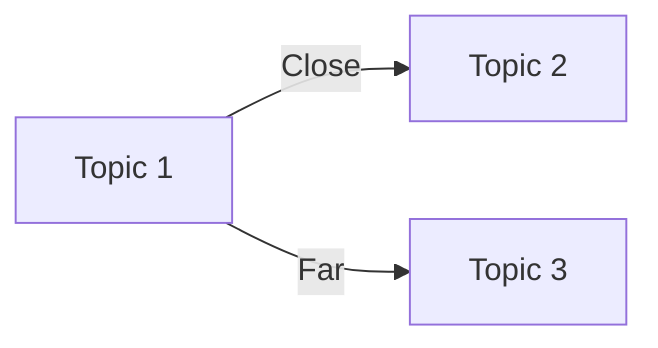

# Important Semantic Principle

```text
distance in embedding/topic space approximates semantic difference
```

# Bubble Size Meaning

Typically:

- larger bubbles = more dominant topics
    
- smaller bubbles = less frequent topics
    

# Why Topic Modeling Is Powerful

It enables:

- document organization
    
- thematic discovery
    
- clustering
    
- summarization
    
- exploratory analytics
    

without manual labeling.

# Applications of Topic Modeling

|Domain|Use Case|
|---|---|
|Customer reviews|Complaint themes|
|News analytics|Event clustering|
|Legal systems|Case categorization|
|Healthcare|Clinical themes|
|Social media|Trend discovery|

# Hidden Insight
![[Latent Semantic Geometry.png]]

# NLP as Dimensionality Reduction

Text is extremely high-dimensional.

Topic models compress:

- millions of words
    
- thousands of documents
    

into:

```text
small semantic structures humans can interpret
```

# Semantic Compression Pipeline

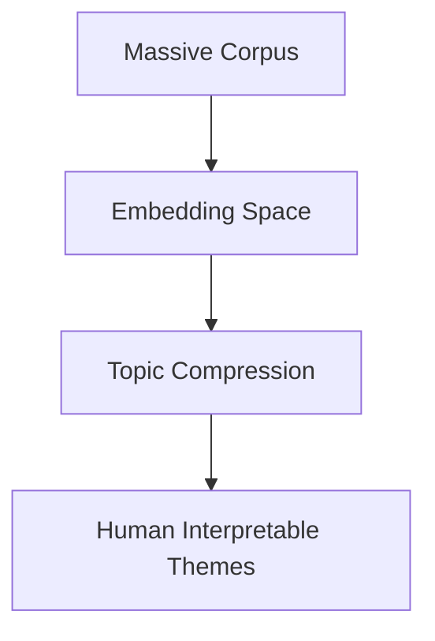

# Relationship Between Embeddings and Topic Models

|Embeddings|Topic Models|
|---|---|
|Represent individual words|Represent document themes|
|Continuous vector space|Probabilistic topic space|
|Local semantic similarity|Global thematic structure|

# Modern AI Connection

Modern LLMs fundamentally rely on:

- embeddings
    
- attention mechanisms
    
- semantic vector spaces
    

The lecture is indirectly introducing the foundations of modern generative AI.

# Modern Transformer Pipeline

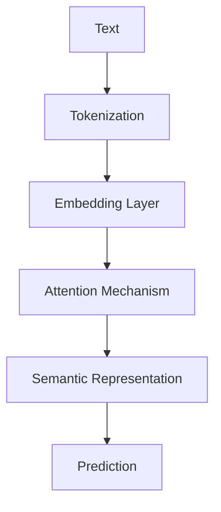

# Final Conceptual Shift

This lecture moves NLP from:

- visible language
    

to:

```text
latent semantic geometry
```

where meaning emerges mathematically through contextual similarity.

# Final Mental Model

Think of word embeddings and topic models as:

```text
machines constructing geometric maps of meaning from language usage patterns
```

through unsupervised semantic organization.
 
![[Pasted image 20260528221002.png]]
# Topic Modeling, t-SNE Clustering, and Semantic Dimensionality Reduction

# Visualizing Latent Themes in High-Dimensional Text Data

This section completes the progression from:

- word frequency
    
- sentiment analysis
    
- embeddings
    
- topic models
    

toward:

```text
high-dimensional semantic space visualization
```

The lecture now addresses one of the deepest problems in machine learning and NLP:

> Human beings cannot directly perceive high-dimensional semantic structures.

Modern NLP systems operate in:

- hundreds of dimensions
    
- thousands of latent variables
    
- complex vector spaces
    

Visualization techniques like:

- topic modeling
    
- t-SNE clustering
    

attempt to compress these spaces into:

```text
human-interpretable geometric representations
```

# The Central NLP Challenge

Textual data is extraordinarily high-dimensional.

Why?

Because every unique word potentially becomes:

- a variable
    
- a feature
    
- a semantic coordinate
    

# High-Dimensional Text Space

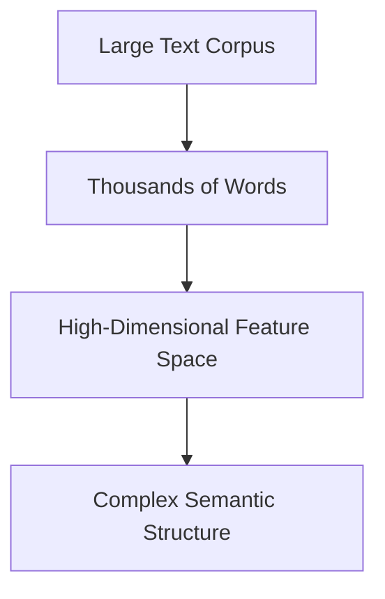

Humans cannot visualize:

- 300-dimensional embeddings
    
- 1000-dimensional semantic vectors
    
- probabilistic topic distributions
    

Therefore NLP requires:

```text
dimensionality reduction
```

# Revisiting Topic Modeling

# Discovering Hidden Themes

The lecture continues discussing:

- LDA
    
- LSA
    
- inter-topic distance
    
- word frequency within topics
    

The key idea remains:

```text
documents discussing similar themes use similar vocabularies
```

# Topic Modeling Objective

Topic models attempt to answer:

```text
What are the dominant semantic themes hidden inside the corpus?
```

# Topic Modeling Pipeline

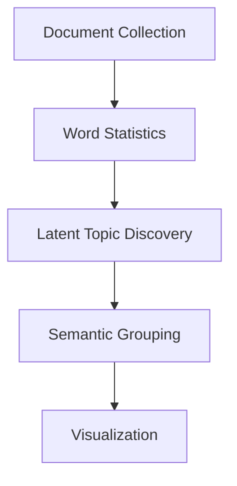

# Topic Composition

The lecture emphasizes:

A topic model can divide documents into:

- 3 topics
    
- 4 topics
    
- 5 topics
    

depending on configuration.

# Important Insight

Topic count is usually:

```text
a modeling choice
```

not an objectively fixed truth.

# Why Topic Number Matters

Too few topics:

- oversimplifies meaning
    
- merges unrelated themes
    

Too many topics:

- fragments semantic structure
    
- creates noisy interpretations
    

# Topic Granularity Tradeoff

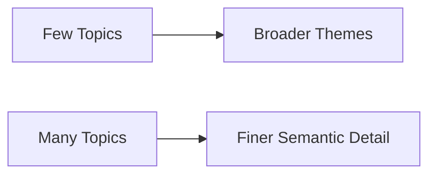

# Topic Frequency Visualization

The lecture references:

```text
word frequencies within topics
```

This is critical because topics themselves are abstract.

We interpret them through:

- dominant words
    
- recurring vocabulary
    
- semantic patterns
    

# Example

A topic containing words such as:

- audit
    
- compliance
    
- penalty
    
- regulation
    

is interpreted as:

```text
a regulatory/legal topic
```
![[Pasted image 20260528221315.png]]
# Important NLP Principle

Topic models do not inherently know semantic labels.

Humans assign labels after observing:

- dominant vocabulary
    
- contextual meaning
    

# Human Interpretation Layer

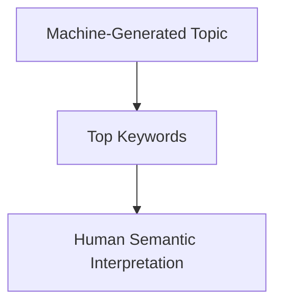

# Inter-Topic Distance

# Semantic Similarity Between Topics

The lecture again references:

```text
bubble distances between topics
```

This is fundamentally geometric.

# Topic Space Geometry

If two topics appear close:

- they share vocabulary
    
- they overlap semantically
    

If distant:

- they represent distinct themes
    

# Topic Distance Model

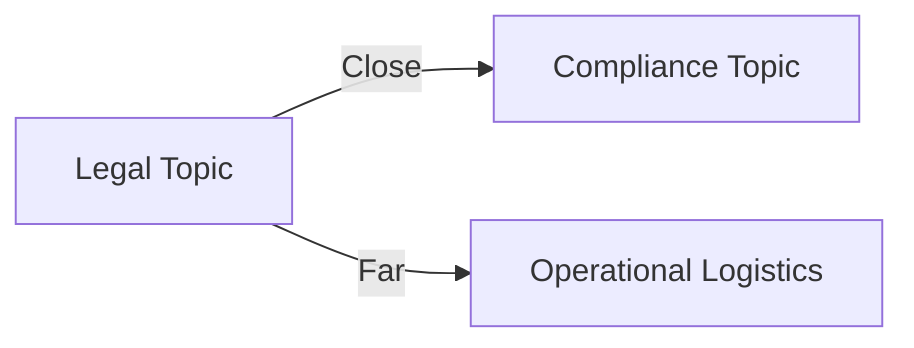

# Important Hidden Insight

Modern NLP largely operates through:

```text
geometric representations of meaning
```

rather than symbolic reasoning.

# Transition Into t-SNE Clustering

# Visualizing High-Dimensional Semantic Spaces

The lecture now introduces:

```text
t-SNE clustering
```

This is one of the most important visualization techniques in machine learning.

# Full Form

t-SNE stands for:

```text
t-distributed Stochastic Neighbor Embedding
```

# Why t-SNE Exists

Modern datasets often exist in:

- hundreds of dimensions
    
- latent semantic vector spaces
    

Humans can only directly visualize:

- 2D
    
- 3D
    

Therefore:

t-SNE attempts to preserve semantic relationships while reducing dimensions.

# Dimensionality Reduction Problem

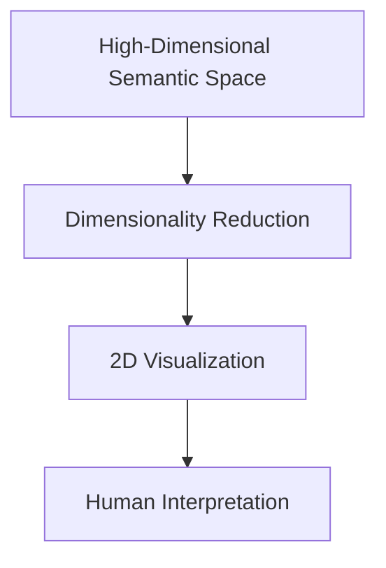

# Core Goal of t-SNE

t-SNE tries to preserve:

```text
local neighborhood structure
```

Meaning:

points close in high-dimensional space remain close in lower-dimensional visualization.

# Important Intuition

Imagine compressing a globe onto a flat map.

Some distortion is unavoidable.

t-SNE attempts to preserve:

- local relationships
    
- cluster integrity
    

even if global geometry changes.

# t-SNE Intuition


# Why t-SNE Became Popular

t-SNE produces visually intuitive clusters.

This makes hidden semantic structures:

```text
perceptually accessible
```

# The Lecture’s Document Clusters

The lecture describes colored topical regions such as:

|Color|Topic|
|---|---|
|Orange|Bankruptcy|
|Green|Actions|
|Blue|Fallout|
|Red|Regulatory|

# What This Means

Documents with similar semantic content cluster together geometrically.

# Semantic Cluster Structure

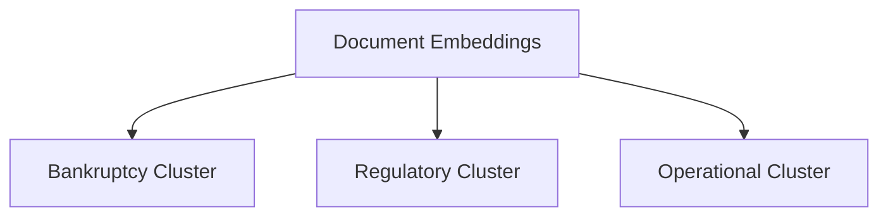

# Important Insight

Distance in t-SNE space approximately reflects:

```text
semantic similarity
```

# Why Clustering Matters

Clusters reveal:

- recurring themes
    
- communication patterns
    
- latent structures
    
- organizational focus areas
    

without manual categorization.

# Important Caveat About t-SNE

The lecture simplifies t-SNE significantly.

In reality:

t-SNE is excellent for visualization but has limitations.

# t-SNE Limitations

|Limitation|Explanation|
|---|---|
|Global distances unreliable|Far-apart clusters may not preserve true geometry|
|Sensitive to hyperparameters|Perplexity affects output|
|Non-deterministic|Different runs may vary|
|Computationally expensive|Large datasets scale poorly|

# Important Visualization Warning

```text
t-SNE visualizations are interpretive approximations, not exact geometric truths.
```

# Why Dimensionality Reduction Is Necessary

Without reduction:

semantic embeddings become impossible to interpret visually.

Example:

Modern transformer embeddings may contain:

- 768 dimensions
    
- 1024 dimensions
    
- 4096 dimensions
    

Humans cannot conceptualize this directly.

# Embedding Compression Pipeline

```mermaid
flowchart TD
    A[Transformer Embeddings]
    
    A --> B[768-Dimensional Space]
    --> C[t-SNE Reduction]
    --> D[2D Visualization]
```

# Relationship Between Embeddings, Topics, and t-SNE

These techniques operate at different abstraction levels.

|Technique|Primary Goal|
|---|---|
|Word Embeddings|Represent semantic meaning|
|Topic Models|Discover latent themes|
|t-SNE|Visualize high-dimensional structure|

# Integrated NLP Pipeline

```mermaid
flowchart TD
    A[Raw Text]
    
    A --> B[Embedding Generation]
    --> C[Topic Modeling]
    --> D[Dimensionality Reduction]
    --> E[Cluster Visualization]
```

# Why Semantic Visualization Matters

Humans are visual creatures.

Even powerful AI models remain difficult to interpret without visualization.

Semantic visualization allows analysts to:

- inspect latent themes
    
- detect anomalies
    
- identify semantic regions
    
- understand document structure
    

# Real-World Applications

|Domain|Application|
|---|---|
|Cybersecurity|Threat communication clustering|
|Healthcare|Clinical note grouping|
|Finance|Regulatory document analysis|
|Social Media|Opinion clustering|
|Legal Tech|Case topic analysis|
|Search Engines|Semantic retrieval|

# Hidden Conceptual Shift

# Language Becomes Spatial Geometry

One of the deepest ideas in this lecture is:

```text
meaning can be represented geometrically
```

Words, documents, and themes become:

- points
    
- clusters
    
- distances
    
- neighborhoods
    

inside semantic spaces.

# Modern AI Connection

Large Language Models fundamentally rely on:

- embedding spaces
    
- attention geometry
    
- latent semantic structures
    

The lecture is effectively introducing:

```text
the geometric foundations of modern generative AI
```

# Transformer Semantic Pipeline

```mermaid
flowchart TD
    A[Input Text]
    
    A --> B[Tokenization]
    --> C[Embedding Layer]
    --> D[Attention Computation]
    --> E[Semantic Space]
    --> F[Prediction]
```

# Important Final Insight

All these techniques:

- word embeddings
    
- topic modeling
    
- t-SNE clustering
    

attempt to solve the same problem:

```text
making latent semantic structure visible and interpretable
```

# Final Mental Model

Think of modern NLP visualization as:

```text
cartography for semantic space
```

where algorithms build geometric maps of meaning hidden inside language.

![[Pasted image 20260528221900.png]]