## Visualization of Text Data

## Challenges of Handling Unstructured Textual Information

This lecture serves as the conceptual foundation for the entire text visualization module.

Until now, visualization primarily dealt with:

- structured tables
    
- numerical values
    
- categorical variables
    
- explicit relationships
    

Now the lecture introduces a fundamentally harder problem:

```text
How do we extract meaning from human language?
```

This is one of the deepest problems in:

- data science
    
- NLP
    
- AI
    
- cognitive computing
    
- information retrieval
    
- machine learning
    

because human language is inherently:

- ambiguous
    
- contextual
    
- nonlinear
    
- unstructured
    

## Structured vs Unstructured Data

## The Core Distinction

The lecture begins by contrasting:

- structured data
    
- unstructured data
    

This distinction is extremely important computationally.

## Structured Data

Structured data exists in:

- rows
    
- columns
    
- matrices
    
- predefined schemas
    

Examples:

|CustomerID|Revenue|Region|
|---|---|---|
|1001|2500|West|

## Why Structured Data Is Easier

Machines naturally process:

- numerical arrays
    
- fixed schemas
    
- relational tables
    

efficiently.

## Structured Data Pipeline


## Unstructured Data

## The Opposite Problem

Unstructured data lacks predefined organization.

Examples include:

- emails
    
- chat messages
    
- articles
    
- reports
    
- social media posts
    
- transcripts
    
- customer reviews
    

## Why Unstructured Data Is Difficult

Human language does not naturally obey:

- fixed schemas
    
- predictable structures
    
- explicit semantics
    

## Textual Complexity Model

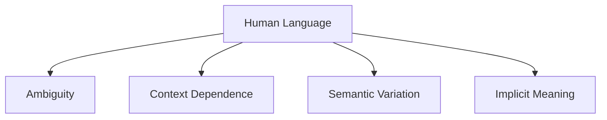

This creates enormous computational challenges.

## Important Core Insight

```text
Language is optimized for humans, not machines.
```

## Why Text Is Computationally Hard

The lecture emphasizes:

> You cannot immediately decipher meaning computationally without processing.

Humans effortlessly infer meaning because we possess:

- contextual memory
    
- world knowledge
    
- emotional understanding
    
- semantic intuition
    

Machines do not.

## Human vs Machine Language Understanding

|Human|Machine|
|---|---|
|Contextual reasoning|Statistical computation|
|Semantic intuition|Pattern recognition|
|World knowledge|Mathematical encoding|

## Example of Ambiguity

```text
"The bank is near the river."
```

versus:

```text
"The bank approved the loan."
```

Same word.

Different meaning.

Humans infer context instantly.

Machines require modeling.

## NLP Challenge Pipeline

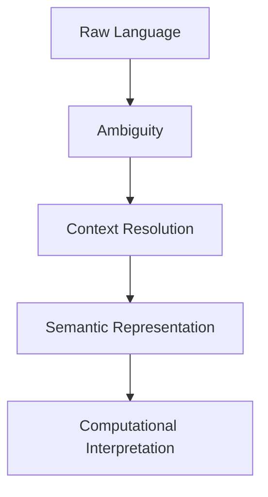

## Why Text Matters Despite Complexity

The lecture highlights an extremely important idea:

> Valuable behavioral and informational signals are hidden inside language.

This is foundational to modern AI.

## Human Communication Is Largely Textual

Organizations generate enormous textual information through:

- emails
    
- reports
    
- reviews
    
- chats
    
- documentation
    
- legal records
    

## Hidden Signals Inside Text

Text contains:

|Signal Type|Examples|
|---|---|
|Sentiment|Positive/negative emotion|
|Intent|Purchase intent, complaints|
|Relationships|Entity interactions|
|Behavioral patterns|Coordination, stress|
|Topics|Discussion themes|

## Important Modern Insight

```text
Language is one of the richest behavioral datasets humans produce.
```

## Why Visualization Becomes Important

Raw text is extremely difficult to process cognitively at scale.

Humans cannot manually analyze:

- millions of emails
    
- huge document corpora
    
- large review systems
    
- social media streams
    

Visualization acts as:

```text
cognitive compression for language
```

## Text Visualization Pipeline


## The Central NLP Problem

## Machines Cannot Directly Understand Text

The lecture introduces a crucial principle:

```text
Text must first be converted into a computationally interpretable form.
```

This is the foundation of all NLP systems.

## Why Conversion Is Necessary

Computers fundamentally operate on:

- numbers
    
- vectors
    
- matrices
    
- probabilities
    

not language.

Therefore:

language must become mathematics.

## Language Conversion Pipeline

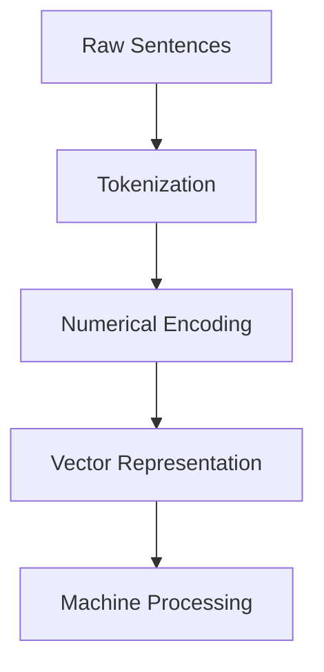

## Important Concept

## Text as Data

One of the biggest conceptual shifts in NLP is:

```text
Treating language as analyzable statistical structure.
```

Rather than:

- literature
    
- grammar
    
- symbolic communication
    

NLP views text as:

- patterns
    
- distributions
    
- probabilities
    
- semantic relationships
    

## Role of Algorithms

The lecture references:

- Python
    
- Power BI
    
- Tableau
    

These systems provide NLP capabilities through:

- tokenization
    
- sentiment analysis
    
- embeddings
    
- clustering
    
- visualization libraries
    

## Why Algorithms Are Necessary

Without algorithms:

language remains unstructured and uninterpretable computationally.

Algorithms help:

|Task|Purpose|
|---|---|
|Tokenization|Break text into units|
|Stopword removal|Remove noise|
|Embeddings|Represent meaning numerically|
|Clustering|Group semantic similarity|
|Topic modeling|Discover themes|

## NLP Processing Stack

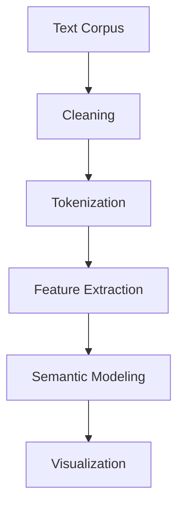

## Challenges in Textual Data Analysis

The lecture now introduces the broader challenge landscape.

## 1. Lack of Explicit Structure

Unlike tables:

text lacks:

- fixed columns
    
- consistent ordering
    
- predefined schema
    

## Example

```text
"I love this product."
```

versus:

```text
"This product exceeded all my expectations."
```

Different wording.

Similar semantic intent.

## 2. Context Dependence

Meaning changes based on context.

## Example

```text
"Cold"
```

may refer to:

- weather
    
- illness
    
- emotional distance
    

## 3. Synonymy

Different words may mean similar things.

Examples:

- happy
    
- joyful
    
- delighted
    

## 4. Polysemy

Same word may carry multiple meanings.

Examples:

- bank
    
- mouse
    
- model
    

## 5. Scale Problem

Modern organizations process:

- millions of messages
    
- massive corpora
    
- continuous communication streams
    

Manual interpretation becomes impossible.

## NLP Challenge Landscape

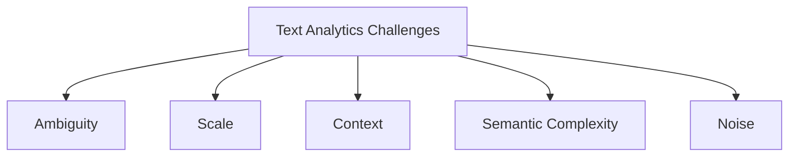

## Why Visualization of Text Is Harder Than Numerical Visualization

Numerical visualization deals with:

- explicit magnitude
    
- measurable scales
    
- direct comparisons
    

Text visualization deals with:

- implicit meaning
    
- semantic uncertainty
    
- probabilistic interpretation
    

## Numerical vs Textual Analytics

|Numerical Data|Text Data|
|---|---|
|Explicit values|Implicit meaning|
|Fixed scale|Contextual interpretation|
|Direct comparison|Semantic similarity|

## Important Hidden Insight

The lecture quietly introduces one of the deepest truths in AI:

```text
Meaning itself must be approximated computationally.
```

Machines do not truly “understand” text.

They model statistical relationships.

## Why Modern NLP Works Surprisingly Well

Modern systems leverage:

- massive datasets
    
- probabilistic learning
    
- contextual embeddings
    
- transformer architectures
    

to approximate semantic understanding.

## Modern NLP Architecture

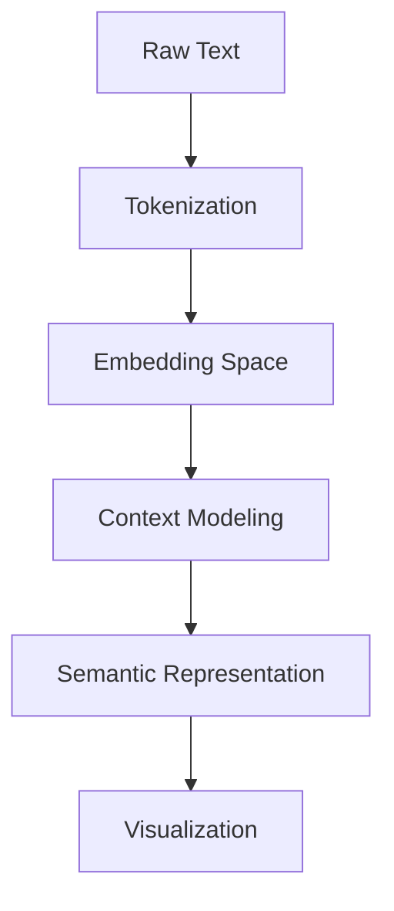

## Relationship to Visualization

The lecture strongly connects NLP to visualization.

Visualization helps humans:

- inspect semantic patterns
    
- identify clusters
    
- detect sentiment
    
- understand relationships
    
- interpret hidden structure
    

## NLP Visualization Goals

|Goal|Visualization Type|
|---|---|
|Frequency|Word cloud|
|Relationships|Word tree|
|Topics|Topic clusters|
|Sentiment|Score distributions|
|Communication flow|Network graphs|

## Hidden Computational Philosophy

This lecture is fundamentally about:

```text
transforming language into geometry, statistics, and visual structure
```

so that machines and humans can jointly reason about meaning.

## Why This Matters in Modern AI

Large Language Models fundamentally depend on:

- embeddings
    
- semantic spaces
    
- contextual relationships
    
- probabilistic token prediction
    

The concepts introduced here are direct foundations of:

- ChatGPT
    
- semantic search
    
- recommendation systems
    
- retrieval systems
    
- AI assistants
    

## End-to-End NLP Visualization Pipeline

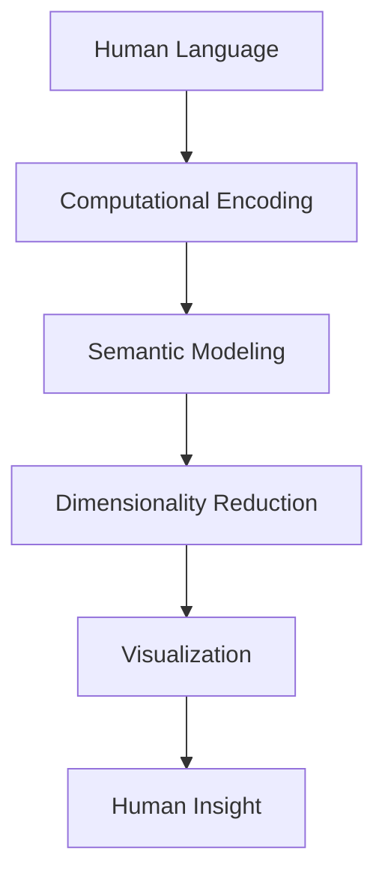

## Final Conceptual Shift

This lecture transitions analytics from:

- structured numerical reasoning
    

toward:

```text
semantic computational interpretation of language
```

## Final Mental Model

Think of text visualization as:

```text
building perceptual interfaces for exploring hidden semantic structure inside human language
```

through computational transformation and visual abstraction.

## Text Preprocessing Pipeline

## Transforming Human Language into Computationally Usable Data

This section introduces one of the most important foundations in Natural Language Processing (NLP):

```text
raw human language cannot be directly analyzed computationally
```

Before:

- visualization
    
- sentiment analysis
    
- topic modeling
    
- embeddings
    
- clustering
    

can happen,

the text must first undergo:

```text
preprocessing
```

This preprocessing stage is fundamentally:

```text
a translation layer between human language and machine computation
```

## Why Preprocessing Exists

Human language is:

- inconsistent
    
- noisy
    
- redundant
    
- ambiguous
    
- inefficient computationally
    

Machines require:

- normalized structure
    
- reduced variability
    
- numerical consistency
    

## NLP Preprocessing Pipeline

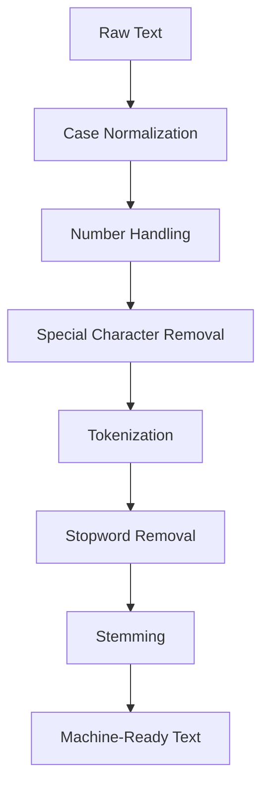

This pipeline dramatically improves:

- computational efficiency
    
- semantic consistency
    
- visualization quality
    
- model performance
    

## Important Core Principle

```text
Preprocessing is not merely cleaning.
It is semantic standardization.
```

## Why Text Requires Standardization

Humans easily recognize:

```text
Apple
apple
APPLE
```

as identical concepts.

Machines do not naturally infer this equivalence.

Therefore normalization becomes essential.

## 1. Case Normalization

## Standardizing Capitalization

The lecture begins with:

```text
case conversion
```

All text is converted into:

- lowercase  
    or
    
- uppercase
    

Most systems prefer lowercase.

## Example

Before:

```text
Apple APPLE apple
```

After:

```text
apple apple apple
```

## Why This Matters

Without normalization:

machines treat these as separate tokens.

## Vocabulary Explosion Problem

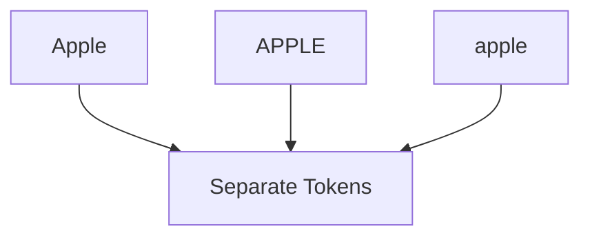

This unnecessarily increases:

- dimensionality
    
- memory usage
    
- computational cost
    

## Important Insight

```text
Normalization reduces semantic fragmentation.
```

## Tradeoff of Lowercasing

Lowercasing sometimes removes useful information.

Example:

|Word|Meaning|
|---|---|
|Apple|Company|
|apple|Fruit|

Therefore modern NLP systems sometimes preserve casing contextually.

## 2. Number Handling

## Numerical Normalization

The lecture then discusses:

```text
handling numbers inside text
```

Numbers create special preprocessing challenges.

## Example

```text
"The company lost 120 million dollars."
```

Possible strategies:

|Strategy|Purpose|
|---|---|
|Remove numbers|Simplify vocabulary|
|Convert to text|Preserve meaning|
|Replace with placeholder|Generalize patterns|

## Example Transformation

```text
120 → one hundred twenty
```

## Why Number Handling Matters

Numbers may represent:

- quantities
    
- dates
    
- identifiers
    
- prices
    
- measurements
    

Removing them blindly may destroy meaning.

## Important NLP Tradeoff

```text
Noise reduction vs semantic preservation
```

## Number Processing Pipeline

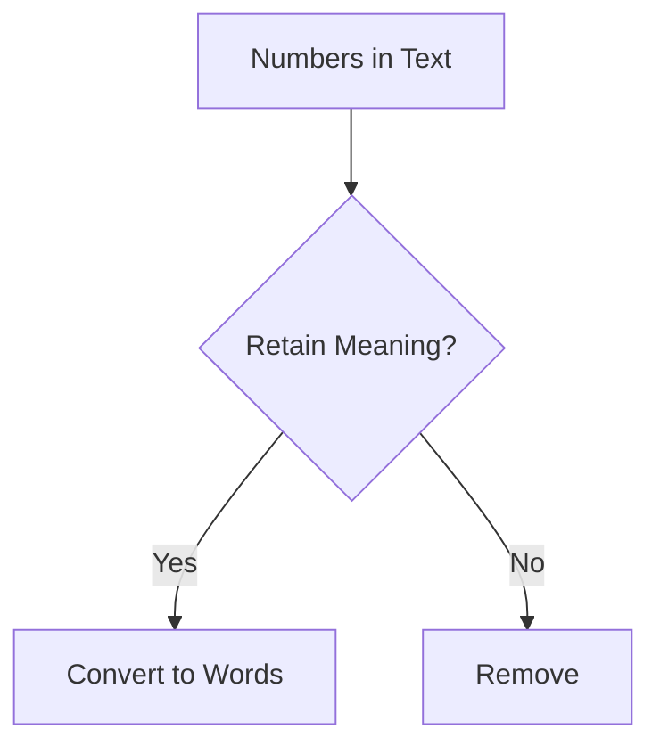

## 3. Removing Punctuation and Special Characters

## Noise Reduction

The lecture next introduces:

```text
special character removal
```

Examples include:

- commas
    
- periods
    
- symbols
    
- brackets
    
- punctuation
    

## Why This Matters

Special characters often:

- add computational complexity
    
- increase vocabulary size
    
- contribute little semantic value
    

## Example

Before:

```text
"Hello!!!"
```

After:

```text
hello
```

## Important Caveat

Punctuation sometimes carries meaning.

Example:

|Text|Meaning|
|---|---|
|"Let's eat, grandma."|Normal|
|"Let's eat grandma."|Cannibalism|

Therefore aggressive cleaning can distort semantics.

## Cleaning Tradeoff

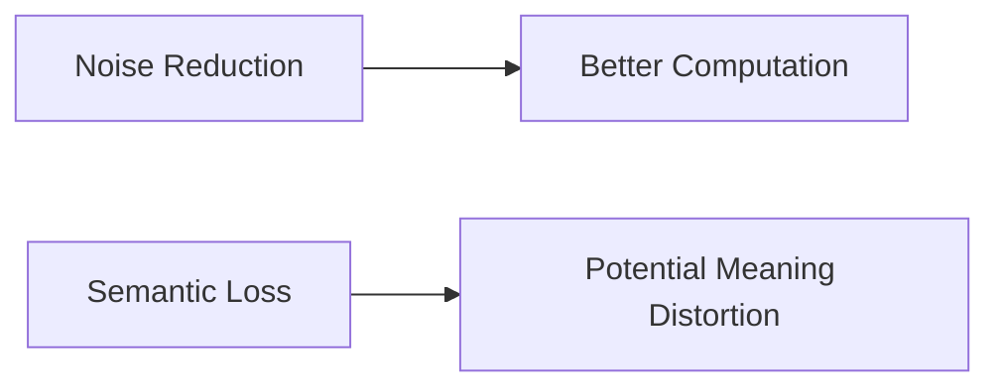

## Important NLP Principle

```text
Preprocessing always involves information tradeoffs.
```

## 4. Tokenization

## Breaking Text into Computational Units

The lecture now introduces one of the most fundamental NLP operations:

```text
tokenization
```

## What Is Tokenization?

Tokenization breaks text into:

- words
    
- subwords
    
- phrases
    
- symbols
    

called:

```text
tokens
```

## Example

Sentence:

```text
"Visualization of text data"
```

becomes:

|Token|
|---|
|visualization|
|of|
|text|
|data|

## Tokenization Pipeline

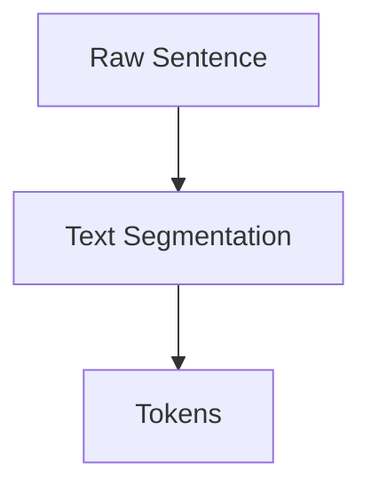

## Why Tokenization Matters

Computers cannot process raw sentences directly.

Tokenization transforms:

```text
continuous language into discrete computational units
```

## Bag of Words Representation

The lecture references:

```text
bag of words
```

This is one of the earliest NLP representations.

## Bag of Words Idea

Text becomes:

- unordered token collection
    
- frequency representation
    

ignoring:

- grammar
    
- sequence
    
- syntax
    

## Example

Sentence:

```text
"The cat chased the mouse"
```

becomes:

|Word|Count|
|---|---|
|cat|1|
|chased|1|
|mouse|1|

## Important Limitation

Bag of words ignores:

- word order
    
- context
    
- semantics
    

Therefore:

```text
meaning becomes partially flattened
```

## Bag of Words Pipeline

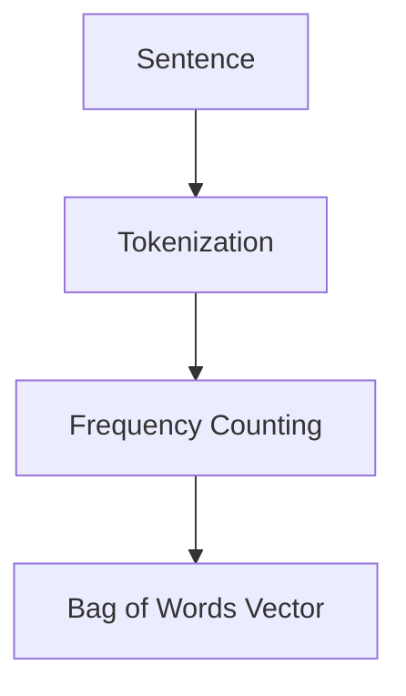

## 5. Stopword Removal

## Eliminating Low-Information Words

The lecture next introduces:

```text
stopword removal
```

## What Are Stopwords?

Common words carrying little semantic value.

Examples:

- a
    
- an
    
- the
    
- is
    
- of
    

## Example

Before:

```text
"An apple"
```

After:

```text
apple
```

## Why Stopword Removal Helps

Stopwords dominate language frequency but often contribute little meaning.

Removing them:

- reduces dimensionality
    
- improves efficiency
    
- sharpens semantic focus
    

## Stopword Reduction Pipeline

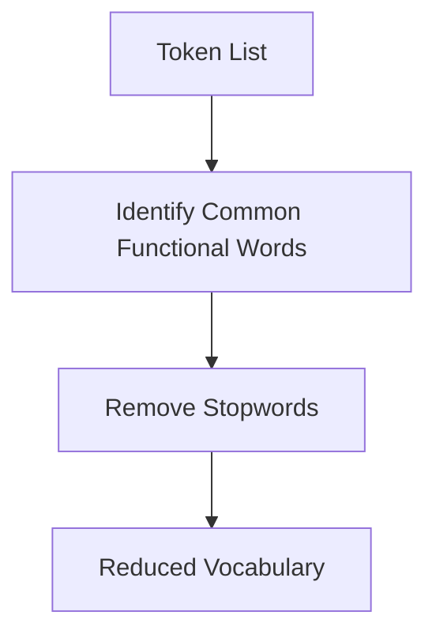

## Important Computational Insight

Large text corpora contain enormous redundancy.

Stopword removal reduces:

```text
computational burden without heavily affecting semantics
```

## Important Caveat

Stopwords sometimes matter contextually.

Example:

```text
"To be or not to be"
```

Removing stopwords destroys meaning entirely.

## Important NLP Tradeoff

```text
Efficiency improvements may reduce semantic nuance.
```

## 6. Stemming

## Reducing Words to Common Roots

The lecture finally introduces:

```text
stemming
```

## What Is Stemming?

Stemming reduces related words to a shared root form.

## Example

|Original Word|Stem|
|---|---|
|enjoyed|enjoy|
|enjoyable|enjoy|

## Why Stemming Matters

Many word variants express similar semantic concepts.

Stemming reduces:

- vocabulary size
    
- dimensionality
    
- redundancy
    

## Stemming Pipeline

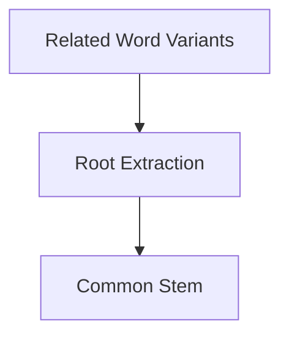

## Important Benefit

Stemming groups semantically related forms together.

This improves:

- clustering
    
- search
    
- frequency analysis
    
- topic modeling
    

## Major Limitation of Stemming

The lecture begins introducing a critical warning:

stemming can over-simplify meaning.

## Example Problem

Words like:

- happiness
    
- happy
    

share roots but differ subtly.

Aggressive stemming may distort:

- grammar
    
- nuance
    
- semantics
    

## Over-Stemming Problem

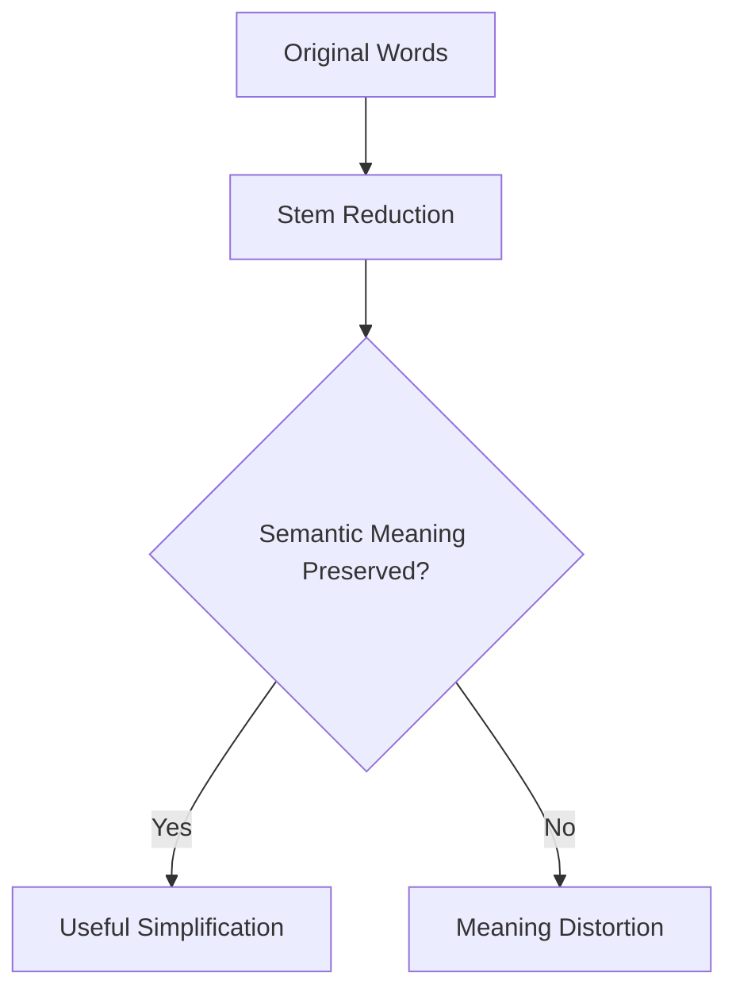

## Stemming vs Lemmatization

The lecture mentions stemming but this naturally connects to:

```text
lemmatization
```

## Difference

|Stemming|Lemmatization|
|---|---|
|Rule-based truncation|Linguistically informed normalization|
|Faster|More accurate|
|Cruder|Semantically cleaner|

## Example

|Word|Stem|Lemma|
|---|---|---|
|running|runn|run|
|studies|studi|study|

## Hidden Insight

## NLP Is Controlled Information Loss

Every preprocessing step removes information intentionally.

Goal:

```text
retain semantic structure while reducing computational complexity
```

## NLP Compression Pipeline

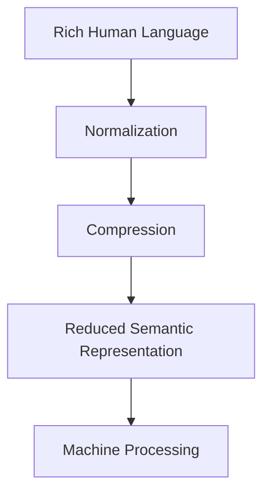

## Why Preprocessing Matters for Visualization

Without preprocessing:

visualizations become:

- noisy
    
- fragmented
    
- computationally expensive
    
- semantically inconsistent
    

## Example Without Cleaning

Word cloud may contain:

- Apple
    
- apple
    
- APPLE
    

as separate concepts.

## Example With Cleaning

All consolidate into:

```text
apple
```

producing meaningful patterns.

## Relationship to Modern AI

Modern transformer models reduce some preprocessing requirements because they learn contextual structure automatically.

However preprocessing still remains important in:

- traditional NLP
    
- topic modeling
    
- visualization systems
    
- search engines
    
- enterprise analytics
    

## Modern NLP Pipeline

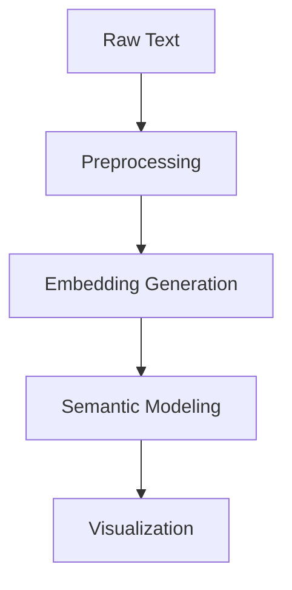

## Final Conceptual Insight

This lecture demonstrates that preprocessing is fundamentally:

```text
the engineering discipline of converting messy human language into structured computational signals
```

## Final Mental Model

Think of NLP preprocessing as:

```text
compressing and standardizing human language into machine-compatible semantic building blocks
```

while preserving as much meaning as computationally possible.


Tags: #statistics #machine-learning #data-science #statistical-modelling