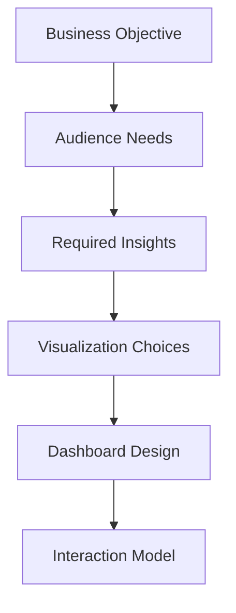

# Dashboard Design Framework

```mermaid
flowchart TD
    A[Business Objective] --> B[Audience Needs]
    B --> C[Required Insights]
    C --> D[Visualization Choices]
    D --> E[Dashboard Design]
    E --> F[Interaction Model]
```
