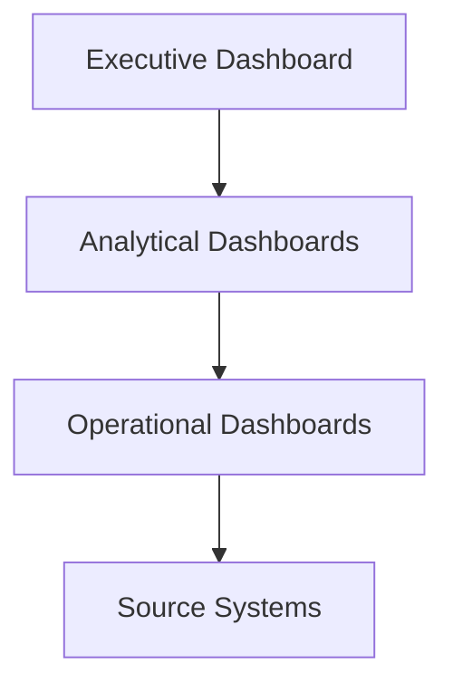

# Layered Dashboard Ecosystems

Strong organizations usually create:  
dashboard ecosystems.

```mermaid
flowchart TD
    A[Executive Dashboard]
    A --> B[Analytical Dashboards]
    B --> C[Operational Dashboards]
    C --> D[Source Systems]
```

Each layer:

- abstracts complexity differently,
    
- based on decision needs.
