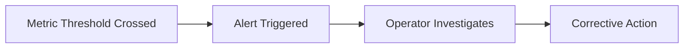

# Operational Dashboard Logic

Operational dashboards often support:  
if-this-then-that workflows.

Example:

```mermaid
flowchart LR
    A[Metric Threshold Crossed] --> B[Alert Triggered]
    B --> C[Operator Investigates]
    C --> D[Corrective Action]
```
