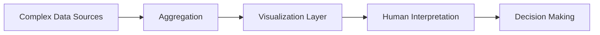
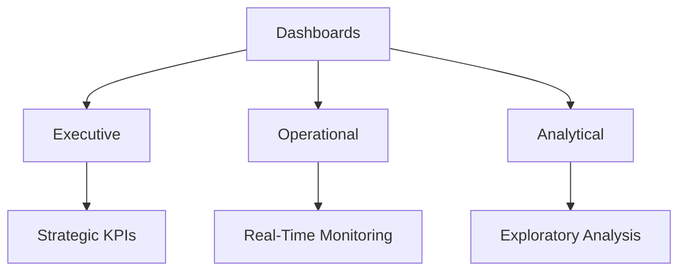
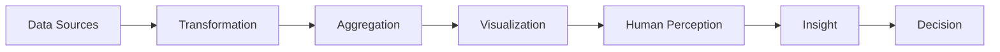

# Lesson 14: Dashboards

# What is a Dashboard?

A dashboard is a visual information system designed to:

- monitor important metrics,
    
- summarize large amounts of data,
    
- support decision-making,
    
- and enable rapid understanding of business or operational conditions.
    

The defining characteristic of a dashboard is:  
high information density with low cognitive effort.

A dashboard consolidates:

- KPIs,
    
- trends,
    
- alerts,
    
- summaries,
    
- comparisons,
    
- and operational signals
    

onto a single visual interface.

## Core Definition

A dashboard is:

> A visual decision-support interface that consolidates critical information into a concise, actionable, and easy-to-monitor format.

## Important Clarification

A dashboard is not:

- a raw report,
    
- a spreadsheet,
    
- or a collection of random charts.
    

It is specifically engineered for:

- monitoring,
    
- interpretation,
    
- and action.
    

# Historical Analogy

Dashboards originate conceptually from:

- automobile dashboards,
    
- aircraft cockpits,
    
- industrial control panels.
    

In all these systems:

- many underlying subsystems exist,
    
- but operators see only critical indicators.
    

The goal:  
reduce complexity without losing awareness.

# Dashboard Mental Model

# Why Dashboards Exist

Modern systems generate enormous volumes of data:

- transactions,
    
- logs,
    
- events,
    
- telemetry,
    
- customer interactions,
    
- financial metrics,
    
- operational signals.
    

Humans cannot process raw data efficiently.

Dashboards act as:  
cognitive compression systems.

They transform:

- millions of records
    

into:

- meaningful visual insight.
    

# Why Different Dashboard Types Exist

Different users require different forms of information.

A CEO,  
a business analyst,  
and a network engineer  
have fundamentally different decision-making needs.

Therefore dashboards must adapt to:

- audience,
    
- decision speed,
    
- analytical depth,
    
- operational context.
    

# Dashboard Audience Hierarchy

|User Type|Primary Goal|Typical Dashboard|
|---|---|---|
|Executives|Strategic monitoring|Executive dashboard|
|Managers|Tactical analysis|Management dashboard|
|Analysts|Exploration and diagnosis|Analytical dashboard|
|Operators|Real-time monitoring|Operational dashboard|

# 1. Executive Dashboards

Designed for:

- senior leadership,
    
- strategic overview,
    
- business health monitoring.
    

## Characteristics

- Highly summarized
    
- Minimal detail
    
- KPI-focused
    
- Trend-oriented
    
- Often updated daily/weekly/monthly
    

## Typical Metrics

- Revenue
    
- Profit margins
    
- Growth rates
    
- Customer acquisition
    
- Market share
    

## Design Style

- Clean
    
- Minimalistic
    
- High-level summaries
    
- Few interactions
    

# 2. Operational Dashboards

Designed for:

- real-time monitoring,
    
- immediate action,
    
- anomaly detection.
    

## Characteristics

- Live updates
    
- Alert-heavy
    
- High refresh frequency
    
- Dense monitoring visuals
    

## Examples

- Network operations center
    
- Manufacturing systems
    
- Cybersecurity monitoring
    
- Hospital ICU monitoring
    

## Key Requirement

Low latency.

Delayed operational dashboards are often useless.

# 3. Analytical Dashboards

Designed for:

- exploration,
    
- diagnosis,
    
- hypothesis testing,
    
- root-cause analysis.
    

## Characteristics

- Highly interactive
    
- Drill-down capability
    
- Advanced filtering
    
- Multi-dimensional analysis
    

## Typical Users

- Data analysts
    
- BI teams
    
- Product analysts
    
- Researchers
    

# Dashboard Taxonomy

# Characteristics of Dashboards

# 1. Visual Summarization

## Definition

Dashboards condense complex datasets into visual representations.

Instead of:

- reading raw tables,
    
- scanning reports,
    
- or analyzing spreadsheets,
    

users interpret:

- charts,
    
- maps,
    
- indicators,
    
- and visual patterns.
    

# Why Visuals Matter

Human brains process visual patterns much faster than textual data.

Visuals support:

- anomaly detection,
    
- trend recognition,
    
- comparative analysis,
    
- pattern identification.
    

# Example

Instead of reading:

- 183 GDP growth values,
    

a world heatmap immediately communicates:

- global recession,
    
- regional growth,
    
- recovery patterns.
    

# Important Principle

Visualization is not decoration.

It is:  
cognitive acceleration.

# 2. Single-Screen Display

## Definition

A dashboard should ideally fit within:

- one screen,
    
- one viewport,
    
- one visual context.
    

Users should not need:

- excessive scrolling,
    
- multiple tabs,
    
- or deep navigation.
    

# Why This Matters

Scrolling breaks:

- situational awareness,
    
- visual comparison,
    
- cognitive continuity.
    

A dashboard succeeds when users can:  
understand the system state at a glance.

# Important Distinction

A long report is not a dashboard.

A dashboard prioritizes:

- compactness,
    
- hierarchy,
    
- and rapid interpretation.
    

# Common Mistake

Many BI tools produce:  
“dashboard-shaped reports”

These contain:

- dozens of visuals,
    
- massive scrolling,
    
- no prioritization.
    

This defeats the purpose.

# 3. Real-Time or Near Real-Time

## Definition

Dashboards often require continuously updated information.

The required freshness depends on context.

# Examples

|Use Case|Refresh Requirement|
|---|---|
|Stock trading|Milliseconds|
|Cybersecurity|Seconds|
|Logistics|Minutes|
|Retail sales|Hourly|
|Executive reports|Daily/weekly|

# Key Principle

Information latency must match:  
decision velocity.

# Operational Importance

Real-time dashboards support:

- anomaly detection,
    
- rapid intervention,
    
- live monitoring.
    

Without freshness:  
dashboards become historical reports rather than operational systems.

# Engineering Challenges

Real-time dashboards require:

- streaming pipelines,
    
- caching,
    
- scalable querying,
    
- efficient rendering,
    
- event processing systems.
    

# 4. Customization and Interactivity

## Definition

Dashboards should allow users to:

- filter,
    
- drill down,
    
- compare,
    
- explore,
    
- and personalize views.
    

# Why Interactivity Matters

Different users ask different questions.

A static dashboard cannot support:  
deep analysis or investigative workflows.

# Common Interactive Features

|Feature|Purpose|
|---|---|
|Filters|Restrict data|
|Drill-downs|Increase detail|
|Tooltips|Show precise values|
|Time sliders|Analyze trends|
|Cross-filtering|Linked analysis|

# Reader-Driven Narrative

Modern dashboards support:  
interactive exploration.

The user:

- notices patterns,
    
- asks questions,
    
- interacts,
    
- uncovers explanations.
    

# Important Balance

Too little interaction:

- dashboard becomes rigid.
    

Too much interaction:

- dashboard becomes cognitively exhausting.
    

# 5. Contextual Relevance

## Definition

Every visual in a dashboard should support:  
a specific business objective.

# Weak Dashboard

Random metrics without:

- narrative,
    
- prioritization,
    
- or purpose.
    

# Strong Dashboard

Every visual contributes toward answering:  
a focused business question.

# Example

Instead of:  
“all sales metrics”

A better dashboard asks:

> Why are delivery delays increasing this month?

Now every visualization supports that question.

# Key Principle

Context determines meaning.

The same data may require different presentations depending on:

- audience,
    
- goals,
    
- and decisions.
    

# 6. Visual Design Principles

Dashboards rely heavily on:  
human perception psychology.

This includes:

- color,
    
- position,
    
- size,
    
- spacing,
    
- hierarchy,
    
- alignment.
    

# Pre-Attentive Attributes

These are visual properties processed rapidly by the brain before conscious reasoning.

## Examples

|Attribute|Usage|
|---|---|
|Color|Highlight anomalies|
|Size|Indicate magnitude|
|Position|Accurate comparison|
|Shape|Categorization|
|Intensity|Emphasize importance|

# Example

A single red KPI among gray metrics immediately attracts attention.

No conscious reading required.

# Visual Hierarchy

Important information should visually dominate:

- through size,
    
- placement,
    
- contrast,
    
- and spacing.
    

# Common Visualization Mistakes

## 1. Overcrowding

Too many visuals create cognitive overload.

## 2. Decorative Design

3D charts and flashy effects reduce clarity.

## 3. Poor Color Usage

Too many bright colors destroy hierarchy.

## 4. Inconsistent Encoding

If colors mean different things across charts,  
users become confused.

# Dashboard Cognitive Architecture

# Real-World Examples

## Business Dashboard

Tracks:

- revenue,
    
- churn,
    
- growth,
    
- conversion rates.
    

## Healthcare Dashboard

Tracks:

- ICU occupancy,
    
- patient risk,
    
- vital signs,
    
- emergency alerts.
    

## Manufacturing Dashboard

Tracks:

- machine uptime,
    
- defect rates,
    
- throughput,
    
- maintenance alerts.
    

## Environmental Dashboard

Tracks:

- emissions,
    
- temperature changes,
    
- disaster frequency,
    
- pollution levels.
    

# Advanced Dashboard Concepts

# 1. Progressive Disclosure

Start with overview.  
Reveal detail only when needed.

# 2. Information Density

High-value dashboards maximize:  
useful information per unit screen area.

# 3. Cognitive Load Reduction

Good dashboards reduce:  
mental decoding effort.

# 4. Situational Awareness

Dashboards should continuously answer:

- What is happening?
    
- Why is it happening?
    
- What requires attention?
    

# Modern Dashboard Evolution

Modern dashboards increasingly integrate:

- predictive analytics,
    
- anomaly detection,
    
- ML forecasts,
    
- AI-generated insights,
    
- automated recommendations.
    

# Example

Instead of merely showing:  
sales decline,

modern systems may predict:

- future churn,
    
- likely causes,
    
- recommended interventions.
    

# Final Takeaways

A dashboard is:

- a visual decision-support system,  
    not merely a reporting screen.
    

Effective dashboards:

- summarize complexity,
    
- support rapid understanding,
    
- guide attention,
    
- reduce cognitive effort,
    
- and enable informed decisions.
    

The best dashboards combine:

- data engineering,
    
- visualization science,
    
- cognitive psychology,
    
- interaction design,
    
- and business understanding.
    

# Interview-Style Questions

1. Why is single-screen design important in dashboards?
    
2. What are pre-attentive attributes?
    
3. Difference between operational and analytical dashboards?
    
4. Why is contextual relevance critical?
    
5. What is reader-driven narrative?
    
6. Why are bar charts perceptually effective?
    
7. What are the dangers of dashboard overcrowding?
    
8. How does interactivity improve analytical reasoning?
    

# Recommended Tools & Technologies

| Area             | Tools                                    |
| ---------------- | ---------------------------------------- |
| BI Platforms     | Tableau, Microsoft Power BI, Qlik Sense  |
| Visualization    | D3.js, Plotly                            |
| Data Processing  | Apache Spark                             |
| Streaming        | Apache Kafka                             |
| Monitoring       | Grafana                                  |
| Python Libraries | Pandas, Matplotlib, Seaborn, Plotly Dash |