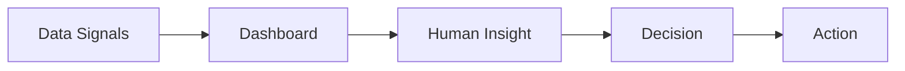
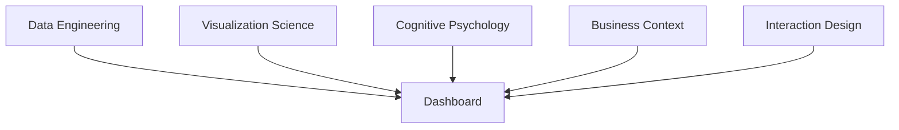
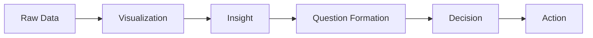
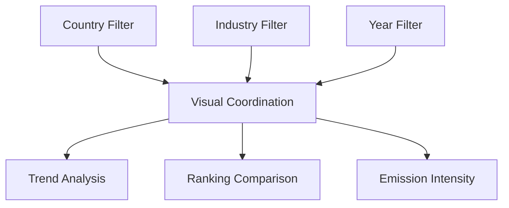
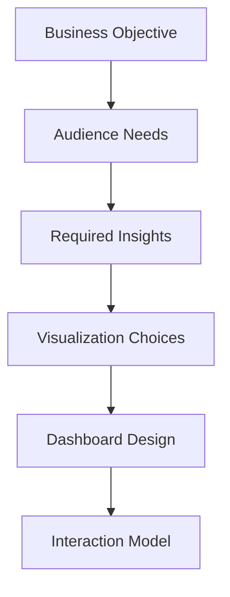
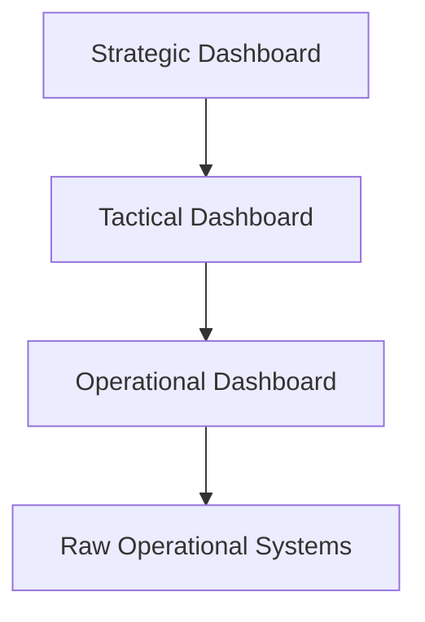
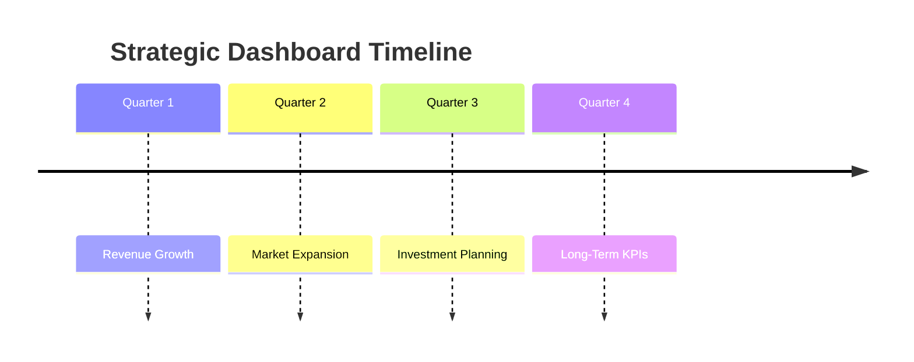
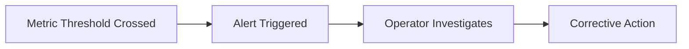
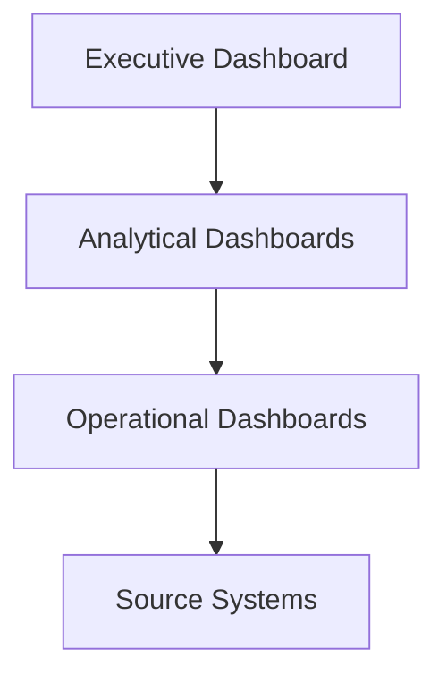

# Types of Dashboards

# Introduction

Dashboards are one of the most important systems in modern data visualization because they combine:

- visualization,
    
- storytelling,
    
- interaction,
    
- monitoring,
    
- and decision support
    

into a single analytical environment.

This transcript introduces a very important idea:

> Dashboards are a hybrid of author-driven and reader-driven storytelling.

That is fundamentally correct and extremely important.

Traditional reports are usually:

- static,
    
- linear,
    
- author-controlled.
    

Dashboards are different because:

- the author designs the analytical environment,
    
- but the reader controls the exploration path.
    

This creates a collaborative analytical narrative between:

- designer,
    
- data,
    
- and audience.
    

# Dashboards in Data Storytelling

Earlier storytelling models discussed:

|Narrative Type|Meaning|
|---|---|
|Author-driven|Creator controls the story flow|
|Reader-driven|Audience explores independently|

Dashboards combine both.

# Author-Driven Elements

The dashboard creator decides:

- which KPIs matter,
    
- which visuals appear,
    
- layout hierarchy,
    
- color schemes,
    
- interaction logic,
    
- and business framing.
    

The author defines:  
the analytical boundaries.

# Reader-Driven Elements

The user decides:

- what to filter,
    
- what to investigate,
    
- where to drill down,
    
- what comparisons to make,
    
- how deeply to explore.
    

The user defines:  
the analytical journey.

# Hybrid Narrative Architecture


# What Makes Dashboards Unique?

The transcript identifies the core differentiator:

> Interactivity.

Without interactivity,  
many dashboards are merely:  
static reports with charts.

True dashboards allow:

- exploration,
    
- filtering,
    
- monitoring,
    
- and investigative reasoning.
    

# Dashboard as an Interface

A dashboard is not simply:  
a visualization artifact.

It is:  
a human-data interface.

This is a very important conceptual shift.

The dashboard sits between:

- raw data systems,
    
- and human cognition.
    

Its purpose is to:

- reduce complexity,
    
- guide attention,
    
- and accelerate understanding.
    

# Dashboard Definition

The transcript defines dashboards as:

- collections of visualizations,
    
- graphs,
    
- narration,
    
- text,
    
- and pictorial elements,  
    working together to generate insight.
    

This is correct, but incomplete unless we add:

> Dashboards are integrated visual reasoning systems.

The value comes not from individual charts,  
but from:

- coordination,
    
- hierarchy,
    
- context,
    
- and interaction between visuals.
    

# Important Dashboard Principle

A dashboard is more than:  
“multiple charts on one page.”

It is:

- a coordinated analytical environment.
    

# Limited Space and Limited Time

The transcript emphasizes:  
important information must be surfaced within:

- limited screen space,
    
- and limited attention span.
    

This is crucial.

Dashboards operate under:  
cognitive constraints.

Users typically spend:

- seconds,  
    not minutes,  
    forming initial impressions.
    

Therefore dashboards must optimize for:

- rapid perception,
    
- low cognitive load,
    
- immediate anomaly detection.
    

# Rapid Scanning

One major dashboard objective is:  
rapid scanning.

Users should quickly identify:

- what changed,
    
- what is abnormal,
    
- what requires attention.
    

# Example

In an operations dashboard:  
users should instantly see:

- server failures,
    
- traffic spikes,
    
- security alerts,
    
- downtime risks.
    

Not after:  
10 clicks and 5 filters.

# Real-Time Visibility

Dashboards often support:  
live operational awareness.

This is especially important for:

- operations,
    
- cybersecurity,
    
- logistics,
    
- manufacturing,
    
- healthcare,
    
- trading systems.
    

# Key Principle

Visibility delay reduces decision quality.

If a dashboard updates too slowly:  
it becomes historical reporting,  
not operational intelligence.

# Action-Oriented Design

This is one of the most overlooked dashboard concepts.

Dashboards are not designed merely for:  
observation.

They are designed for:  
action.

Every dashboard should answer:

- What is happening?
    
- Why is it happening?
    
- What should be done?
    

# Strong Dashboard Design



# Characteristics of Effective Dashboards

The transcript identifies five key properties:

1. Small
    
2. Concise
    
3. Clear
    
4. Intuitive
    
5. Customized
    

Let us examine them deeply.

# 1. Small

“Small” does not mean:  
low information density.

It means:  
focused scope.

A dashboard should avoid:

- unnecessary visuals,
    
- redundant metrics,
    
- excessive navigation.
    

# Important Insight

Small dashboards often outperform massive BI portals because:  
they reduce cognitive fragmentation.

# 2. Concise

Every element must justify its existence.

Good dashboards eliminate:

- decorative visuals,
    
- redundant labels,
    
- unnecessary text,
    
- visual clutter.
    

Conciseness improves:

- scanning speed,
    
- memory retention,
    
- anomaly detection.
    

# 3. Clear

Clarity is the most important dashboard property.

Users should never wonder:

- what a chart means,
    
- what colors represent,
    
- what metric matters most.
    

# Clarity Requires

- strong hierarchy
    
- proper labeling
    
- intuitive encodings
    
- visual consistency
    
- semantic color usage
    

# 4. Intuitive

An intuitive dashboard aligns with:  
natural human perception.

Users should understand:

- where to look,
    
- what matters,
    
- and how to interact,  
    without training.
    

# Important UX Principle

The best dashboards feel obvious.

Not because the data is simple,  
but because the cognitive design is excellent.

# 5. Customized

Different users require different:

- metrics,
    
- detail levels,
    
- refresh rates,
    
- interactions,
    
- analytical depth.
    

A CFO dashboard and a warehouse operations dashboard cannot be identical.

# Role-Based Dashboarding

|Role|Dashboard Focus|
|---|---|
|CEO|Strategic KPIs|
|Analyst|Root-cause analysis|
|Operations staff|Real-time monitoring|
|Marketing team|Campaign performance|

# Dashboard Design Integrates Multiple Disciplines

The transcript correctly connects dashboards with:

- storytelling,
    
- pre-attentive attributes,
    
- communication principles,
    
- narrative design.
    

This is critical.

Dashboard design is multidisciplinary.

# Dashboard Engineering Stack



# Pre-Attentive Attributes in Dashboards

Dashboards heavily depend on:  
pre-conscious visual processing.

## Examples

|Attribute|Purpose|
|---|---|
|Color|Highlight anomalies|
|Position|Enable comparison|
|Size|Show importance|
|Contrast|Direct attention|
|Spacing|Reduce clutter|

# Example

One red KPI among gray cards immediately attracts attention.

This is intentional perceptual engineering.

# Why Dashboard Design is Difficult

Dashboards attempt to optimize competing objectives:

|Goal|Conflict|
|---|---|
|High information density|Can increase clutter|
|Interactivity|Can increase complexity|
|Simplicity|Can reduce analytical depth|
|Real-time updates|Can reduce performance|
|Flexibility|Can reduce usability|

Great dashboard design is fundamentally:  
tradeoff optimization.

# Advanced Insight

Dashboards are:  
external cognitive systems.

They extend human analytical capability by:

- compressing information,
    
- reducing memory burden,
    
- guiding attention,
    
- and accelerating reasoning.
    

This is why dashboards are so powerful in modern organizations.

# Common Dashboard Failure Modes

# 1. Dashboard as Decoration

Many dashboards prioritize:  
visual attractiveness over interpretability.

# 2. Overcrowding

Too many visuals destroy:  
attention hierarchy.

# 3. Interaction Overload

Too many filters create:  
analytical paralysis.

# 4. No Context

Metrics without business framing become meaningless.

# 5. Static Thinking

Some “dashboards” are just screenshots of reports.

Without interaction,  
their analytical value collapses.

# Important Concept Introduced by the Transcript

The transcript ends with:

> Dashboard is not just presentation of visuals, but binding them together in a particular context.

This is one of the most important dashboard principles.

A dashboard succeeds when:  
all visuals cooperate toward:

- one analytical objective,
    
- one operational narrative,
    
- or one decision framework.
    

# Final Takeaways

Dashboards are:

- interactive visual reasoning systems,  
    not merely collections of charts.
    

Their power comes from combining:

- storytelling,
    
- interaction,
    
- cognitive psychology,
    
- visualization science,
    
- and business context.
    

Effective dashboards:

- grab attention quickly,
    
- surface critical insights rapidly,
    
- reduce cognitive effort,
    
- support exploration,
    
- and enable action-oriented decision-making.
    

The best dashboards feel:

- intuitive,
    
- information-dense,
    
- visually coherent,
    
- and analytically empowering.


# Dashboard Example: CO₂ Emissions Dashboard

This section analyzes a real dashboard example using:

- CO₂ emissions data,
    
- country comparisons,
    
- industrial segmentation,
    
- and interactive filtering.
    

The transcript moves from:  
dashboard theory

to:  
dashboard interpretation and critique.

This is important because effective dashboard learning requires:

- not only understanding design principles,
    
- but also learning how to evaluate dashboards critically.
    

# Dashboards as Insight-to-Action Systems

The transcript introduces a very important concept:

> Dashboards move data into insight and insight into action.

This is one of the best ways to think about dashboards.

# Data Pipeline of Decision-Making



Dashboards are therefore not:

- reporting endpoints.
    

They are:

- decision acceleration systems.
    

# Re-emphasis of Effective Dashboard Properties

The transcript repeats five key properties:

1. Small
    
2. Clear
    
3. Concise
    
4. Intuitive
    
5. Customized
    

The repetition is intentional because:  
these principles are foundational.

# Important Clarification About “Small”

The instructor correctly clarifies:

> Small does not refer to physical size.  
> It refers to content scope.

This is critical.

A dashboard can contain:

- large visuals,
    
- dense information,
    
- rich analytics,
    

while still being:  
small in cognitive complexity.

# Cognitive Compactness

Good dashboards maximize:

$$  
\text{Insight Density} \div \text{Cognitive Effort}  
$$

The best dashboards:

- communicate more,
    
- with less mental processing.
    

# CO₂ Emissions Dashboard Overview

The dashboard uses:  
CO₂ emissions data from the International Monetary Fund.

The dashboard contains four coordinated visuals.

## Visual Components

|Visual|Purpose|
|---|---|
|CO₂ emission multipliers|Comparative emissions impact|
|CO₂ emission intensities|Efficiency analysis|
|Total CO₂ emissions|Aggregate pollution levels|
|Top 10 country comparison|Relative ranking|

This is an example of:  
multi-view coordinated analytics.

# Important Dashboard Principle

Each chart serves:  
a different analytical purpose.

Together they create:  
a richer understanding than any single chart could provide.

# Why Multiple Coordinated Views Matter

A single metric rarely explains a system completely.

For example:

|Metric|Problem|
|---|---|
|Total emissions|Ignores efficiency|
|Intensity|Ignores scale|
|Rankings|Ignore trends|
|Trends|Ignore relative position|

Combining them creates:  
multi-dimensional reasoning.

# Interactivity in the Dashboard

The dashboard allows users to select:

- country,
    
- industry subtype,
    
- year.
    

This creates:  
reader-driven analytical exploration.

# Important Insight

The dashboard author defines:  
the analytical framework.

The reader defines:  
the analytical pathway.

This hybrid model is central to dashboarding.

# Why Bar Charts Were Used

The transcript notes:  
comparison graphs use bar charts.

This is correct visualization selection.

Bar charts are ideal for:

- categorical comparison,
    
- ranking,
    
- relative magnitude evaluation.
    

# Why Line Charts Were Used

Time-based changes are represented using:  
line charts.

This is appropriate because:  
line charts encode continuity over time.

# Visualization Selection Principle

|Visualization|Best Use|
|---|---|
|Bar chart|Category comparison|
|Line chart|Temporal trends|
|Scatter plot|Correlation|
|Heatmap|Density patterns|
|Map|Geographic relationships|

Poor dashboards often fail because:  
chart type does not match analytical purpose.

# Gestalt Principles Mentioned

The transcript references:  
Gestalt principles.

This is extremely important in dashboard design.

Gestalt principles explain:  
how humans naturally organize visual information.

# Relevant Gestalt Principles Here

|Principle|Dashboard Role|
|---|---|
|Proximity|Related visuals grouped together|
|Similarity|Consistent encoding|
|Continuity|Logical visual flow|
|Closure|Pattern completion|
|Figure-ground|Attention focus|

# Close Order Principle

The dashboard arranges related charts together.

This helps users perceive:

- conceptual grouping,
    
- analytical relationships,
    
- coherent narrative flow.
    

# Visual Contrast

The transcript mentions:  
clear contrast.

Contrast is critical for:

- hierarchy,
    
- focus,
    
- anomaly detection.
    

Without contrast:  
everything competes equally for attention.

# Critical Dashboard Evaluation

The instructor provides an important critique:

> The selected country should have been highlighted in a different color.

This is excellent dashboard analysis.

# Why This Matters

If the user selects:  
India,

then India should visually stand out across charts.

Otherwise:

- interaction loses visual reinforcement,
    
- users expend more cognitive effort,
    
- dashboard responsiveness feels weaker.
    

# Example

Bad Design:

- India selected,
    
- but India bar looks identical to others.
    

Good Design:

- India highlighted in accent color,
    
- others muted.
    

This immediately reinforces:  
user context.

# Dashboard Reading Flow

The dashboard enables a natural reasoning sequence:


# Important Insight About Dashboards

The transcript introduces something deeper:

> Good dashboards generate questions.

This is extremely important.

Dashboards should not merely provide answers.

They should stimulate:

- analytical curiosity,
    
- hypothesis generation,
    
- investigative reasoning.
    

# Example from the Transcript

The dashboard shows:  
Ireland is a top CO₂ emitter in air transport.

This creates surprise because:  
Ireland is geographically small.

That cognitive mismatch triggers:  
investigation.

# This is Excellent Dashboard Behavior

The dashboard successfully created:

- anomaly perception,
    
- curiosity,
    
- exploratory reasoning.
    

# Why Ireland Appears Large in Aviation Emissions

The likely explanation:  
Ireland hosts major aircraft leasing companies and aviation-related financial structures.

This is an example of:  
data interpretation requiring domain context.

# Critical Lesson

Dashboards alone do not create understanding.

Users still require:

- domain knowledge,
    
- contextual reasoning,
    
- critical thinking.
    

# Information Balance in the Dashboard

The instructor notes:  
the four visuals do not dominate one another.

This is crucial.

Poor dashboards often contain:

- one oversized chart,
    
- competing color schemes,
    
- conflicting hierarchies.
    

Balanced dashboards create:  
stable cognitive flow.

# Dashboard Cognitive Architecture

The dashboard likely follows:



# Hidden Design Principle

This dashboard demonstrates:  
progressive analytical disclosure.

## User Journey

1. Select country
    
2. Observe metrics
    
3. Compare rankings
    
4. Notice anomalies
    
5. Form questions
    
6. Explore further
    

This mirrors:  
human analytical cognition.

# Advanced Dashboard Insight

The best dashboards:

- compress information,
    
- while expanding analytical possibility.
    

That is a paradox:  
less visible information,  
more cognitive power.

# Common Failure Modes in Similar Dashboards

# 1. Metric Redundancy

Multiple charts showing nearly identical information.

# 2. Weak Interaction Feedback

Filters applied without visual emphasis.

# 3. Poor Layout Hierarchy

Important charts buried visually.

# 4. Visual Competition

Too many colors or styles competing for attention.

# 5. No Analytical Trigger

Dashboards that show data but provoke no thinking.

# Final Takeaways

This CO₂ emissions dashboard demonstrates several advanced dashboard principles:

- coordinated visual analytics
    
- reader-driven exploration
    
- effective chart selection
    
- visual hierarchy
    
- interactivity
    
- contextual reasoning
    
- question generation
    
- cognitive guidance
    

Most importantly, it demonstrates that:

> Effective dashboards do not merely display information.  
> They actively shape analytical thinking.

# Curiosity and Analytical Thinking in Dashboards

The transcript begins with an extremely important idea:

> Dashboards should trigger inquisitive thinking.

This separates:

- passive reporting,  
    from:
    
- analytical dashboarding.
    

A good dashboard does not simply tell users:  
what happened.

It encourages users to ask:

- why did it happen?
    
- what caused it?
    
- what patterns exist?
    
- what actions are needed?
    

# Example: Ireland and CO₂ Emissions

The dashboard showed:  
Ireland appearing as a top CO₂ emitter in aviation.

This initially seems counterintuitive because:

- Ireland is geographically small,
    
- India and China have much larger populations and air traffic.
    

This creates:  
cognitive dissonance.

That is analytically useful.

# Important Dashboard Principle

Unexpected patterns create:  
investigative curiosity.

That curiosity drives:

- deeper analysis,
    
- domain exploration,
    
- hypothesis formation.
    

# Underlying Explanation

The transcript explains:  
many aircraft leasing companies operate through Ireland for tax and corporate structuring reasons.

Therefore:  
aviation-related emissions may become economically attributed to Ireland.

# Important Insight

Dashboards surface signals.  
They do not automatically explain causality.

Human interpretation remains essential.

# Dashboarding and Domain Knowledge

A dashboard without domain understanding can lead to:

- incorrect conclusions,
    
- false correlations,
    
- misleading interpretations.
    

This is why:  
data visualization alone is insufficient.

Strong analysis requires:

- statistical thinking,
    
- business understanding,
    
- contextual reasoning.
    

# Core Design Principle: Form Follows Function

The transcript introduces one of the most fundamental visualization principles:

> Form should follow function.

This principle comes from:  
design theory,  
architecture,  
and human-centered systems engineering.

# Meaning

The way a dashboard looks should be determined by:

- what it is supposed to accomplish.
    

Not by:

- aesthetics alone,
    
- tool defaults,
    
- or visual complexity.
    

# In Visualization Terms

The function determines:

- chart selection,
    
- layout,
    
- interaction,
    
- refresh frequency,
    
- information density,
    
- and narrative structure.
    

# Fundamental Dashboard Question

Before building any dashboard:

> What decision or action is this dashboard supposed to support?

This question should drive:  
everything else.

# Dashboard Design Framework



# Audience-Centric Dashboard Design

The transcript correctly emphasizes:  
dashboard design is audience-centric.

Different audiences:

- consume information differently,
    
- operate at different abstraction levels,
    
- and make different types of decisions.
    

# Why Different Dashboard Types Exist

Because:  
different users perform different cognitive tasks.

# Executive Dashboards

## Purpose

Support:

- strategic decisions,
    
- organizational monitoring,
    
- high-level comparisons.
    

## Audience

- CEOs
    
- Directors
    
- Senior leadership
    
- Board members
    

# Characteristics

|Feature|Behavior|
|---|---|
|Aggregated data|High-level summaries|
|Low detail|Minimal operational noise|
|Strategic KPIs|Revenue, growth, risk|
|Comparative focus|Competitors, benchmarks|
|Forward-looking|Trends and forecasts|

# Executive Cognitive Style

Executives typically ask:

- Are we growing?
    
- Are we compliant?
    
- Where are risks emerging?
    
- How do we compare to competitors?
    

They usually do not need:

- raw transaction detail,
    
- operational logs,
    
- minute-level diagnostics.
    

# Design Style

Executive dashboards prioritize:

- simplicity,
    
- summary,
    
- clarity,
    
- and rapid scanning.
    

# Analytical Dashboards

The transcript next describes:  
analyst-oriented dashboards.

These are fundamentally different.

# Purpose

Support:

- pattern discovery,
    
- root-cause analysis,
    
- operational optimization,
    
- exploratory reasoning.
    

# Audience

- Business analysts
    
- Data analysts
    
- Product teams
    
- Marketing analysts
    
- Operations researchers
    

# Characteristics

|Feature|Behavior|
|---|---|
|Drill-down capability|Deep exploration|
|Time-series analysis|Trend tracking|
|Correlation analysis|Relationship discovery|
|Segmentation|Detailed slicing|
|Multi-dimensional views|Rich analytical context|

# Analyst Cognitive Style

Analysts ask:

- Why did sales drop?
    
- Which regions underperformed?
    
- What caused traffic spikes?
    
- Which user segments are changing?
    
- What operational bottlenecks exist?
    

They require:

- detailed exploration,
    
- flexible filtering,
    
- investigative workflows.
    

# Key Distinction

Executives consume:

- synthesized intelligence.
    

Analysts produce:

- synthesized intelligence.
    

That changes dashboard design dramatically.

# Operational Dashboards

The transcript finally introduces:  
operations dashboards.

These are designed for:  
continuous monitoring and immediate intervention.

# Purpose

Maintain:

- uptime,
    
- stability,
    
- compliance,
    
- operational continuity.
    

# Audience

- Operations teams
    
- Network engineers
    
- DevOps
    
- Manufacturing supervisors
    
- Logistics coordinators
    

# Characteristics

|Feature|Behavior|
|---|---|
|Real-time updates|High refresh frequency|
|Alert-driven|Immediate visibility|
|Detailed monitoring|Fine-grained metrics|
|Exception-focused|Highlight anomalies|
|Action-oriented|Trigger intervention|

# Operational Cognitive Style

Operations users ask:

- Is something failing?
    
- Is latency increasing?
    
- Is throughput dropping?
    
- Are thresholds violated?
    
- Is immediate action required?
    

# Key Difference from Analysts

Analysts:

- investigate.
    

Operators:

- react.
    

# Dashboard Type Comparison

|Feature|Executive|Analytical|Operational|
|---|---|---|---|
|Time Horizon|Long-term|Medium-term|Immediate|
|Granularity|Aggregate|Detailed|Highly granular|
|Refresh Rate|Daily/weekly|Hourly/daily|Real-time|
|Goal|Strategy|Insight discovery|Stability|
|Interaction Depth|Low|High|Medium|
|Cognitive Focus|Monitoring|Exploration|Response|

# Important Insight

Dashboard design is fundamentally:  
decision-design.

Different decisions require:  
different information architectures.

# Function Drives Dashboard Form

This is the key lesson of the transcript.

## Executive Dashboard

Function:  
strategic awareness

Form:  
simple KPI summaries

## Analytical Dashboard

Function:  
deep exploration

Form:  
interactive multi-dimensional analytics

## Operational Dashboard

Function:  
real-time intervention

Form:  
live alerts and monitoring systems

# Failure Mode: One Dashboard for Everyone

One of the biggest BI mistakes is:  
trying to create one universal dashboard.

This usually fails because:  
different users require incompatible levels of detail.

# Example

Executives do not want:

- server logs,
    
- SQL query diagnostics,
    
- minute-level operational charts.
    

Operators do not want:

- quarterly strategic summaries.
    

# Advanced Insight

Dashboards are:  
cognitive instruments.

Just as:

- microscopes,
    
- telescopes,
    
- and radar systems  
    serve different observational purposes,
    

different dashboards support different forms of organizational cognition.

# Dashboard Hierarchy Architecture



This hierarchy mirrors:  
organizational decision structure.

# Hidden Principle in the Transcript

The transcript repeatedly implies:  
dashboard complexity should match decision complexity.

This is critical.

Too much detail:  
creates noise.

Too little detail:  
creates blindness.

# Final Takeaways

This section establishes several foundational principles:

- dashboards should provoke inquiry,
    
- form must follow function,
    
- dashboard design is audience-centric,
    
- different decisions require different dashboard architectures,
    
- and dashboards are fundamentally tools for cognitive support.
    

Most importantly:

> There is no universally “correct” dashboard design.

A dashboard is effective only if:  
its structure aligns with:

- user goals,
    
- decision context,
    
- and operational function.

# Determining Dashboard Types

This final section explains a critical idea:

> The dashboard structure changes because the function changes.

This is the core principle behind dashboard taxonomy.

The dashboard itself remains:

- a visual decision-support system.
    

But:

- the audience,
    
- decision speed,
    
- analytical depth,
    
- and operational requirements
    

change dramatically across contexts.

Therefore:  
different dashboard architectures emerge.

# Central Principle

The transcript reinforces:

> Function determines dashboard form.

This principle governs:

- layout,
    
- interaction,
    
- granularity,
    
- refresh rate,
    
- visualization choice,
    
- and information density.
    

# Three Core Dashboard Types

The discussion has now fully established the three primary dashboard categories:

|Dashboard Type|Primary Goal|
|---|---|
|Strategic Dashboard|Long-term organizational direction|
|Analytical Dashboard|Exploration and diagnosis|
|Operational Dashboard|Real-time monitoring and intervention|

# What Determines Dashboard Type?

The transcript identifies three major determining factors:

1. Time sensitivity
    
2. Level of interactivity
    
3. Nature of decisions supported
    

These are extremely important design dimensions.

# 1. Time Sensitivity

## Definition

Time sensitivity refers to:  
how quickly data changes and how rapidly decisions must be made.

This fundamentally changes:  
dashboard architecture.

# Strategic Dashboards

Strategic decisions operate over:

- weeks,
    
- months,
    
- quarters,
    
- or years.
    

Examples:

- market expansion,
    
- investment planning,
    
- growth strategy,
    
- compliance direction.
    

## Characteristics

- Lower refresh frequency
    
- Aggregated trends
    
- Historical comparisons
    
- Forecast-oriented views
    

# Strategic Time Horizon



# Operational Dashboards

Operational systems function in:

- real time,
    
- hourly,
    
- minute-level windows,
    
- or even milliseconds.
    

Examples:

- server uptime,
    
- fraud detection,
    
- manufacturing failures,
    
- trading systems.
    

# Operational Time Horizon

```mermaid
timeline
    title Operational Dashboard Timeline
    09:00 : System Alert
    09:05 : Traffic Spike
    09:06 : Failure Detection
    09:07 : Corrective Action
```

# Key Principle

Decision latency tolerance determines dashboard design.

If delays are unacceptable:  
the dashboard must prioritize:

- speed,
    
- visibility,
    
- and alerts.
    

# Analytical Dashboards Sit Between Both

Analytical dashboards typically operate in:

- medium-term reasoning windows.
    

They often analyze:

- days,
    
- weeks,
    
- campaigns,
    
- customer behavior trends,
    
- operational performance shifts.
    

# Analytical Dashboard Goal

Not immediate reaction.  
Not long-term strategy.

Instead:

- diagnosis,
    
- explanation,
    
- optimization.
    

# 2. Level of Interactivity

The transcript next explains:  
dashboard types differ in interaction complexity.

# Strategic Dashboards

Executives generally require:

- low-to-moderate interaction.
    

Why?

Because they consume:

- synthesized summaries,
    
- high-level indicators,
    
- directional trends.
    

Too much interaction:  
creates unnecessary cognitive friction.

# Strategic Dashboard Interaction

Typically includes:

- regional filters,
    
- department comparisons,
    
- time selectors,
    
- KPI drill summaries.
    

But usually avoids:

- transaction-level exploration,
    
- deep operational slicing.
    

# Analytical Dashboards

Analytical dashboards require:  
high interactivity.

This is because analysts:

- investigate,
    
- explore,
    
- test hypotheses,
    
- and search for patterns.
    

# Typical Analytical Interactions

|Feature|Purpose|
|---|---|
|Drill-down|Root-cause analysis|
|Multi-filtering|Segmentation|
|Time windows|Trend analysis|
|Cross-highlighting|Relationship discovery|
|Dynamic dimensions|Flexible exploration|

# Operational Dashboards

Operational dashboards occupy an interesting middle ground.

They need:

- rapid interaction,  
    but:
    
- minimal complexity.
    

Operators often cannot spend time:  
exploring deeply.

They need:

- immediate signal clarity,
    
- quick response capability.
    

# Operational Dashboard Design Philosophy

Minimize:

- interaction friction.
    

Maximize:

- action visibility.
    

# Important Insight

More interactivity is not always better.

Interaction must match:

- decision speed,
    
- user expertise,
    
- and operational context.
    

# 3. Nature of Decisions Supported

This is perhaps the most important differentiator.

Dashboard structure changes because:  
the decisions themselves differ fundamentally.

# Strategic Decisions

Strategic decisions are:

- forward-looking,
    
- broad,
    
- high-level,
    
- uncertain,
    
- and long-term.
    

Examples:

- entering new markets,
    
- resource allocation,
    
- organizational restructuring,
    
- sustainability planning.
    

# Strategic Dashboard Focus

Executives ask:

- Where are we heading?
    
- What risks are emerging?
    
- How do we compare competitively?
    
- What long-term trends matter?
    

# Analytical Decisions

Analytical decisions focus on:

- understanding causes,
    
- finding relationships,
    
- identifying opportunities.
    

Analysts ask:

- Why did conversion rates fall?
    
- What caused customer churn?
    
- Which regions underperform?
    
- What patterns are emerging?
    

# Operational Decisions

Operational decisions are:

- immediate,
    
- predefined,
    
- procedural,
    
- and action-triggered.
    

Examples:

- restart a failed server,
    
- reroute logistics,
    
- resolve inventory shortages,
    
- handle system downtime.
    

# Operational Dashboard Logic

Operational dashboards often support:  
if-this-then-that workflows.

Example:



# Important Organizational Insight

Dashboard hierarchy mirrors:  
organizational decision hierarchy.

|Organization Layer|Dashboard Type|
|---|---|
|Leadership|Strategic|
|Analysts|Analytical|
|Operations|Operational|

# Key Tradeoff Dimensions

Dashboard design involves balancing:

|Dimension|Strategic|Analytical|Operational|
|---|---|---|---|
|Detail|Low|High|Medium-High|
|Speed|Lower|Medium|Very High|
|Interactivity|Medium|Very High|Focused|
|Refresh Frequency|Low|Medium|High|
|Time Horizon|Long|Medium|Immediate|
|Action Type|Strategic|Investigative|Reactive|

# Advanced Insight

Dashboard architecture is fundamentally:  
organizational cognition engineering.

Different dashboards support different forms of thinking:

|Dashboard Type|Cognitive Mode|
|---|---|
|Strategic|Abstract reasoning|
|Analytical|Exploratory reasoning|
|Operational|Reactive monitoring|

# Why One Dashboard Usually Fails

Many organizations attempt:  
“single source dashboards for everyone.”

This often fails because:  
different users require incompatible information structures.

Example:

- Executives want compression.
    
- Analysts want expansion.
    
- Operators want immediacy.
    

One layout rarely satisfies all three effectively.

# Layered Dashboard Ecosystems

Strong organizations usually create:  
dashboard ecosystems.



Each layer:

- abstracts complexity differently,
    
- based on decision needs.
    

# Hidden Principle in the Transcript

The transcript repeatedly implies:

> Dashboard effectiveness is contextual.

There is no universally perfect dashboard.

A dashboard succeeds only when:

- its design aligns with,
    
    - decision velocity,
        
    - user cognition,
        
    - business objectives,
        
    - and operational constraints.
        

# Final Takeaways

This section completes the conceptual framework for dashboard classification.

The key lessons are:

- dashboards differ because decisions differ,
    
- time sensitivity shapes dashboard architecture,
    
- interactivity must match user needs,
    
- strategic, analytical, and operational dashboards serve fundamentally different cognitive purposes,
    
- and dashboard design must always follow function.
    

Most importantly:

> A dashboard is not designed around data alone.  
> It is designed around human decision-making behavior.