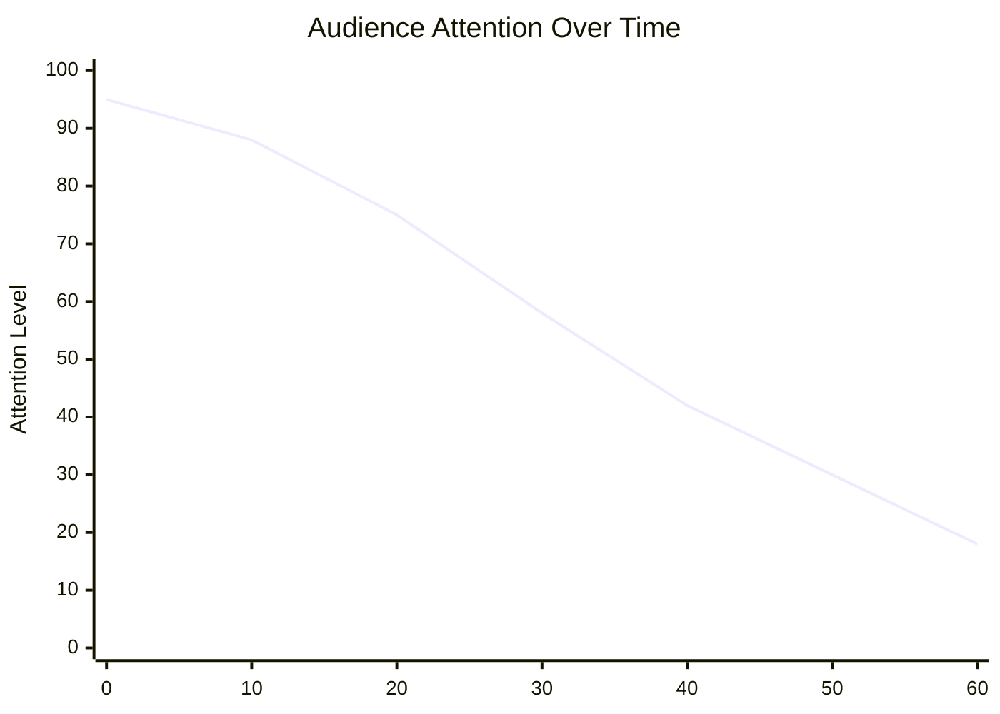

# Attention Curve

```mermaid
xychart-beta
    title "Audience Attention Over Time"
    x-axis [0,10,20,30,40,50,60]
    y-axis "Attention Level" 0 --> 100
    line [95,88,75,58,42,30,18]
```

This is why:  
brevity matters.
