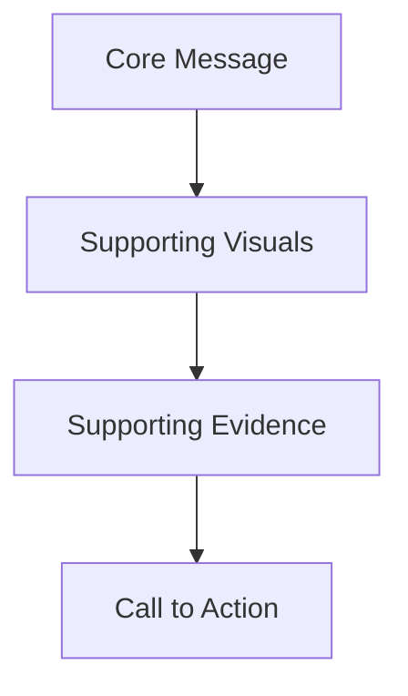

# Strong Presentation Structure

```mermaid
flowchart TD
    A[Core Message]
    --> B[Supporting Visuals]
    --> C[Supporting Evidence]
    --> D[Call to Action]
```

Everything should support:  
the central narrative.
