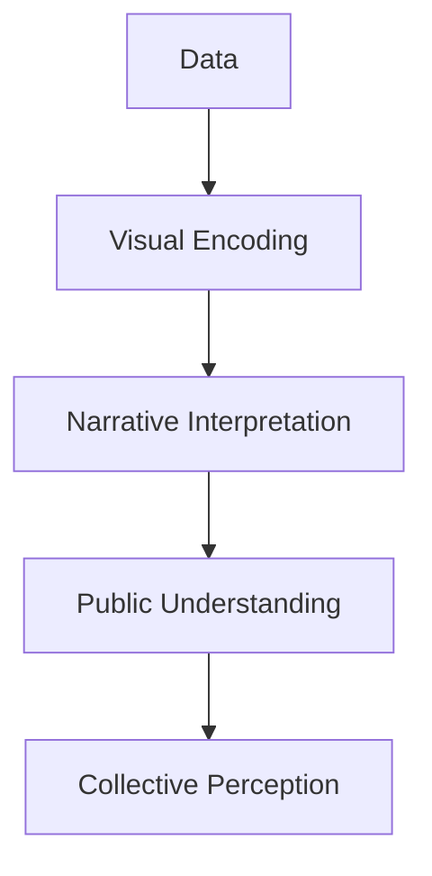
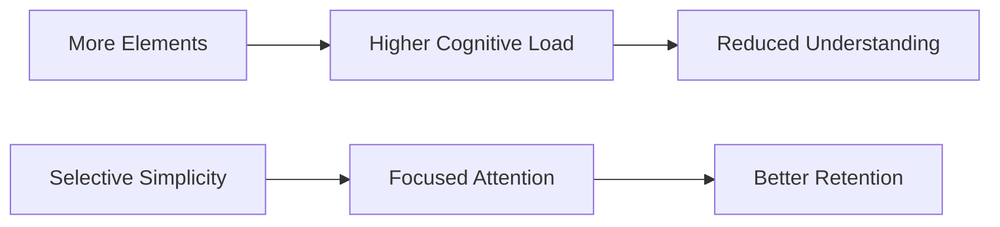
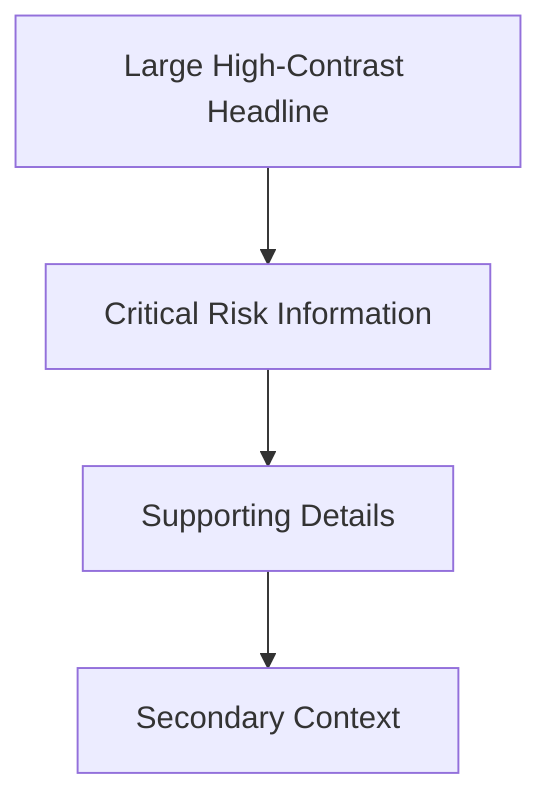

# The Power and Science of Storytelling

# Introduction

Storytelling is one of the oldest and most powerful cognitive technologies humans have ever developed.

Long before:

- writing,
    
- databases,
    
- dashboards,
    
- or statistical reports,
    

humans transmitted:

- survival knowledge,
    
- cultural values,
    
- history,
    
- strategy,
    
- and social identity
    

through stories.

Modern business communication still relies heavily on storytelling because:  
human cognition is fundamentally narrative-driven.

This section explains:

- why storytelling is powerful,
    
- why humans remember stories better than raw information,
    
- and how storytelling influences decision-making, persuasion, and memory.
    

# Why Storytelling Matters

The transcript highlights three major functions of storytelling:

1. Retention
    
2. Persuasion
    
3. Emotional connection
    

These are not accidental.  
They emerge directly from how the human brain processes information.

# 1. Retention

Humans remember stories significantly better than isolated facts.

# Why?

Because stories create:

- structure,
    
- sequence,
    
- causality,
    
- emotional relevance,
    
- and meaning.
    

Raw data is difficult for the brain to organize naturally.

Stories provide:  
cognitive scaffolding.

# Example from the Transcript

Most people can recall:

- movie scenes,
    
- character arcs,
    
- emotional moments,
    
- dialogue,
    
- plot twists,
    

from films watched years ago.

But they cannot remember:

- quarterly revenue reports,
    
- KPI tables,
    
- annual business presentations.
    

This demonstrates:  
memory is context-dependent.

# Human Memory Is Associative

The brain remembers information better when it is connected to:

- emotion,
    
- sequence,
    
- conflict,
    
- imagery,
    
- and causality.
    

Stories naturally contain all of these elements.

# Memory Architecture of Storytelling


# 2. Persuasion

The transcript references the Harvard Business Review discussing storytelling as a persuasion tool.

This is critically important in:

- leadership,
    
- management,
    
- sales,
    
- marketing,
    
- politics,
    
- and data communication.
    

# Why Stories Persuade Better Than Facts Alone

Facts often trigger:

- analytical resistance,
    
- skepticism,
    
- argumentation.
    

Stories bypass some of this resistance because:  
they create experiential immersion.

Instead of saying:

> “Customer satisfaction improved by 15%”

a story says:

> “A frustrated customer who almost left the platform became a loyal advocate after the redesign.”

The second creates:

- visualization,
    
- empathy,
    
- relatability,
    
- and emotional resonance.
    

# Important Insight

Humans do not make decisions purely rationally.

Most decisions are:

- emotionally initiated,
    
- then rationally justified afterward.
    

Stories influence:  
the emotional layer of cognition.

# Storytelling in Leadership

Leaders use storytelling to:

- align teams,
    
- communicate vision,
    
- motivate action,
    
- explain change,
    
- reduce uncertainty.
    

# Example

Compare:

## Raw Statement

> “We must improve operational efficiency by 18%.”

Versus:

## Story-Driven Statement

> “Last quarter, one delayed shipment caused three major customers to reconsider renewal contracts. Improving operational efficiency is not just about cost reduction. It directly affects customer trust and long-term survival.”

The second creates:

- urgency,
    
- meaning,
    
- context,
    
- and emotional understanding.
    

# 3. Cognitive Value of Structured Narratives

The transcript states:

> A structured story aids memory recall.

This aligns with cognitive psychology research.

# Why Structure Matters

Stories usually contain:

- beginning,
    
- conflict,
    
- progression,
    
- resolution.
    

This structure mirrors how humans process events in real life.

# Narrative Structure


The brain naturally searches for:

- cause,
    
- consequence,
    
- sequence,
    
- and meaning.
    

Stories satisfy this cognitive expectation.

# Brain Activation and Stories

The transcript mentions:  
stories activate multiple centers of the brain.

This is supported by neuroscience research.

# Raw Facts vs Stories

## Raw Facts

Mainly activate:

- language processing areas.
    

## Stories

Can activate:

- sensory cortex,
    
- motor cortex,
    
- emotional regions,
    
- memory systems,
    
- predictive reasoning systems.
    

# Example

When someone says:

> “The coffee was hot.”

the brain may activate:  
temperature-related sensory regions.

When hearing:

> “He sprinted toward the airport.”

motor planning regions may partially activate.

This phenomenon is called:  
neural coupling or embodied simulation.

# Important Insight

Stories simulate experience.

That is why they feel immersive.

# Jerome Bruner’s Theory

The transcript references Jerome Bruner.

The famous claim:

> Facts are 22 times more memorable when wrapped in narrative.

Whether the exact numerical multiplier varies across studies is debated,  
but the core principle is strongly supported:

Narrative dramatically improves recall.

# Why Narrative Improves Recall

Narratives provide:

- context,
    
- emotional encoding,
    
- causality,
    
- sequence,
    
- relational meaning.
    

Raw facts lack these memory anchors.

# Example

Difficult to remember:

- “Revenue increased 12%.”
    

Easier to remember:

> “After redesigning the onboarding process, first-time customer retention improved, leading to a 12% revenue increase.”

Now the fact has:

- cause,
    
- sequence,
    
- interpretation,
    
- and meaning.
    

# Emotional Connection

The transcript emphasizes:  
emotional relation.

This is crucial.

Emotion acts as:  
a memory amplifier.

# Emotional Encoding

Emotion increases:

- attention,
    
- neurological activation,
    
- and long-term retention.
    

This is why:  
emotionally charged experiences are remembered vividly.

# In Business Communication

Pure statistics often fail because:  
they are emotionally neutral.

Stories transform abstract metrics into:  
human experiences.

# Example

Instead of:

> “10,000 users experienced outages.”

A story says:

> “Hospitals lost access to patient records for 27 minutes during peak emergency operations.”

The second creates:

- immediacy,
    
- seriousness,
    
- emotional engagement.
    

# Storytelling in Data Visualization

This directly connects to dashboards and visual storytelling.

Charts alone often fail to communicate meaning.

Strong data storytelling combines:

- data,
    
- narrative,
    
- context,
    
- and emotion.
    

# Data Storytelling Pipeline


# Important Distinction

Storytelling is not:  
data manipulation.

Good storytelling:

- clarifies meaning,
    
- preserves truth,
    
- and improves comprehension.
    

Bad storytelling:

- distorts evidence,
    
- exaggerates claims,
    
- manipulates emotion.
    

# Common Misunderstanding

Many people assume storytelling means:

- oversimplification,
    
- entertainment,
    
- or emotional manipulation.
    

Actually:  
effective storytelling is:  
structured communication design.

# Storytelling as Compression

Stories compress:

- complexity,
    
- causality,
    
- and meaning
    

into cognitively manageable forms.

This is similar to how dashboards compress operational information.

# Advanced Cognitive Insight

Humans evolved socially.  
Stories likely evolved because they improved:

- coordination,
    
- teaching,
    
- memory transfer,
    
- and collective survival.
    

Storytelling is therefore not merely communication.  
It is:  
a core human cognitive mechanism.

# Storytelling in Business Analytics

Modern analytics increasingly depends on:  
storytelling capability.

Because:

- data without interpretation rarely changes behavior.
    

# Analysts Who Influence Organizations

Usually excel not only at:

- analysis,  
    but at:
    
- narrative framing.
    

# Example

Weak analyst:

> “Metric X decreased by 7%.”

Strong analyst:

> “Customer drop-off increased sharply after onboarding friction rose in mobile devices, suggesting UX instability is affecting conversion.”

The second tells:  
a causal story.

# Common Storytelling Failures

# 1. Data Dumping

Too many facts without narrative structure.

# 2. Emotional Manipulation

Using emotion without evidence.

# 3. No Audience Context

Ignoring what the audience actually values.

# 4. No Clear Conflict

Stories require tension:

- problem,
    
- risk,
    
- challenge,
    
- uncertainty.
    

# 5. No Resolution

Good stories lead toward:

- insight,
    
- meaning,
    
- or action.
    

# Final Takeaways

Storytelling is powerful because it aligns with:  
how human cognition naturally works.

Stories improve:

- memory,
    
- persuasion,
    
- emotional engagement,
    
- and understanding.
    

The science behind storytelling involves:

- neural activation,
    
- emotional encoding,
    
- associative memory,
    
- and structured cognition.
    

Most importantly:

> Humans rarely remember isolated facts.  
> They remember meaning embedded in narrative.

# 2. Visual Storytelling in Action

# Introduction

Visual storytelling is the combination of:

- data,
    
- visuals,
    
- and narrative structure
    

to shape:

- interpretation,
    
- understanding,
    
- memory,
    
- and public perception.
    

This is fundamentally different from:  
simply displaying charts.

Visual storytelling attempts to answer:

> What does the data mean?

not merely:

> What does the data show?

# Why Visual Storytelling Matters

Humans process visuals faster than text.

When visuals are combined with:

- narrative,
    
- emotional framing,
    
- and contextual meaning,
    

they become extremely persuasive cognitive tools.

# Core Idea

Visual storytelling transforms:

- abstract information
    

into:

- interpretable human meaning.
    

# Visual Storytelling Pipeline


# Real-World Example: 2000 U.S. Election Maps

The transcript references the 2000 U.S. presidential election.

Media organizations used:

- red-colored states for Republicans,
    
- blue-colored states for Democrats.
    

This eventually became:  
a deeply embedded political visual language in the United States.

# Why This Example Matters

The visualization did more than:  
display election results.

It shaped:

- political identity,
    
- geographic perception,
    
- media narratives,
    
- and national interpretation.
    

# Important Insight

Visualizations are not neutral.

They influence:

- attention,
    
- emotional response,
    
- interpretation,
    
- and belief formation.
    

# The Power of Color Encoding

The election maps used:

- color coding,
    
- geographic partitioning,
    
- spatial dominance.
    

These created powerful psychological effects.

# Example

Large rural states visually dominated maps because:  
they occupy more geographic area.

This often created the perception that:  
Republicans dominated the country geographically,  
even when population distribution was more balanced.

# Important Visualization Bias

Geographic area ≠ population density.

This is a classic visualization distortion issue.

# Choropleth Map Bias

The election maps are examples of:  
choropleth maps.

These can unintentionally exaggerate:

- spatial dominance,
    
- regional influence,
    
- geographic scale.
    

# Visualization and Narrative Formation

The transcript correctly states:

> The visuals did not just display numbers.  
> They helped build a national narrative.

This is extremely important.

Visualizations can:

- reinforce ideologies,
    
- simplify complexity,
    
- amplify emotional interpretations,
    
- and shape collective memory.
    

# Data + Narrative = Perception Engine



# Important Lesson

Every visualization:  
implicitly tells a story.

Even if the creator claims neutrality.

Choices about:

- color,
    
- scale,
    
- ordering,
    
- framing,
    
- comparison,
    
- and emphasis
    

all shape interpretation.

# Visual Storytelling vs Raw Visualization

|Raw Visualization|Visual Storytelling|
|---|---|
|Displays data|Communicates meaning|
|Focuses on metrics|Focuses on interpretation|
|Often static|Often narrative-driven|
|Reader interprets alone|Author guides understanding|

# Good Visual Storytelling

Good visual storytelling:

- clarifies complexity,
    
- preserves truth,
    
- improves understanding,
    
- reduces ambiguity.
    

# Bad Visual Storytelling

Bad visual storytelling:

- manipulates emotion,
    
- distorts scale,
    
- exaggerates differences,
    
- or hides uncertainty.
    

# Important Ethical Principle

Powerful storytelling increases responsibility.

Because:  
visual narratives can influence:

- elections,
    
- markets,
    
- public trust,
    
- and social behavior.
    

# Psychological Power of Visuals

Humans are highly responsive to:

- patterns,
    
- contrast,
    
- movement,
    
- color,
    
- and spatial organization.
    

Visual storytelling leverages:  
pre-attentive cognition.

This allows audiences to:  
“feel” patterns before consciously analyzing them.

# Example

A mostly red election map immediately creates:  
a perception of political dominance.

Even before users inspect:  
population counts,  
electoral votes,  
or demographic nuance.

# Advanced Insight

Visual storytelling works because:  
the human brain evolved for:  
pattern-based environmental interpretation.

Stories + visuals combine:

- emotional cognition,
    
- spatial cognition,
    
- and associative memory.
    

This creates very strong persuasive force.

# 3. Frameworks for Effective Presentations

The lecture now shifts toward:  
presentation design frameworks.

This is important because:  
good storytelling can fail if presentation structure is poor.

# Problem with Most Presentations

Most business presentations suffer from:

- clutter,
    
- excessive text,
    
- weak hierarchy,
    
- overloaded slides,
    
- and cognitive fatigue.
    

The result:  
audiences stop processing information.

# Important Principle

More information does not create more understanding.

Often:  
it creates less.

# Presentation as Cognitive Design

Presentations are not:  
information dumps.

They are:  
attention-management systems.

# Presentation Zen by Garr Reynolds

The transcript references:  
Presentation Zen.

This framework emphasizes:

- simplicity,
    
- clarity,
    
- minimalism,
    
- and meaningful communication.
    

# Core Philosophy

The goal is not:  
to maximize slide content.

The goal is:  
to maximize audience understanding.

# A. Restraint

## Definition

Remove:  
everything unnecessary.

This is one of the most difficult design skills.

# Why Restraint Matters

Every unnecessary element creates:

- cognitive noise,
    
- attentional competition,
    
- reduced clarity.
    

# Common Slide Problems

- Too much text
    
- Excessive bullet points
    
- Decorative graphics
    
- Tiny fonts
    
- Overloaded tables
    
- Multiple unrelated ideas
    

# Cognitive Load Theory

Human working memory is limited.

Overloaded slides exceed:  
processing capacity.

# Restraint Principle



# Important Design Insight

Good presenters spend more time:  
removing information,  
than adding it.

# B. Simplicity

The framework emphasizes:

- whitespace,
    
- one idea per slide,
    
- clean layouts.
    

# Why Whitespace Matters

Whitespace is not:  
empty space.

It is:  
attention control.

Whitespace:

- separates concepts,
    
- improves readability,
    
- reduces visual stress,
    
- guides focus.
    

# Example

Bad Slide:

- 12 bullets
    
- 3 charts
    
- 2 tables
    
- 5 colors
    

Good Slide:

- 1 key message
    
- 1 supporting visual
    
- strong visual hierarchy
    

# One Idea Per Slide

This is extremely important.

Most audiences cannot deeply process:  
multiple competing concepts simultaneously.

# Slide Narrative Flow


# Why Simplicity Feels Powerful

Simple presentations:

- reduce mental friction,
    
- improve confidence,
    
- increase perceived clarity,
    
- strengthen persuasion.
    

# Important Misconception

Simplicity is not:  
lack of sophistication.

True simplicity often requires:  
deep understanding.

# Einstein Principle

Often paraphrased as:

> “If you cannot explain it simply, you do not understand it well enough.”

# Relationship to Dashboard Design

Presentation Zen principles strongly overlap with:  
dashboard design principles.

Both prioritize:

- clarity,
    
- hierarchy,
    
- cognitive efficiency,
    
- and intentional focus.
    

# Dashboard vs Presentation

|Dashboard|Presentation|
|---|---|
|Interactive|Usually linear|
|Exploratory|Author-guided|
|Persistent monitoring|Sequential storytelling|
|Multi-path reasoning|Controlled narrative flow|

But both rely heavily on:

- visual cognition,
    
- storytelling,
    
- and attention management.
    

# Common Presentation Failures

# 1. Slide as Teleprompter

Slides overloaded with full paragraphs.

# 2. Bullet Point Abuse

Too many nested bullets destroy attention.

# 3. Decorative Noise

Animations and excessive styling reduce clarity.

# 4. Multiple Competing Messages

No dominant idea per slide.

# 5. No Narrative Flow

Disconnected slides without logical progression.

# Final Takeaways

Visual storytelling transforms:  
data into interpretable narrative.

It shapes:

- perception,
    
- memory,
    
- and understanding.
    

The 2000 U.S. election example demonstrates how:  
visual encoding can influence national interpretation and collective narratives.

Frameworks like Presentation Zen emphasize:

- restraint,
    
- simplicity,
    
- whitespace,
    
- and focused communication.
    

The deeper lesson is:

> Effective communication is not about showing more information.  
> It is about reducing cognitive friction while maximizing meaning.

# Frameworks for Effective Presentations

This section introduces three major presentation frameworks:

1. Presentation Zen
    
2. SUCCESS Model
    
3. Pecha Kucha
    

These frameworks all attempt to solve the same problem:

> Humans have limited attention, limited working memory, and low tolerance for cognitive overload.

Good presentation design is therefore:

- cognitive engineering,  
    not decorative slide creation.
    

# A. Presentation Zen

The Presentation Zen framework by Garr Reynolds emphasizes:

- simplicity,
    
- authenticity,
    
- clarity,
    
- and minimalism.
    

Its philosophy strongly overlaps with:

- dashboard design,
    
- storytelling theory,
    
- and cognitive psychology.
    

# 1. Naturalness

The transcript emphasizes:

- authentic voice,
    
- natural delivery,
    
- eye contact.
    

This matters because:  
presentations are social communication systems,  
not merely information transfer systems.

# Why Authenticity Matters

Audiences unconsciously evaluate:

- confidence,
    
- credibility,
    
- sincerity,
    
- emotional congruence.
    

Over-scripted delivery creates:

- cognitive distance,
    
- lower trust,
    
- reduced engagement.
    

# Human Communication Is Multi-Channel

Communication is not just:  
words.

It also includes:

- tone,
    
- pacing,
    
- pauses,
    
- posture,
    
- facial expression,
    
- visual emphasis.
    

# Important Insight

Slides should support the speaker.  
They should not replace the speaker.

# Common Failure

Many presenters:

- read directly from slides,
    
- overload text,
    
- avoid audience connection.
    

This destroys:  
engagement and retention.

# Eye Contact and Cognitive Engagement

Eye contact improves:

- attention,
    
- emotional connection,
    
- perceived confidence,
    
- audience involvement.
    

This is because humans evolved for:  
face-to-face communication.

# Presentation Mistake

People often treat presentations as:  
document projection.

But presentations are:  
live narrative performances.

# B. The SUCCESS Model

The transcript references the SUCCESS framework by Chip Heath and Dan Heath.

The framework explains:  
why certain ideas become memorable or “sticky.”

# SUCCESS Acronym

|Letter|Meaning|
|---|---|
|S|Simple|
|U|Unexpected|
|C|Concrete|
|C|Credible|
|E|Emotional|
|S|Storied|

This framework is deeply connected to:  
human cognitive architecture.

# 1. Simple

Simple does not mean:  
shallow.

It means:  
clear and cognitively compressible.

# Example

Bad:

> “Our multi-channel optimization initiative improved customer lifecycle efficiency.”

Better:

> “Customers now buy faster and leave less often.”

# Cognitive Principle

The brain prefers:  
compressed meaning structures.

# 2. Unexpected

Humans pay attention to:  
surprise.

Unexpected information creates:  
prediction error.

Prediction error increases:  
attention and memory encoding.

# Example

Instead of:

> “Climate change affects weather.”

Unexpected framing:

> “Some cities may become physically uninsurable within decades.”

# Why This Works

The brain constantly predicts reality.

Unexpected information interrupts:  
automatic filtering.

# 3. Concrete

Abstract language is difficult to remember.

Concrete examples:

- create imagery,
    
- improve mental simulation,
    
- increase clarity.
    

# Example

Abstract:

> “Operational inefficiency increased.”

Concrete:

> “Warehouse workers walked an extra 14 miles daily due to poor inventory layout.”

Concrete information is:  
visually imaginable.

# 4. Credible

People trust information when:

- evidence exists,
    
- expertise is demonstrated,
    
- examples feel believable.
    

# Credibility Sources

|Source|Example|
|---|---|
|Data|Metrics/statistics|
|Authority|Experts/institutions|
|Experience|Case studies|
|Specificity|Detailed examples|

# Important Insight

Precision often increases credibility.

Example:

> “17% increase”

feels more trustworthy than:

> “large increase.”

# 5. Emotional

Emotion improves:

- attention,
    
- memory,
    
- persuasion,
    
- action likelihood.
    

# Why?

Emotion signals:  
importance.

The brain prioritizes emotionally relevant information.

# Example

Weak:

> “Flooding increased.”

Strong:

> “Thousands lost homes after the river exceeded historical flood levels.”

# 6. Storied

Stories organize:

- causality,
    
- conflict,
    
- meaning,
    
- emotional progression.
    

Stories create:  
narrative memory structures.

# SUCCESS Cognitive Pipeline


# Why SUCCESS Works

The framework aligns with:  
how humans naturally process information.

It optimizes:

- attention,
    
- comprehension,
    
- retention,
    
- and persuasion.
    

# C. Pecha Kucha: The Art of Visual Brevity

The transcript next introduces:  
Pecha Kucha.

This originated in Japan as a response to:  
overlong, overloaded presentations.

# Core Philosophy

> Talk less. Show more.

This is extremely important.

Most presentations fail because:

- they overwhelm audiences with words.
    

# Pecha Kucha Format

|Element|Rule|
|---|---|
|Slides|20|
|Time per slide|20 seconds|
|Total duration|6 minutes 40 seconds|

# Why This Format Exists

The format forces:

- brevity,
    
- prioritization,
    
- visual emphasis,
    
- narrative discipline.
    

# Important Constraint Principle

Constraints often improve communication quality.

Without constraints:  
people overload slides endlessly.

# Pecha Kucha Cognitive Benefits

|Benefit|Explanation|
|---|---|
|Faster pacing|Sustains attention|
|Less text|Reduces overload|
|Stronger visuals|Improves memory|
|Narrative discipline|Forces clarity|

# Presentation Cognitive Failure

Humans cannot sustain deep attention for:  
long, repetitive slide decks.

# Typical Corporate Failure

- 70-slide presentations
    
- tiny text
    
- endless bullets
    
- repeated metrics
    
- low visual hierarchy
    

This produces:  
cognitive fatigue.

# Visual Communication Principle

Slides should:  
amplify speech,  
not duplicate speech.

# Death by Presentation

This phrase refers to:  
audience disengagement caused by:

- clutter,
    
- excessive bullets,
    
- poor hierarchy,
    
- and overloaded content.
    

# Important Insight

Most presentation failure is:  
not informational failure.

It is:  
attention management failure.

# Cognitive Overload

Working memory is limited.

When slides contain:

- dense paragraphs,
    
- multiple fonts,
    
- excessive concepts,
    
- competing visuals,
    

the audience stops processing meaning effectively.

# NASA Columbia Shuttle Disaster (2003)

The transcript introduces one of the most important communication failure case studies in modern engineering history:

the Space Shuttle Columbia disaster.

# Why This Case Matters

This was not merely:  
a technical failure.

It was also:  
a communication failure.

# The Core Problem

Critical safety concerns were buried inside:  
poor presentation design.

This is extraordinarily important.

Poor communication in high-stakes systems can become:  
catastrophic.

# Problems in the Slide

# 1. Clutter

The slide contained:

- dense bullets,
    
- multiple font sizes,
    
- long sentences,
    
- weak hierarchy.
    

This created:  
signal dilution.

# Important Principle

When everything looks important:  
nothing looks important.

# 2. Vague Language

Terms like:  
“significant”  
and  
“significantly”

were used ambiguously.

# Critical Problem

In technical contexts:  
words require precision.

“Significant” can mean:

- statistically significant,
    
- operationally significant,
    
- visually large,
    
- emotionally important.
    

Ambiguity in high-risk environments is dangerous.

# 3. Poor Hierarchy

The most critical warning:

- flight conditions outside the test database,
    

was placed:

- in the smallest font,
    
- at the bottom.
    

This violated:  
visual hierarchy principles.

# Human Attention Behavior

Users naturally prioritize:

- larger text,
    
- top placement,
    
- stronger contrast,
    
- highlighted elements.
    

Critical information should dominate attention.

# 4. Misleading Title

The title:

> “Review of Test Data Indicates Conservatism”

created false reassurance.

Titles frame interpretation.

# Important Insight

Presentation titles act as:  
cognitive anchors.

A misleading title biases:  
subsequent interpretation.

# The Real Danger

The slide structure unintentionally communicated:  
“acceptable risk”  
instead of:  
“severe uncertainty.”

# Communication Failure Pipeline


# Why This Case Is So Important

It proves:  
presentation design is not cosmetic.

It directly affects:

- decision quality,
    
- operational safety,
    
- and organizational outcomes.
    

# Lessons from the Columbia Case

# 1. Hierarchy Matters

Critical information must visually dominate.

# 2. Precision Matters

Ambiguous language causes interpretation failure.

# 3. Simplicity Matters

Overloaded slides reduce comprehension.

# 4. Titles Matter

Titles frame cognitive interpretation.

# 5. Communication Is Part of Engineering

Technical correctness alone is insufficient.

If decision-makers cannot understand risk clearly,  
systems fail.

# Final Takeaways

This section establishes several critical principles:

- presentations are cognitive systems,
    
- simplicity improves understanding,
    
- storytelling improves retention,
    
- visual brevity increases engagement,
    
- and poor presentation design can create catastrophic consequences.
    

The deeper lesson is:

> Communication quality directly affects decision quality.

And in high-stakes environments:

> Poor visualization and presentation design are not merely aesthetic failures.  
> They can become operational failures.


# Fixing the NASA Columbia Presentation Failure

The transcript now explains:  
how the flawed presentation could have been redesigned.

This is extremely important because:  
effective communication design is not merely about aesthetics.

It directly affects:

- interpretation,
    
- risk perception,
    
- and decision quality.
    

# 1. Better Headlines

The transcript proposes replacing the vague title:

> “Review of Test Data Indicates Conservatism”

with:

> “Foam strike is 600x stronger than tested safety limit”

This is a massive improvement.

# Why the Original Title Failed

The original title:

- softened urgency,
    
- implied safety,
    
- reduced perceived risk.
    

It framed the situation as:  
manageable or conservative.

# Why the Revised Title Works

The improved title is:

- direct,
    
- quantitative,
    
- specific,
    
- risk-centered.
    

It immediately communicates:

- danger magnitude,
    
- uncertainty,
    
- and urgency.
    

# Important Principle

Headlines frame cognition.

The audience interprets everything that follows through the lens of the title.

# Cognitive Anchoring

Titles act as:  
mental anchors.

The first framing strongly influences:  
subsequent interpretation.

# Weak vs Strong Headline

|Weak Headline|Strong Headline|
|---|---|
|Abstract|Specific|
|Ambiguous|Quantified|
|Reassuring|Risk-focused|
|Passive|Action-oriented|

# Important Insight

Technical communication often fails because:  
critical conclusions are hidden inside cautious language.

# Example

Weak:

> “There may be concerns regarding operational anomalies.”

Strong:

> “System failure probability exceeds tested operating thresholds.”

The second creates:  
immediate cognitive clarity.

# 2. Visual Hierarchy

The transcript next emphasizes:  
visual prioritization.

# Definition

Visual hierarchy refers to:  
arranging elements so the audience naturally notices the most important information first.

# Why Hierarchy Matters

Human attention is selective.

People naturally focus on:

- large elements,
    
- top-positioned content,
    
- high-contrast regions,
    
- bold visual features.
    

If critical information is visually weak:  
it may never be cognitively processed properly.

# Problem in the NASA Slide

The most important warning:

- was small,
    
- buried,
    
- visually subordinate.
    

This is catastrophic in:  
high-stakes communication.

# Important Design Principle

Critical information should dominate:

- size,
    
- contrast,
    
- position,
    
- and whitespace.
    

# Example of Strong Hierarchy

```text
HIGH RISK: Foam impact exceeds tested limits by 600×

Supporting Evidence:
• Impact velocity calculations
• Thermal protection vulnerability
• Unknown damage probability
```

The audience instantly understands:

- what matters most.
    

# Visual Attention Flow



This mirrors:  
natural human scanning behavior.

# 3. Clear Visuals Instead of Dense Text

The transcript recommends:  
using images to show potential damage scenarios.

This is extremely important.

# Why Images Matter

Humans process:  
visual evidence faster than textual abstraction.

An image showing:

- shuttle tile damage,
    
- foam impact simulations,
    
- thermal breach regions,
    

would likely communicate risk more effectively than:  
multiple paragraphs.

# Important Principle

When communicating physical systems:  
visual simulation often outperforms textual description.

# Example

Instead of:

> “Potential thermal protection damage may occur.”

Show:

- impact visualization,
    
- heat penetration simulation,
    
- structural failure diagram.
    

Now the audience:  
experiences the risk visually.

# Cognitive Advantage of Visuals

Visuals improve:

- immediacy,
    
- emotional impact,
    
- mental simulation,
    
- and comprehension.
    

# Why This Matters in Engineering

Engineering failures often emerge not from:  
lack of technical knowledge,

but from:  
communication breakdowns between specialists and decision-makers.

# Technical Communication Problem

Experts often communicate in:

- cautious,
    
- overloaded,
    
- technically fragmented formats.
    

Decision-makers often require:

- clarity,
    
- prioritization,
    
- and interpretability.
    

# Visualization Bridges This Gap

Good visual storytelling converts:  
technical complexity

into:  
decision-ready understanding.

# Information Compression Principle

Strong visuals compress:

- risk,
    
- uncertainty,
    
- causality,
    
- and consequence
    

into rapidly understandable forms.

# Example Comparison

## Weak Communication

- Dense bullet points
    
- Technical jargon
    
- Ambiguous wording
    
- Buried warnings
    

## Strong Communication

- Clear headline
    
- One dominant risk statement
    
- Supporting visual evidence
    
- Explicit consequence framing
    

# Hidden Lesson of the Columbia Case

The disaster demonstrates:  
presentation design is part of systems engineering.

Poor communication can:

- distort risk perception,
    
- delay intervention,
    
- weaken organizational response.
    

# Important Organizational Insight

Many organizations wrongly assume:  
technical expertise automatically creates communication clarity.

It does not.

Technical experts often:

- overload information,
    
- under-emphasize conclusions,
    
- avoid direct language,
    
- and bury uncertainty.
    

# Why This Happens

Experts fear:

- oversimplification,
    
- loss of nuance,
    
- appearing imprecise.
    

But excessive complexity creates:  
another type of failure:  
incomprehension.

# Final Summary of Key Takeaways

# 1. Storytelling Is a Cognitive Tool

Storytelling improves:

- retention,
    
- persuasion,
    
- emotional engagement,
    
- and meaning formation.
    

Humans remember:  
narratives far better than isolated facts.

# 2. Simplicity Improves Understanding

Frameworks like:

- Presentation Zen,
    
- SUCCESS,
    
- and Pecha Kucha
    

all emphasize:

- simplicity,
    
- clarity,
    
- and cognitive efficiency.
    

# Important Principle

Communication quality often improves by:  
removing information,  
not adding it.

# 3. Visual Hierarchy Is Critical

Important information must visually dominate attention.

Without hierarchy:  
critical signals become lost inside noise.

# Core Rule

If everything looks important:  
nothing looks important.

# 4. Brevity Prevents Cognitive Fatigue

Pecha Kucha demonstrates:  
constraints improve communication discipline.

Shorter,  
focused,  
visual-first presentations often outperform:  
long,  
text-heavy slide decks.

# 5. Presentation Design Has Real Consequences

The Space Shuttle Columbia disaster case proves:

Poor presentation design is not merely an aesthetic issue.

It can contribute to:

- organizational failure,
    
- operational blindness,
    
- and catastrophic outcomes.
    

# Deepest Lesson Across the Entire Topic

All the frameworks discussed:

- storytelling,
    
- dashboards,
    
- Presentation Zen,
    
- SUCCESS,
    
- Pecha Kucha,
    
- visual hierarchy,
    

ultimately converge toward one principle:

> Human attention is limited.

Therefore:  
effective communication is fundamentally:  
the art of directing attention toward meaning.

# Final Cognitive Model


The ultimate goal of all effective communication systems is:

> Transform information into actionable understanding with minimal cognitive friction.

Tags: #statistics #machine-learning #data-science #statistical-modelling