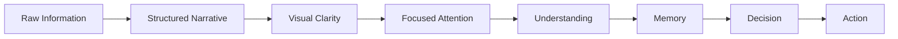

# Final Cognitive Model

The ultimate goal of all effective communication systems is:

> Transform information into actionable understanding with minimal cognitive friction.

Tags: #statistics #machine-learning #data-science #statistical-modelling
