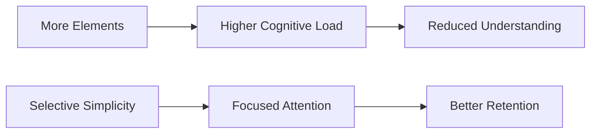

# Restraint Principle

```mermaid
flowchart LR
    A[More Elements] --> B[Higher Cognitive Load]
    B --> C[Reduced Understanding]

    D[Selective Simplicity] --> E[Focused Attention]
    E --> F[Better Retention]
```
