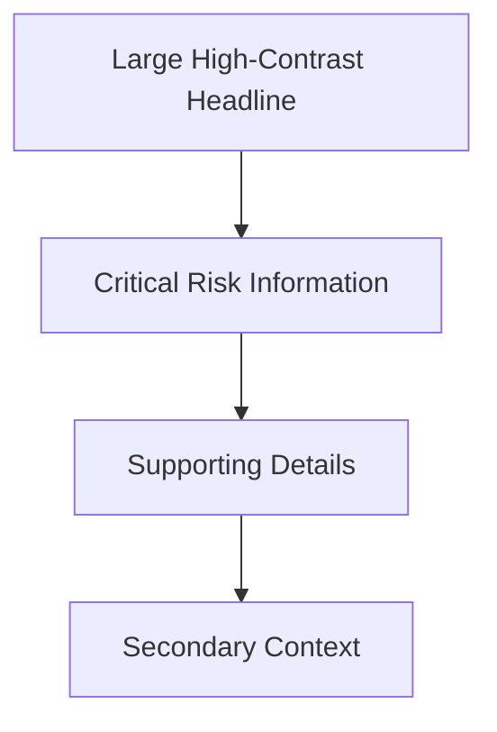

# Visual Attention Flow

```mermaid
flowchart TD
    A[Large High-Contrast Headline]
    --> B[Critical Risk Information]
    --> C[Supporting Details]
    --> D[Secondary Context]
```

This mirrors:  
natural human scanning behavior.
