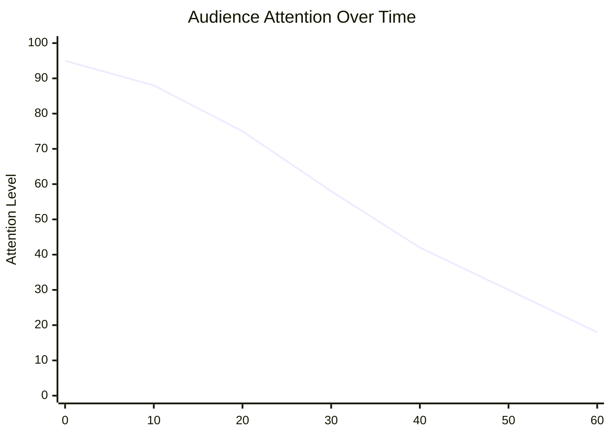
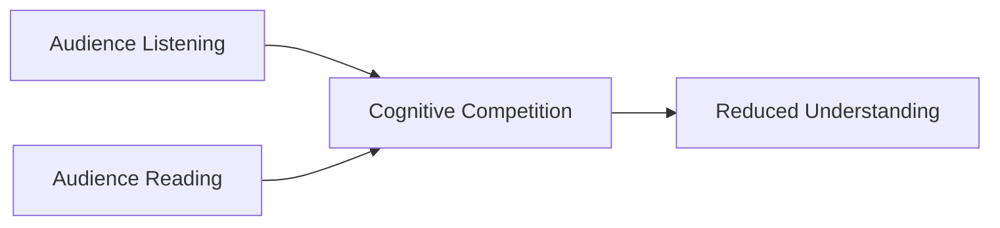
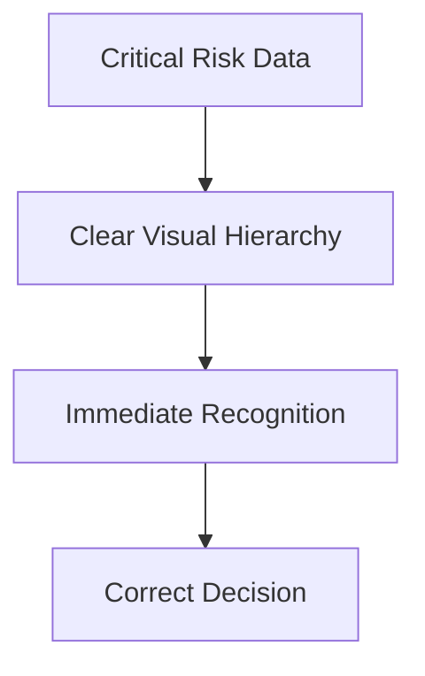
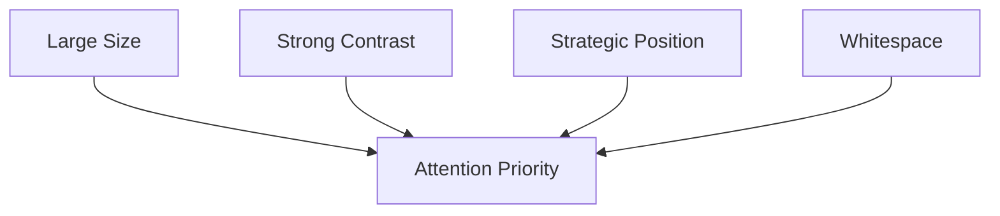
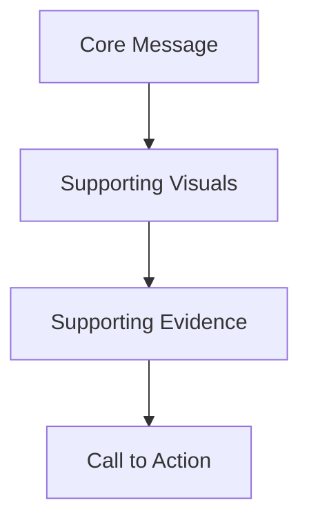

# Stories: Formulating a Story Using Visuals and Dashboards

# Introduction

This section connects:

- data visualization,
    
- dashboards,
    
- and storytelling
    

into a unified framework.

The core idea is extremely important:

> Visualization alone is not enough.  
> Meaning emerges when visuals are embedded inside narrative.

A chart without narrative is often:

- descriptive,
    
- fragmented,
    
- cognitively weak.
    

A chart combined with storytelling becomes:

- persuasive,
    
- memorable,
    
- actionable,
    
- and emotionally meaningful.
    

# Why Storytelling Matters

The transcript begins by emphasizing:

> Human communication is fundamentally story-centered.

This is not merely cultural.  
It is neurological and cognitive.

Humans evolved to:

- understand the world,
    
- transfer knowledge,
    
- coordinate socially,
    
- and remember experiences
    

through stories.

# Historical Perspective

Before:

- books,
    
- databases,
    
- dashboards,
    
- or scientific reports,
    

humans transmitted:

- survival knowledge,
    
- morality,
    
- social structure,
    
- and historical memory
    

through oral storytelling.

Storytelling functioned as:  
a distributed memory system for civilization.

# Storytelling as Cognitive Compression

Stories compress:

- complexity,
    
- emotion,
    
- causality,
    
- and meaning
    

into forms that humans can:  
remember and transmit efficiently.

# Cognitive Compression Model


# Why Stories Are More Memorable Than Raw Data

The transcript repeatedly contrasts:

- stories,  
    with:
    
- raw data.
    

This distinction is foundational.

# Raw Data Problem

Raw data is:

- abstract,
    
- disconnected,
    
- emotionally neutral,
    
- difficult to encode into memory.
    

Example:  
A spreadsheet containing:

- thousands of numbers,
    
- percentages,
    
- and KPIs
    

usually produces:  
low retention.

# Story Advantage

Stories create:

- sequence,
    
- tension,
    
- causality,
    
- emotional relevance,
    
- human connection.
    

These dramatically improve:

- attention,
    
- interpretation,
    
- and recall.
    

# Important Insight

Humans rarely remember:  
isolated information.

They remember:  
meaningful patterns.

Stories provide:  
pattern structure.

# Visualization + Storytelling

The transcript introduces a critical idea:

> Simply seeing a graphic and building a narrative around it increases conviction and retention.

This is central to:  
data storytelling.

# Why Visuals Amplify Stories

Visuals accelerate:  
pattern recognition.

Stories accelerate:  
meaning formation.

Combined together:  
they become extremely powerful.

# Data Storytelling Pipeline


# Conviction and Belief

The transcript uses an important word:

> Conviction.

Stories increase:  
belief confidence.

Why?

Because stories simulate:  
coherent causal worlds.

Humans are more persuaded by:  
causal explanations  
than isolated statistics.

# Example

Weak:

> “Customer churn rose by 8%.”

Stronger:

> “Customers increasingly abandoned the platform after onboarding friction increased during the mobile redesign.”

The second:

- explains,
    
- contextualizes,
    
- and humanizes the metric.
    

# Important Distinction

Visualization answers:

> What happened?

Storytelling answers:

> Why should I care?

# Storytelling and Action

The transcript emphasizes:  
stories increase:

- retention,
    
- and action.
    

This is crucial.

Data without narrative often produces:  
passive observation.

Narratives create:  
decision momentum.

# Why Leaders Use Stories

The lecture explains:  
storytelling helps leaders:

- persuade,
    
- build teams,
    
- gain audience attention.
    

This aligns with organizational psychology.

# Leadership Is Meaning Management

Leaders rarely succeed through:  
raw information alone.

They succeed by:

- framing meaning,
    
- aligning interpretation,
    
- motivating collective behavior.
    

Stories are ideal for this.

# Example

Weak leadership communication:

> “Revenue targets must increase.”

Strong storytelling:

> “Three years ago we were losing customers monthly. Today we have an opportunity to become the fastest-growing platform in the sector, but only if we improve onboarding reliability.”

The second creates:

- direction,
    
- tension,
    
- identity,
    
- and motivation.
    

# Movie vs Annual Report Example

The transcript provides an excellent comparison:

People remember:

- movie details,  
    more than:
    
- annual reports.
    

# Why?

Movies contain:

- narrative arcs,
    
- emotional tension,
    
- conflict,
    
- characters,
    
- progression,
    
- visual immersion.
    

Annual reports usually contain:

- disconnected facts,
    
- tables,
    
- passive language,
    
- low emotional encoding.
    

# Human Memory Prefers Narrative Structures

Memory works better when information contains:

- causality,
    
- chronology,
    
- emotional relevance,
    
- and identity connection.
    

# The Science of Storytelling

The transcript next introduces:  
the neuroscience and cognitive psychology behind storytelling.

# Brain Activation

Stories activate:  
more than language-processing regions.

They may activate:

- emotional systems,
    
- sensory systems,
    
- predictive reasoning,
    
- memory centers,
    
- empathy networks.
    

# Important Concept: Neural Simulation

When hearing stories,  
the brain partially simulates experiences internally.

# Example

Hearing:

> “The freezing wind cut across the mountain.”

may activate:

- sensory imagination,
    
- emotional anticipation,
    
- environmental simulation.
    

This creates:  
deeper encoding than abstract description.

# Stories and Emotion

Emotion acts as:  
a memory amplifier.

The brain prioritizes emotionally meaningful information because:  
from an evolutionary perspective,  
emotion often signaled survival relevance.

# Emotional Encoding Pipeline


# Better Structured Stories Improve Recall

The transcript highlights:  
structured stories improve retention.

This aligns with:  
cognitive schema theory.

# Story Structures Organize Information

Most stories contain:

- setup,
    
- conflict,
    
- progression,
    
- resolution.
    

This provides:  
mental organization.

# Narrative Framework


This structure helps the brain:  
predict and organize information efficiently.

# Jerome Bruner’s Narrative Principle

The transcript references the famous claim associated with Jerome Bruner:

> Facts wrapped in narrative are far more memorable.

Whether the exact multiplier varies experimentally,  
the underlying principle is strongly supported.

Narrative increases:

- retention,
    
- engagement,
    
- and meaning formation.
    

# Storytelling in Data Visualization

The course now transitions from:  
learning visualization tools

to:  
using them for storytelling.

This is a major conceptual shift.

# Weak Visualization Thinking

Many people assume:  
good charts automatically create insight.

They do not.

Without narrative:  
users may:

- misinterpret,
    
- ignore,
    
- or forget visual information.
    

# Strong Data Storytelling

Strong storytelling provides:

- context,
    
- sequence,
    
- explanation,
    
- interpretation,
    
- and significance.
    

# Example

Weak:

> “Sales declined in Q4.”

Stronger:

> “Sales declined sharply after shipping delays increased during holiday demand spikes, suggesting fulfillment reliability is directly affecting customer retention.”

Now the data:  
has causality and consequence.

# Dashboards and Storytelling

Dashboards often combine:

- author-driven storytelling,  
    with:
    
- reader-driven exploration.
    

The author:

- frames the context,
    
- selects metrics,
    
- designs the interaction.
    

The reader:

- explores,
    
- investigates,
    
- and constructs deeper narratives.
    

# Advanced Insight

The most effective dashboards are:  
interactive storytelling systems.

Not static reporting surfaces.

# Important Misconception

Storytelling is not:  
“making data emotional.”

It is:  
structuring information into meaningful causal frameworks.

# Storytelling Failure Modes

# 1. Data Dumping

Too many charts without narrative cohesion.

# 2. Manipulative Narratives

Emotion disconnected from evidence.

# 3. No Conflict

Stories require:

- tension,
    
- uncertainty,
    
- or change.
    

# 4. No Context

Metrics without meaning.

# 5. No Action Implication

Strong stories imply:

- consequence,
    
- decision,
    
- or next step.
    

# Final Takeaways

This section establishes several foundational truths:

- storytelling is central to human cognition,
    
- humans retain narratives better than raw facts,
    
- visuals become more powerful when embedded inside stories,
    
- stories improve persuasion, retention, and action,
    
- and data storytelling combines visualization with meaning construction.
    

Most importantly:

> Data alone rarely changes behavior.  
> Stories built around data often do.
# Visual Narratives and Public Perception

This section explores an extremely important idea:

> Visuals do not merely communicate information.  
> They shape long-term perception and cultural narratives.

The transcript uses the example of the 2000 U.S. presidential election to demonstrate how:

- visual encoding,
    
- repeated exposure,
    
- and narrative reinforcement
    

can permanently influence public cognition.

# The 2000 U.S. Election Example

The transcript references the 2000 U.S. presidential election.

This election popularized the now-standard political color convention in the United States:

|Political Party|Color|
|---|---|
|Democrats|Blue|
|Republicans|Red|

The election maps used:

- blue states for Democrats,
    
- red states for Republicans.
    

This eventually became:  
a deeply embedded political communication framework.

# Important Insight

The colors themselves are arbitrary.

There is no intrinsic reason:  
Democrats must be blue  
or Republicans must be red.

But once repeated consistently:  
the mapping became psychologically entrenched.

# Narrative Encoding

This demonstrates:  
visual narrative encoding.

Repeated visual associations create:  
long-term symbolic meaning.

# Cognitive Association Pipeline


# Why This Matters

Visualizations can create:

- semantic conventions,
    
- emotional associations,
    
- and political identity structures.
    

Eventually:  
the visualization becomes part of the narrative itself.

# Persistence of Visual Narratives

The transcript highlights:  
even later charts,  
including simple bar charts,  
continued using:

- blue for Democrats,
    
- red for Republicans.
    

This demonstrates:  
narrative persistence.

# Important Principle

Once a visual language becomes culturally stable,  
changing it becomes extremely difficult.

This happens because:  
human cognition relies heavily on:

- pattern familiarity,
    
- symbolic consistency,
    
- and associative memory.
    

# Visual Language as Cognitive Infrastructure

Colors become:  
semantic shortcuts.

Eventually:  
people no longer consciously interpret them.

The association becomes automatic.

# Similar Examples

|Color|Associated Meaning|
|---|---|
|Red|Danger / loss / stop|
|Green|Growth / success / safe|
|Blue|Stability / trust|
|Black|Luxury / seriousness|
|White|Simplicity / cleanliness|

These meanings are partly:

- cultural,
    
- psychological,
    
- and repeatedly reinforced.
    

# Important Visualization Insight

Visual choices are never neutral.

Every design choice:

- color,
    
- placement,
    
- hierarchy,
    
- scale,
    
- typography
    

affects interpretation.

# Communication Paradigms

The transcript uses the phrase:

> Visuals create communication paradigms.

This is a powerful idea.

It means:  
visual systems shape:

- how people think,
    
- what they notice,
    
- and how they interpret reality.
    

# Example

Election maps eventually shaped:

- media language,
    
- political identity,
    
- public discourse.
    

Terms like:

- “red states”
    
- “blue states”
    

became embedded in national culture.

# Advanced Insight

Visual storytelling does not merely describe culture.

It actively constructs culture.

# Presentation Beyond PowerPoint

The transcript next shifts toward:  
presentation principles.

Importantly, the instructor clarifies:

> Presentation is not restricted to PowerPoint.

This is a crucial insight.

# Presentation Is Broader Than Slides

Presentation means:  
structured communication delivery.

It includes:

- dashboards,
    
- reports,
    
- speeches,
    
- meetings,
    
- visual storytelling,
    
- product demos,
    
- and analytical communication.
    

# Presentation as Attention Architecture

Presentations fundamentally manage:

- attention,
    
- cognition,
    
- and interpretation.
    

Good presentations guide:  
what the audience notices,  
thinks,  
and remembers.

# Garr Reynolds Principles

The lecture references principles associated with Garr Reynolds.

These principles focus heavily on:

- simplicity,
    
- restraint,
    
- whitespace,
    
- and authenticity.
    

# 1. Restraint

## Definition

Eliminate:  
everything unnecessary.

# Why This Matters

Human working memory is extremely limited.

Too many elements create:

- cognitive overload,
    
- fragmented attention,
    
- reduced comprehension.
    

# Important Design Principle

Every slide element competes for attention.

# Common Failure

Many presentations attempt:  
maximum information density.

This usually reduces:  
understanding and retention.

# Cognitive Load Theory

Humans can process only limited information simultaneously.

Overloaded slides create:  
processing bottlenecks.

# Example of Poor Restraint

- 12 bullet points
    
- 3 charts
    
- multiple colors
    
- dense paragraphs
    
- tiny fonts
    

This creates:  
visual chaos.

# Strong Restraint

A strong slide may contain:

- one idea,
    
- one visual,
    
- minimal text,
    
- strong emphasis.
    

# Important Insight

Communication effectiveness often increases when:  
information quantity decreases.

# 2. Whitespace as a Strategic Tool

The transcript emphasizes:  
whitespace is strategically important.

This is frequently misunderstood.

# Whitespace Is Not Empty Space

Whitespace functions as:

- visual breathing room,
    
- grouping mechanism,
    
- attention controller,
    
- hierarchy enhancer.
    

# Whitespace Reduces Cognitive Noise

Without whitespace:  
visuals compete aggressively for attention.

Whitespace improves:

- readability,
    
- comprehension,
    
- visual focus.
    

# Example

Compare:

## Overcrowded Slide

Everything compressed together.

Result:

- scanning difficulty,
    
- confusion,
    
- cognitive fatigue.
    

## Balanced Slide

Clear separation between elements.

Result:

- guided attention,
    
- improved understanding.
    

# Gestalt Psychology Connection

Whitespace supports:  
Gestalt grouping principles.

Humans naturally interpret:  
proximate objects as related.

# Visual Hierarchy and Whitespace

Whitespace helps define:

- importance,
    
- grouping,
    
- reading sequence.
    

# Strategic Simplicity

The transcript connects this back to:  
pre-attentive attributes.

This is correct.

Whitespace itself acts as:  
a pre-attentive organizational mechanism.

# 3. Naturalness in Delivery

The lecture emphasizes:

- confidence,
    
- natural delivery,
    
- emotional connection.
    

This is critical because:  
storytelling is partly:  
performance psychology.

# Human Communication Is Emotional

Audiences evaluate:

- authenticity,
    
- sincerity,
    
- emotional congruence.
    

Even highly analytical presentations are influenced by:  
delivery style.

# Important Insight

People rarely separate:

- information quality,  
    from:
    
- delivery quality.
    

# Naturalness Improves Trust

Over-scripted or robotic communication often reduces:

- engagement,
    
- trust,
    
- and retention.
    

# Storytelling Is an Emotive Exercise

The transcript correctly notes:  
effective storytelling requires:

- emotional investment,
    
- practice,
    
- and delivery skill.
    

# Why Emotion Matters

Emotion increases:

- attention,
    
- memory encoding,
    
- and persuasion.
    

# Heath Brothers SUCCESS Model

The transcript next revisits the SUCCESS framework from Chip Heath and Dan Heath.

# SUCCESS Framework

|Principle|Meaning|
|---|---|
|Simple|Clear and focused|
|Unexpected|Attention-grabbing|
|Concrete|Specific and imaginable|
|Credible|Trustworthy|
|Emotional|Personally meaningful|
|Storied|Narrative-based|

# Why SUCCESS Works

The framework aligns closely with:  
human cognitive architecture.

# Simple

Complexity reduces:  
memory and comprehension.

# Unexpected

Surprise increases:  
attention and encoding.

# Concrete

Specificity improves:  
mental visualization.

# Credible

Trust determines:  
acceptance.

# Emotional

Emotion amplifies:  
memory.

# Storied

Narratives organize:  
meaning and causality.

# SUCCESS Cognitive Model


# Important Observation in the Transcript

The instructor repeatedly states:

> We have already learned how to build effective visuals.

Now the focus shifts toward:  
using visuals for:

- communication,
    
- persuasion,
    
- and storytelling.
    

This is a major conceptual transition.

# Weak Visualization Thinking

Weak analysts believe:  
charts alone create insight.

# Strong Storytelling Thinking

Strong communicators understand:  
meaning emerges from:

- framing,
    
- narrative,
    
- hierarchy,
    
- and audience context.
    

# Final Takeaways

This section establishes several foundational ideas:

- visual narratives shape long-term perception,
    
- repeated visual encoding creates cultural associations,
    
- presentation design is fundamentally attention management,
    
- simplicity and whitespace improve cognition,
    
- storytelling requires emotional authenticity,
    
- and effective communication combines:
    
    - visuals,
        
    - narrative,
        
    - emotion,
        
    - and structure.
        

Most importantly:

> Data visualization becomes powerful only when it successfully guides human interpretation and meaning formation.
> 

# Pecha Kucha and the Art of Visual Brevity

# Transition from Visualization to Storytelling

The transcript makes an important conceptual transition:

> Building effective visuals is not enough.  
> The challenge is communicating them effectively.

This is critical.

Many analysts learn:

- chart design,
    
- dashboard construction,
    
- statistical techniques,
    

but fail at:

- communication,
    
- narrative,
    
- persuasion,
    
- and audience engagement.
    

# Important Principle

Visualization creates:  
visibility.

Storytelling creates:  
meaning.

# Why Narrative Wrapping Matters

The lecture states:

> Visuals must be wrapped in a narrative.

This is exactly right.

Without narrative:

- visuals remain fragmented,
    
- interpretation becomes inconsistent,
    
- audience attention weakens.
    

Narratives provide:

- sequence,
    
- focus,
    
- causality,
    
- emotional relevance,
    
- and decision framing.
    

# Data Storytelling Architecture


# Pecha Kucha: Art of Visual Brevity

The transcript introduces the Japanese presentation philosophy:  
Pecha Kucha.

This is fundamentally:  
a constraint-driven communication system.

# Core Idea

> Brevity forces clarity.

This is a profound communication principle.

# Pecha Kucha Format

|Element|Constraint|
|---|---|
|Slides|20|
|Time per slide|20 seconds|
|Total duration|6 minutes 40 seconds|

# Why This Format Exists

Most presentations fail because:

- speakers ramble,
    
- slides become overloaded,
    
- narratives lose momentum,
    
- audience attention collapses.
    

Pecha Kucha introduces:  
hard communication constraints.

# Constraint as Design Optimization

This is important beyond presentations.

Constraints often improve:

- creativity,
    
- focus,
    
- prioritization,
    
- and signal clarity.
    

Without constraints:  
people tend toward:

- excess detail,
    
- redundancy,
    
- cognitive overload.
    

# Important Insight

Unlimited presentation time usually reduces presentation quality.

# Talk Less, Show More

The transcript emphasizes:  
focus should shift toward:

- visuals,  
    rather than:
    
- excessive narration.
    

# Why?

Humans process:  
visual information rapidly.

Long verbal explanations:  
increase cognitive fatigue.

# Strong Visuals Should Be Self-Explanatory

This is a key idea.

A strong slide should communicate:  
its central message almost immediately.

The presenter should:  
enhance interpretation,  
not read the slide aloud.

# Weak Presentation Pattern

```text
Slide:
• Bullet point
• Bullet point
• Bullet point

Presenter:
Reads bullets word-for-word
```

This creates:

- redundancy,
    
- disengagement,
    
- low retention.
    

# Strong Presentation Pattern

```text
Slide:
One strong visual

Presenter:
Adds context, emphasis, interpretation, and narrative
```

This creates:

- complementary communication,
    
- cognitive reinforcement,
    
- stronger audience engagement.
    

# Why Time Constraints Improve Visual Quality

The transcript correctly notes:  
Pecha Kucha forces presenters to:

- refine visuals,
    
- remove clutter,
    
- prioritize essential ideas.
    

# Important Design Principle

When speaking time decreases:  
visual clarity must increase.

# Cognitive Effect of Brevity

Shorter presentations:

- sustain attention better,
    
- improve retention,
    
- reduce fatigue,
    
- increase perceived clarity.
    

# Attention Decay Problem

Human attention naturally declines over time.

Long presentations suffer from:

- cognitive drift,
    
- reduced engagement,
    
- memory collapse.
    

# Attention Curve



This is why:  
brevity matters.

# “Simplicity Is the Ultimate Sophistication”

The transcript includes this famous design principle.

This idea is deeply important.

# Common Misunderstanding

People often believe:  
complexity signals intelligence.

In reality:  
clarity usually signals deeper understanding.

# Simplicity Is Difficult

Simple communication requires:

- prioritization,
    
- abstraction,
    
- structure,
    
- conceptual mastery.
    

# Example

Weak communication:

- technical jargon,
    
- overloaded slides,
    
- scattered metrics.
    

Strong communication:

- one focused message,
    
- one clear visual,
    
- one memorable insight.
    

# Simplicity vs Oversimplification

This distinction matters.

|Simplicity|Oversimplification|
|---|---|
|Clarifies complexity|Ignores complexity|
|Preserves meaning|Distorts meaning|
|Focuses attention|Removes nuance|

Good communicators:  
compress complexity without destroying truth.

# Global Use of Pecha Kucha

The transcript notes:  
Pecha Kucha is used across:

- businesses,
    
- conferences,
    
- business schools,
    
- innovation forums.
    

Why?

Because:  
modern audiences are overloaded with information.

Brevity becomes:  
competitive advantage.

# Death by Presentation

The lecture next discusses:  
“Death by Presentation.”

This refers to:  
audience disengagement caused by:

- clutter,
    
- excessive text,
    
- poor visual structure,
    
- and weak storytelling.
    

# Why This Happens

Most presentations violate:  
basic cognitive principles.

# Common Presentation Failures

|Failure|Effect|
|---|---|
|Dense text|Cognitive overload|
|Tiny fonts|Reduced readability|
|Long bullet lists|Attention fragmentation|
|Weak hierarchy|Important points buried|
|Repetitive narration|Audience disengagement|

# Important Cognitive Insight

People cannot deeply process:  
listening and reading dense text simultaneously.

This creates:  
split-attention overload.

# Cognitive Conflict



# Information Transfer Collapse

The transcript correctly states:

> Knowledge transfer becomes virtually zero.

This is not exaggeration.

Once cognitive overload occurs:

- comprehension drops sharply,
    
- retention collapses,
    
- attention disengages.
    

# Why This Is Dangerous

Poor presentations do not merely waste time.

They degrade:

- organizational decision quality.
    

# Important Organizational Insight

Executives often make decisions based on:

- summaries,
    
- presentations,
    
- dashboards.
    

If communication quality is poor:  
decision quality deteriorates.

# Shortcut Decision-Making

The transcript notes:  
people begin relying on:

- assumptions,
    
- heuristics,
    
- shortcuts.
    

This aligns with behavioral psychology.

When overloaded,  
humans default to:

- simplifications,
    
- intuition,
    
- incomplete interpretation.
    

# NASA Columbia Shuttle Case

The transcript references the Space Shuttle Columbia disaster again.

This remains one of the most important examples of:  
presentation failure causing operational blindness.

# Key Problem

The presentation:

- buried risk,
    
- obscured urgency,
    
- diluted critical warnings,
    
- and failed to communicate danger clearly.
    

# Important Insight

Communication failures in high-stakes environments can become:  
systemic failures.

# Presentation Design as Risk Engineering

This is a critical lesson.

Presentation design is not:  
a cosmetic exercise.

It is:  
part of operational safety infrastructure.

# Why Clutter Is Dangerous

Clutter:

- weakens hierarchy,
    
- disperses attention,
    
- hides anomalies,
    
- delays recognition.
    

In high-risk systems:  
that can become catastrophic.

# Strong Communication Principle

Critical information should:

- dominate attention immediately.
    

# High-Stakes Presentation Model



# Deepest Lesson of This Section

The entire lecture converges toward one fundamental idea:

> Human attention is limited.

Therefore:  
effective communication must:

- minimize cognitive friction,
    
- maximize signal clarity,
    
- and guide interpretation intentionally.
    

# Final Takeaways

This section establishes several important principles:

- storytelling transforms visuals into meaningful communication,
    
- brevity improves clarity,
    
- strong visuals reduce narration dependency,
    
- simplicity increases comprehension,
    
- clutter destroys attention,
    
- and poor presentation design can directly degrade organizational decisions.
    

Most importantly:

> Communication quality determines whether information becomes understanding or noise.

# Visual Hierarchy and Real-World Consequences

This final section brings together:

- storytelling,
    
- presentation design,
    
- visual hierarchy,
    
- and decision-making consequences.
    

The central message is extremely important:

> Poor communication design can directly contribute to bad decisions.

This is not merely a design issue.  
It is:

- a cognitive issue,
    
- an operational issue,
    
- and sometimes a safety issue.
    

# The Columbia Shuttle Presentation Failure

The transcript revisits the Space Shuttle Columbia disaster.

The key observation:

> The most important warning appeared in the smallest font at the bottom.

This is a catastrophic failure of:  
visual hierarchy.

# What Is Visual Hierarchy?

Visual hierarchy is the deliberate organization of visual elements so that:  
the audience naturally notices the most important information first.

# Human Attention Is Selective

People do not process every element equally.

The brain naturally prioritizes:

- larger elements,
    
- high-contrast regions,
    
- top-positioned information,
    
- highlighted content,
    
- and visually dominant structures.
    

# Visual Attention Model



# Why the NASA Slide Failed

The presentation violated:  
basic perceptual principles.

Critical risk information:

- lacked emphasis,
    
- lacked visual prominence,
    
- lacked hierarchy.
    

As a result:  
decision-makers likely underestimated the seriousness of the situation.

# Important Insight

If critical information is visually weak,  
the brain may unconsciously classify it as:  
less important.

# This Is a Cognitive Failure, Not Just a Design Failure

Humans rely heavily on:  
visual cues  
to determine:  
importance and urgency.

# Example

Large red warning text:  
→ perceived as urgent

Tiny gray text at the bottom:  
→ perceived as secondary

Even before conscious reasoning occurs.

# Visual Hierarchy Is Decision Architecture

This is the deeper principle.

Presentation structure shapes:

- what gets noticed,
    
- what gets remembered,
    
- and what influences decisions.
    

# Important Organizational Lesson

Organizations often underestimate:  
the importance of communication structure.

They assume:  
if the information exists somewhere,  
the communication succeeded.

This is false.

# Information Visibility ≠ Information Impact

Buried information is functionally invisible.

# Real-World Consequences

The transcript correctly states:

> Small things like this can have real-world consequences.

This is absolutely true.

Poor communication design can contribute to:

- engineering failures,
    
- medical mistakes,
    
- financial losses,
    
- operational risks,
    
- policy failures.
    

# High-Stakes Domains Where Visualization Matters

|Domain|Consequence of Poor Communication|
|---|---|
|Aviation|Safety failures|
|Healthcare|Misdiagnosis|
|Finance|Risk mispricing|
|Cybersecurity|Missed threats|
|Manufacturing|Operational shutdowns|
|Government|Policy misjudgments|

# Important Principle

Communication quality affects:  
decision quality.

# Presentation Design Is Part of Systems Engineering

This is one of the deepest lessons in the lecture.

Presentations are not:  
cosmetic wrappers around information.

They are:  
interfaces between data and human judgment.

# The Hidden Cost of Clutter

The lecture repeatedly criticizes:

- clutter,
    
- overload,
    
- weak hierarchy.
    

This is because clutter creates:  
cognitive competition.

# Cognitive Competition Model


# Why Important Messages Get Lost

When slides contain:

- too much text,
    
- too many bullets,
    
- too many ideas,
    

the audience cannot distinguish:  
signal from noise.

# Cognitive Overload

Human working memory is extremely limited.

Most people can actively process only a small number of concepts simultaneously.

Overloaded presentations exceed:  
processing capacity.

# Result

The audience:

- disengages,
    
- simplifies mentally,
    
- misses nuance,
    
- or defaults to assumptions.
    

# Improving Presentations

The transcript then shifts toward:  
how to avoid “death by PowerPoint.”

# Step 1: Identify the Core Message

This is the most important presentation question:

> What is the single most important idea the audience must remember?

Most presentations fail because:  
they attempt to communicate everything equally.

# Important Principle

If multiple ideas compete equally,  
none dominate memory.

# Strong Presentation Structure



Everything should support:  
the central narrative.

# Step 2: Create Visual Emphasis

The transcript mentions:  
creating “visual hype.”

A better term analytically would be:  
visual emphasis or visual salience.

# Goal

Direct audience attention intentionally.

# Methods

|Technique|Effect|
|---|---|
|Size contrast|Signals importance|
|Color contrast|Draws focus|
|Positioning|Guides reading order|
|Whitespace|Reduces clutter|
|Minimalism|Improves clarity|

# Important Insight

Visual design controls:  
attention flow.

# Step 3: Convert Text into Visuals

The transcript strongly recommends:  
transforming text-heavy information into visuals.

This is one of the most important communication principles.

# Why Visuals Work Better

Visuals support:

- pattern recognition,
    
- rapid scanning,
    
- memory encoding,
    
- relational understanding.
    

# Weak Communication

```text
• Revenue increased
• Customer retention improved
• Delivery delays reduced
```

# Strong Communication

A single:

- trend chart,
    
- KPI card,
    
- or dashboard
    

can communicate all three instantly.

# Important Principle

Visuals compress complexity efficiently.

# But Important Warning

Not all visuals improve understanding.

Bad visuals can:

- distort meaning,
    
- create confusion,
    
- or exaggerate patterns.
    

# Good Visuals Must Be

- clear,
    
- intentional,
    
- contextual,
    
- and cognitively efficient.
    

# Storytelling and Presentation Together

The lecture ultimately combines:

- storytelling,
    
- dashboards,
    
- visuals,
    
- and presentations
    

into one broader framework:

> Communication design.

# Communication Design Goal

Transform:

- raw information
    

into:

- actionable understanding.
    

# Full Communication Pipeline


# Deepest Lesson of the Entire Topic

The entire discussion converges toward one central idea:

> Humans do not respond to data directly.  
> Humans respond to interpreted meaning.

Therefore:  
effective communication requires:

- structure,
    
- narrative,
    
- clarity,
    
- hierarchy,
    
- emotion,
    
- and intentional design.
    

# Final Takeaways

This section establishes several critical principles:

- visual hierarchy determines what audiences notice,
    
- buried information is effectively ignored,
    
- poor presentations can contribute to real-world failures,
    
- communication quality affects decision quality,
    
- strong presentations prioritize one core message,
    
- and visuals should replace unnecessary text whenever possible.
    

Most importantly:

> The purpose of visualization and storytelling is not merely to display information.  
> It is to guide human attention toward the most meaningful insight with the least cognitive friction.