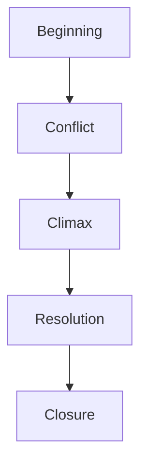

# 2. Story Mountain Framework

Story Mountain follows a different emotional structure.

Core sequence:

1. Beginning
    
2. Conflict
    
3. Climax
    
4. Resolution decline
    
5. Closure
    

