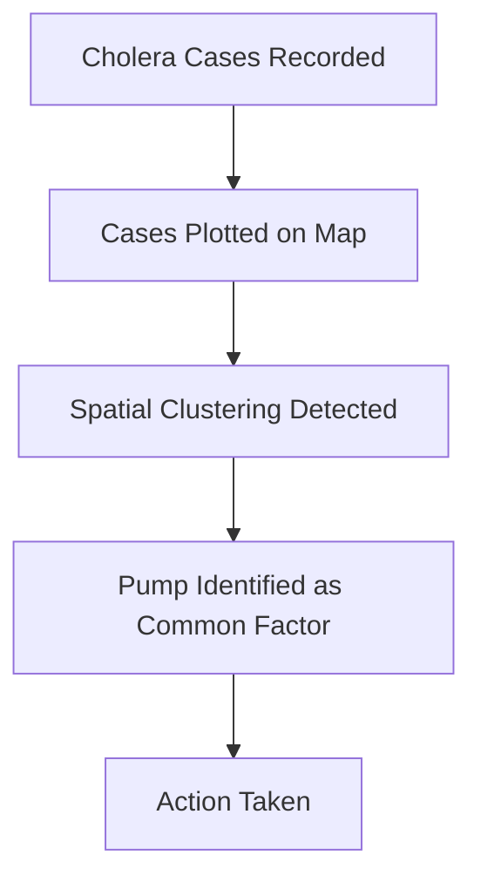

# Simplified Interpretation Flow

```mermaid
flowchart TD
    A[Cholera Cases Recorded] --> B[Cases Plotted on Map]
    B --> C[Spatial Clustering Detected]
    C --> D[Pump Identified as Common Factor]
    D --> E[Action Taken]
```
