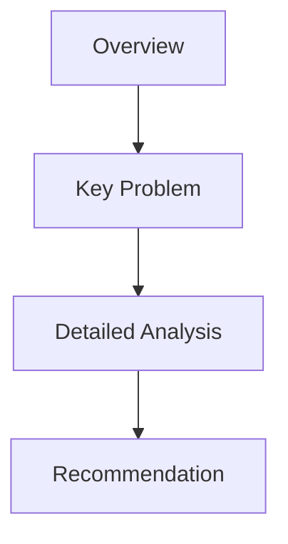
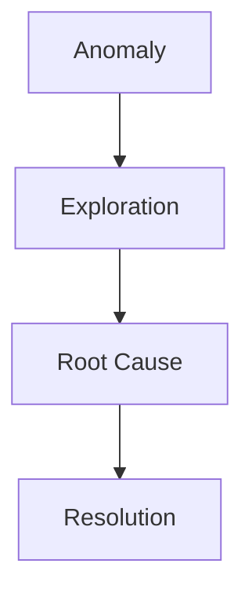

# Common Ordering Structures

### Funnel Structure

```mermaid
flowchart TD
    A[Overview] --> B[Key Problem]
    B --> C[Detailed Analysis]
    C --> D[Recommendation]
```

### Investigative Structure

```mermaid
flowchart TD
    A[Anomaly] --> B[Exploration]
    B --> C[Root Cause]
    C --> D[Resolution]
```
