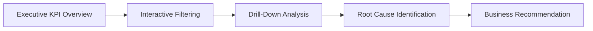

# Example Workflow

```mermaid
flowchart LR
    A[Executive KPI Overview] --> B[Interactive Filtering]
    B --> C[Drill-Down Analysis]
    C --> D[Root Cause Identification]
    D --> E[Business Recommendation]
```

This structure mirrors real analytical thinking:

1. detect anomaly
    
2. explore patterns
    
3. isolate causes
    
4. recommend action
