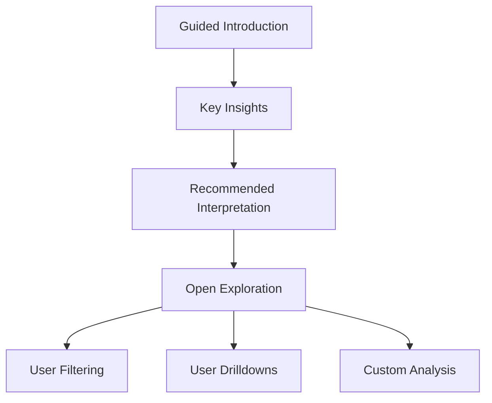
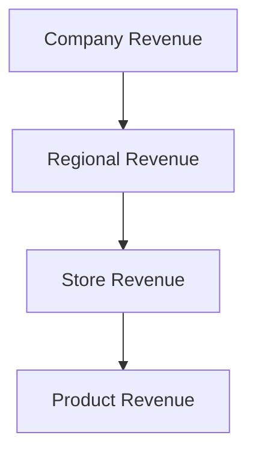
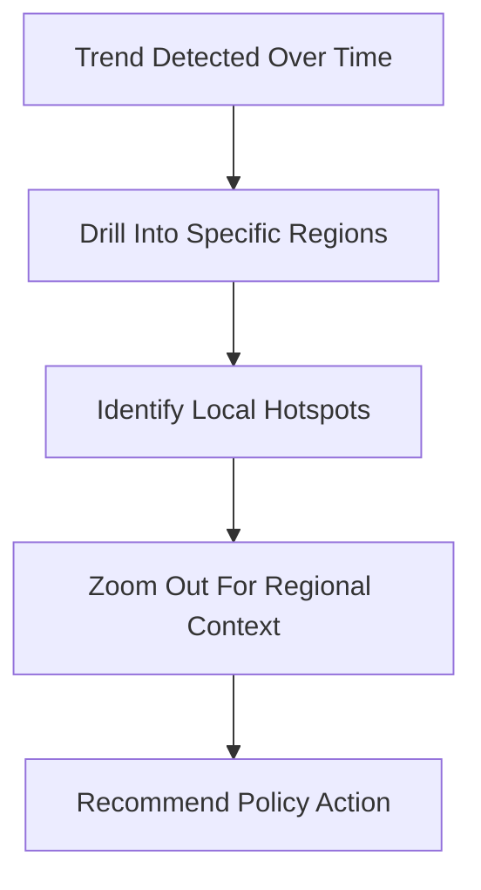
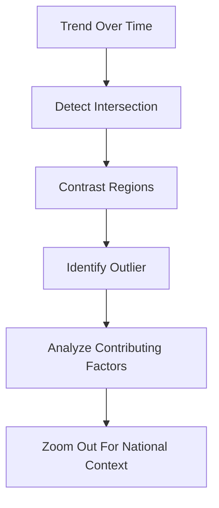

# 1. The Importance of Business Storytelling

Business storytelling is not decoration added after analysis. It is the mechanism that converts information into action.

Most organizations assume decisions are driven by logic because meetings contain charts, KPIs, forecasts, and dashboards. In reality, decisions are usually driven by:

- perceived risk
    
- trust
    
- clarity
    
- emotional conviction
    
- memorability
    
- political alignment
    
- urgency
    

Data alone rarely creates those conditions.

## Storytelling as a Decision-Making Tool

Storytelling in business serves one primary purpose:

> It helps people understand why the data matters.

Without narrative, data is just disconnected observations.

For example:

|Raw Data|Story|
|---|---|
|Revenue declined 12%|Customers are abandoning the onboarding process after the pricing redesign|
|Customer churn increased|Enterprise clients no longer trust implementation timelines|
|Support tickets rose 40%|Product complexity exceeded user expectations after feature expansion|

The second column creates:

- context
    
- causality
    
- urgency
    
- direction for action
    

That is what executives actually respond to.

## Logic vs Emotion in Business Decisions

A common misconception is:

> “Business decisions are rational.”

They are not fully rational.

Even highly analytical leaders make decisions emotionally first, then justify them logically afterward.

This is visible everywhere:

- investment decisions
    
- hiring
    
- acquisitions
    
- product prioritization
    
- vendor selection
    
- strategy pivots
    

Storytelling bridges:

- analytical evidence
    
- human interpretation
    

A dashboard may show:

- declining retention
    
- falling conversion
    
- rising costs
    

But a story explains:

- what changed
    
- why it changed
    
- who is affected
    
- what happens next if nothing is done
    

That narrative creates cognitive compression:  
complex systems become understandable quickly.

## Example: The Significant Objects Project

The “Significant Objects” experiment demonstrated a powerful principle.

Researchers bought inexpensive thrift-store items, many worth around $1 or less.

Then writers created fictional stories for each object.

After attaching narratives:

- ordinary objects sold for dramatically higher prices
    
- some items increased in value by hundreds or thousands of percent
    

The object itself barely changed.

The perceived meaning changed.

This matters in business because:

- data without interpretation has low persuasive power
    
- narrative changes perceived importance
    
- humans assign value through meaning, not raw facts
    

The same principle applies to:

- product marketing
    
- investor decks
    
- dashboards
    
- consulting presentations
    
- executive communication
    

## Why Stories Work Cognitively

Stories are efficient compression systems for the brain.

A good story naturally organizes:

- cause and effect
    
- conflict
    
- stakes
    
- progression
    
- resolution
    

Humans evolved to process narrative long before spreadsheets existed.

Pure statistics overload working memory.

Narratives reduce cognitive load by creating structure.

Compare:

### Raw Metrics

- CAC increased 18%
    
- CTR decreased 11%
    
- onboarding completion dropped 7%
    

### Narrative

“Recent ad targeting brought in lower-intent users, increasing acquisition cost while reducing onboarding completion.”

The second version is easier to:

- remember
    
- repeat
    
- act upon
    

## Business Storytelling Is Not Fiction

A major mistake is assuming storytelling means exaggeration.

Good business storytelling is:

- structured truth
    
- contextualized evidence
    
- strategic sequencing of information
    

Bad storytelling manipulates.

Good storytelling clarifies.

The goal is not:

> “Make the data dramatic.”

The goal is:

> “Make the implications understandable.”

## The Real Skill: Getting Into the Audience’s Head

Strong storytellers think from the audience’s perspective.

Different stakeholders care about different risks:

|Stakeholder|Primary Concern|
|---|---|
|CEO|Strategic impact|
|CFO|Financial risk|
|Product Manager|Adoption and usability|
|Engineer|Feasibility|
|Operations|Process stability|
|Sales|Customer objections|

The same dataset must often be reframed differently for each audience.

This is why storytelling is fundamentally:

- psychological
    
- contextual
    
- audience-aware
    

Not merely visual.

## Storytelling in Data Visualization

A dashboard without narrative is often just visual storage.

Effective storytelling through data requires:

- hierarchy
    
- sequencing
    
- emphasis
    
- contrast
    
- selective simplification
    

The audience should immediately understand:

1. what matters most
    
2. what changed
    
3. why it matters
    
4. what action is needed
    

If viewers must “figure out the story themselves,” the presentation failed.

## A Simple Storytelling Framework for Business

A highly effective structure is:

|Step|Purpose|
|---|---|
|Context|What situation are we in?|
|Conflict|What problem/change occurred?|
|Insight|What does the data reveal?|
|Impact|Why does it matter?|
|Action|What should happen next?|

Example:

> Customer onboarding completion dropped from 78% to 61% after the redesign. Session recordings show users abandoning the flow at the pricing explanation stage. This likely explains the recent decline in activation rates. Simplifying pricing communication should be prioritized next sprint.

That is storytelling driven by evidence.

## Key Insight

Data informs.

Stories persuade.

Business storytelling is the discipline of transforming:

- metrics into meaning
    
- observations into decisions
    
- information into action

# 2. Defining Data Storytelling

Data storytelling is the discipline of transforming raw data into a narrative that drives understanding, memory, and action.

A useful distinction:

|Concept|Purpose|
|---|---|
|Data Analysis|Finds insights|
|Data Visualization|Displays insights|
|Data Storytelling|Persuades people to act on insights|

Many organizations stop at visualization and assume communication is complete.

It is not.

A dashboard full of charts is not automatically a story.

A story emerges only when:

- the audience understands significance
    
- the information connects to business context
    
- the implications are clear
    
- an action becomes obvious
    

## Core Definition

Data storytelling can be defined as:

> The art of communicating insights in a way that makes data actionable and memorable.

The phrase “actionable and memorable” is critical.

If people:

- forget the insight
    
- misunderstand it
    
- fail to act on it
    

then the storytelling failed, regardless of visual quality.

## The Three Core Elements of Data Storytelling

Effective data storytelling combines three components:

|Component|Purpose|
|---|---|
|Data Visualization|Makes patterns visible|
|Narrative|Explains meaning and progression|
|Context|Explains relevance|

Think of them as complementary layers.

### 1. Data Visualization

Visualization reduces cognitive effort.

Humans detect:

- trends
    
- outliers
    
- clusters
    
- comparisons
    

far faster visually than through tables.

Good visualization answers:

- What changed?
    
- Compared to what?
    
- How large is the effect?
    
- Is this normal or abnormal?
    

Examples:

- line charts for trends
    
- bar charts for comparisons
    
- heatmaps for density
    
- scatterplots for relationships
    

But visualization alone is insufficient.

A chart can show _what_ happened without explaining _why it matters_.

## 2. Narrative

Narrative creates logical flow.

It connects:

- observations
    
- causes
    
- consequences
    
- decisions
    

Narrative answers:

- Why is this happening?
    
- Why should we care?
    
- What should we do next?
    

Without narrative:

- dashboards become passive
    
- reports become archives
    
- audiences create their own interpretations
    

That last point is dangerous because audiences often invent incorrect stories when none are provided.

## 3. Context

Context determines relevance.

The same metric can imply:

- success
    
- failure
    
- urgency
    
- irrelevance
    

depending on surrounding conditions.

Example:

|Metric|Without Context|With Context|
|---|---|---|
|Revenue increased 5%|Seems positive|Weak if industry grew 20%|
|Churn decreased 2%|Seems minor|Huge if customer base is massive|
|Wait times increased 30 seconds|Seems small|Critical in emergency healthcare|

Context prevents misleading interpretation.

## Historical Example: The 1854 Cholera Outbreak Map

One of the earliest and most important examples of data storytelling came from physician John Snow during the 1854 cholera outbreak in London.

Snow mapped cholera deaths geographically around the Broad Street water pump.

The visualization revealed:

- deaths clustered around a single water source
    
- cholera spread through contaminated water rather than “bad air” (the dominant theory at the time)
    

The map did several things simultaneously:

- visualized hidden patterns
    
- challenged existing assumptions
    
- created a compelling narrative
    
- enabled intervention
    

The result:

- the pump handle was removed
    
- the outbreak slowed
    

This is a foundational lesson in data storytelling:

> Good visualization changes understanding. Great storytelling changes decisions.

# 3. Storytelling Frameworks

Frameworks exist because unstructured communication usually fails.

A good storytelling framework:

- controls pacing
    
- builds tension
    
- organizes information
    
- creates emotional momentum
    
- improves retention
    

In business settings, frameworks prevent presentations from becoming:

- disconnected facts
    
- random charts
    
- endless dashboards
    

## A. Monomyth (Hero’s Journey)

Popularized by Joseph Campbell, the Hero’s Journey is one of the oldest narrative structures.

Core structure:

1. Ordinary world
    
2. Problem/crisis
    
3. Guidance or discovery
    
4. Transformation
    
5. Resolution
    

### Business Translation

|Hero Journey Element|Business Equivalent|
|---|---|
|Hero|Customer, company, or team|
|Crisis|Market disruption/problem|
|Mentor|Data insight/analyst|
|Transformation|Strategic action|
|Resolution|Business improvement|

### Example

A retail company faces declining customer retention.

Data analysis identifies:

- poor mobile checkout experience
    
- high abandonment rates
    

The analytics team becomes the “guide” helping leadership:

- understand the issue
    
- redesign the process
    
- improve retention
    

This framework works well because it mirrors how humans naturally process struggle and resolution.

## B. Story Mountain

A simpler narrative structure commonly used in presentations.

Structure:

1. Beginning
    
2. Conflict
    
3. Climax
    
4. Deflation
    
5. Resolution
    

### Business Usage

|Phase|Example|
|---|---|
|Beginning|Company growth was stable|
|Conflict|Customer churn increased|
|Climax|Major revenue impact identified|
|Deflation|Root causes isolated|
|Resolution|Retention strategy implemented|

This structure works especially well for:

- executive presentations
    
- consulting decks
    
- KPI reviews
    
- incident retrospectives
    

## C. Nested Loops

Nested loops involve stories embedded within larger stories.

This is common in:

- transformational business narratives
    
- strategic change communication
    
- organizational redesign
    

Structure:

- Main narrative
    
    - Supporting story
        
        - Supporting insight
            
            - Case example
                

### Why It Works

Nested storytelling:

- creates layered persuasion
    
- reinforces themes repeatedly
    
- makes abstract transformation concrete
    

Example:

- Main story: digital transformation initiative
    
    - Supporting story: failed legacy workflows
        
        - Supporting example: customer delays
            
            - Supporting metric: SLA breaches
                

This approach is powerful but dangerous.

Failure mode:

- excessive complexity
    
- audience confusion
    
- narrative fragmentation
    

Good nested storytelling requires tight control of transitions.

# 4. Types of Narratives in Data Visualization

Narratives in visualization differ based on who controls interpretation:

- the author
    
- the audience
    

This distinction fundamentally changes how information is consumed.

## A. Author-Driven (Linear) Narratives

Author-driven narratives are:

- structured
    
- guided
    
- sequential
    

The creator controls:

- pacing
    
- interpretation
    
- progression
    

The audience follows a predefined path.

### Characteristics

|Characteristic|Meaning|
|---|---|
|Linear|Fixed sequence|
|Static|Limited interaction|
|Prescriptive|Clear intended conclusion|
|Focused|Strong narrative emphasis|

Examples:

- PowerPoint presentations
    
- infographics
    
- executive reports
    
- newsroom visualizations
    

## Why Linear Narratives Work

Linear storytelling reduces ambiguity.

This is important when:

- the stakes are high
    
- decisions must align
    
- misunderstanding is dangerous
    

Examples:

- healthcare reporting
    
- financial reporting
    
- crisis communication
    
- regulatory presentations
    

The author intentionally guides attention toward:

- the most important metric
    
- the key anomaly
    
- the recommended action
    

## Weakness of Author-Driven Narratives

The downside:

- reduced exploration
    
- limited user discovery
    
- possible bias from selective framing
    

A linear narrative can oversimplify reality by forcing a single interpretation.

This creates tension between:

- persuasion
    
- analytical neutrality
    

That tension exists in nearly every executive dashboard and business presentation.

# B. Reader-Driven (Exploratory) Narratives

Reader-driven narratives shift control from the author to the audience.

Instead of leading users toward a single interpretation, the system allows them to:

- explore
    
- filter
    
- compare
    
- investigate
    
- ask their own questions
    

This model treats the audience less like passive viewers and more like analysts.

## Core Characteristics

|Characteristic|Meaning|
|---|---|
|Interactive|Users manipulate the data|
|Exploratory|Multiple analytical paths exist|
|Flexible|Different users can derive different insights|
|User-Controlled|Navigation is not fixed|

Unlike author-driven storytelling, there is no guaranteed sequence.

The audience determines:

- where to focus
    
- which metrics matter
    
- how deep to investigate
    

## Common Formats

Typical reader-driven systems include:

- Tableau dashboards
    
- Power BI dashboards
    
- Looker exploration layers
    
- interactive web visualizations
    
- analytics portals
    

These systems often provide:

- filters
    
- drill-throughs
    
- hover interactions
    
- slicers
    
- time controls
    
- segmentation tools
    

## Why Exploratory Narratives Matter

Businesses rarely have one universal question.

Different stakeholders need different answers.

Example:

|Stakeholder|Likely Question|
|---|---|
|CFO|Which regions are least profitable?|
|Marketing|Which campaigns convert best?|
|Product Team|Which feature drives retention?|
|Operations|Where are bottlenecks occurring?|

A static presentation cannot efficiently answer all of these simultaneously.

Interactive systems scale better across audiences.

## The Core Advantage: Discovery

Exploratory storytelling enables:

- hypothesis generation
    
- anomaly detection
    
- self-service analytics
    
- deeper engagement
    

This is especially valuable when:

- the problem is not fully understood
    
- the dataset is large
    
- users have varying goals
    

The audience can uncover insights the author never anticipated.

That is the major strength.

## The Hidden Problem with Exploratory Dashboards

Most dashboards fail because they assume:

> “If users have access to data, they will naturally find insight.”

Usually they do not.

Common failure modes:

- too many filters
    
- poor visual hierarchy
    
- metric overload
    
- unclear business definitions
    
- no prioritization
    
- excessive freedom
    

This creates what is essentially:

> analytical paralysis

Users become lost inside the dashboard.

A badly designed interactive dashboard is often worse than a static report because:

- cognitive load increases
    
- interpretation becomes inconsistent
    
- users cherry-pick evidence
    

## Exploratory Systems Require Strong Information Architecture

Good reader-driven storytelling still requires guidance.

Effective dashboards typically include:

- default views
    
- highlighted KPIs
    
- recommended drill paths
    
- progressive disclosure
    
- contextual tooltips
    
- annotations
    

The best dashboards quietly guide behavior without feeling restrictive.

# C. Hybrid Narratives (Interactive Storytelling)

Hybrid storytelling combines:

- author guidance
    
- audience exploration
    

This is often the most effective modern approach because it balances:

- clarity
    
- flexibility
    
- engagement
    

Purely static systems are restrictive.

Purely exploratory systems are chaotic.

Hybrid systems attempt to solve both problems.

## Core Principle

The system initially guides users toward:

- important findings
    
- key trends
    
- intended interpretation
    

Then gradually allows deeper exploration.

This mirrors how good teachers operate:

1. establish foundations
    
2. guide attention
    
3. allow independent investigation
    

## Why Hybrid Storytelling Works

Hybrid systems solve a central problem in analytics:

> Most users do not know where to begin.

A guided introduction reduces:

- confusion
    
- cognitive overload
    
- misinterpretation
    

After orientation, users gain freedom to:

- validate assumptions
    
- explore edge cases
    
- personalize analysis
    

This creates both:

- alignment
    
- analytical autonomy
    

# Key Hybrid Techniques

## 1. Martini Glass Structure

The Martini Glass is one of the most important storytelling patterns in modern data visualization.

Structure:

- narrow guided beginning
    
- wide exploratory ending
    

The metaphor:

- the stem = tightly controlled narrative
    
- the glass = open exploration
    

## Why the Martini Glass Works

It acknowledges a critical reality:

Most users initially need direction.

Without guidance:

- users may miss critical findings
    
- stakeholders may interpret metrics inconsistently
    
- important anomalies may go unnoticed
    

The guided portion ensures:

- alignment
    
- shared understanding
    
- narrative framing
    

Then exploration allows:

- personalization
    
- trust-building
    
- deeper investigation
    

## Real-World Example

A sales dashboard might:

1. Begin with:
    
    - total revenue decline
        
    - key contributing regions
        
    - highlighted causes
        
2. Then allow users to:
    
    - filter by territory
        
    - explore customer segments
        
    - inspect individual products
        
    - drill into historical trends
        

That is hybrid storytelling.

## 2. Drill-Down Interaction

Drill-down allows users to progressively move from:

- summary  
    to
    
- detail
    

Example hierarchy:

This follows an important analytical principle:

> Start broad. Reveal complexity only when needed.

Good drill-down systems:

- reduce clutter
    
- preserve context
    
- support root-cause analysis
    

Bad drill-down systems:

- create navigation dead ends
    
- overwhelm users
    
- break analytical flow
    

## 3. Interactive Slideshows

Interactive slide-based storytelling combines:

- presentation structure
    
- embedded analytics
    

Examples:

- embedded Tableau visuals
    
- Power BI presentation layers
    
- scrollytelling web reports
    

Users follow a narrative while still interacting with visuals.

This approach is increasingly popular because executives want:

- narrative clarity
    
- without losing analytical flexibility
    

# Comparing Narrative Types

|Narrative Type|Control|Flexibility|Best Use Case|
|---|---|---|---|
|Author-Driven|High author control|Low|Executive persuasion|
|Reader-Driven|High audience control|High|Exploration and analysis|
|Hybrid|Shared control|Moderate to High|Business intelligence systems|

# Strategic Insight

The choice of narrative style should depend on:

- audience sophistication
    
- decision urgency
    
- analytical complexity
    
- risk of misinterpretation
    

High-stakes decisions usually require more author guidance.

Research and discovery environments benefit from exploration.

The strongest BI systems increasingly use hybrid models because organizations need both:

- alignment
    
- self-service investigation
    

That balance is difficult to design well, which is why most dashboards either:

- over-control the audience  
    or
    
- abandon them entirely.
# 5. The Seven Types of Data Stories

Data stories are not random narratives.

Most analytical communication patterns fall into a small number of recurring structures.

These structures determine:

- how audiences interpret information
    
- what patterns become visible
    
- what decisions are encouraged
    

The lecture introduces seven major data story archetypes using crime data from India between 2001 and 2014.

These archetypes are important because different business questions require different narrative structures.

A poor storytelling choice can hide insight even when the analysis itself is correct.

# 6. Change Over Time

## Objective

The purpose of a “Change Over Time” story is to reveal:

- trends
    
- progression
    
- acceleration
    
- decline
    
- cyclical behavior
    
- structural shifts
    

This is one of the most common storytelling patterns in business analytics.

Core question:

> “How did things evolve?”

## Why Time-Based Stories Matter

Humans are highly sensitive to trend direction.

A single value tells little.

But movement over time reveals:

- momentum
    
- instability
    
- emerging risks
    
- long-term transformations
    

Example:

|Metric|Interpretation|
|---|---|
|Revenue = $10M|Static information|
|Revenue grew from $2M to $10M|Growth story|
|Revenue fell from $20M to $10M|Decline story|

The trend creates meaning.

## Crime Dataset Example

The crime dataset from 2001–2014 revealed:

- an initial decline in crime until around 2003
    
- followed by steady increases afterward
    

At first glance, this suggests:

- worsening crime trends
    
- population effects
    
- reporting changes
    
- social transformation
    

But the storytelling becomes more powerful when segmentation is introduced.

The lecture highlights:

- a particularly sharp increase in crimes against women
    

This reframes the narrative from:

> “Crime is increasing.”

to:

> “A specific category of crime is escalating disproportionately.”

That distinction matters because:

- policy response changes
    
- urgency changes
    
- public interpretation changes
    

## Visualization Techniques for Time Stories

Common visual choices:

|Chart Type|Best Use|
|---|---|
|Line chart|Continuous trends|
|Area chart|Cumulative progression|
|Streamgraph|Composition changes|
|Animated timeline|Temporal evolution|
|Slope chart|Before vs after comparisons|

Line charts dominate because humans intuitively interpret slopes as momentum.

## Hidden Complexity in Time Narratives

Time-series storytelling is deceptively dangerous.

Common mistakes include:

- cherry-picking date ranges
    
- ignoring seasonality
    
- confusing correlation with causation
    
- misreading temporary spikes
    
- failing to normalize population growth
    

Example:  
If population increases dramatically, total crime counts may rise even if crime _rates_ remain stable.

This is why normalization matters.

## The Core Analytical Principle

Time stories should answer:

1. What changed?
    
2. How fast did it change?
    
3. Was the change expected?
    
4. Is the change structural or temporary?
    
5. What explains the shift?
    

Without explanation, trend charts become observational rather than actionable.

# 7. Drilling Down

## Objective

Drill-down storytelling moves from:

- broad summaries  
    to
    
- increasingly detailed layers
    

This mirrors how investigations naturally occur.

Start with:

> “Something is wrong.”

Then progressively ask:

- where?
    
- for whom?
    
- under what conditions?
    
- caused by what?
    

## Hierarchical Exploration

Drill-down depends on hierarchy.

Examples:

|Level 1|Level 2|Level 3|
|---|---|---|
|Country|State|City|
|Company|Region|Store|
|Product Category|Product|SKU|
|Website|Page Type|Individual Page|

The analytical goal is:

> isolate concentration points.

## Crime Dataset Example

The lecture demonstrates:

1. National crime overview
    
2. Drill into states
    
3. Drill into city-level data
    
4. Drill into districts
    

At national level:

- patterns appear broad and abstract
    

At district level:

- actionable hotspots emerge
    

The analysis revealed:

- specific districts in Delhi contributed disproportionately to crimes against women
    
- Outer, East, and West districts represented over 55% of incidents
    

This transforms the story from:

> “Crime is a national issue.”

to:

> “Specific districts require targeted intervention.”

That is operationally actionable.

## Why Drill-Down Is Powerful

Drill-down converts:

- macro observations  
    into
    
- operational intelligence
    

Executives need summaries.

Operators need specificity.

Drill-down bridges both.

## Importance of Normalization

One of the most critical lessons in the lecture:

- raw counts can mislead
    

A large city naturally reports more incidents because:

- population is larger
    
- reporting infrastructure is stronger
    
- density effects exist
    

Normalization adjusts for scale.

Example normalization formula:

Crime\ Rate = \frac{Number\ of\ Crimes}{Population} \times 100000

This enables fair comparison across regions.

Without normalization:

- large populations appear artificially dangerous
    
- small populations appear artificially safe
    

This mistake is extremely common in dashboards.

## Drill-Down in Business Intelligence

Modern BI systems heavily rely on drill-down interactions.

Examples:

- executive KPI → regional breakdown
    
- churn metric → customer segment analysis
    
- system outage → server-level diagnostics
    

Good drill-down design:

- preserves context
    
- minimizes navigation friction
    
- prevents disorientation
    

Poor drill-down:

- creates “dashboard rabbit holes”
    
- overwhelms users with detail
    
- breaks narrative continuity
    

# 8. Zooming Out

## Objective

Zooming out expands perspective to reveal:

- macro context
    
- systemic relationships
    
- geographic patterns
    
- external influences
    

Drill-down asks:

> “Where exactly is the problem?”

Zooming out asks:

> “What larger system is this part of?”

## Why Zooming Out Matters

Local patterns can be misleading without broader context.

Example:  
A city’s crime rate may seem alarming.

But compared to:

- national averages
    
- historical norms
    
- regional trends
    

the interpretation may change completely.

## Context Changes Meaning

Consider:

|Observation|Without Context|With Context|
|---|---|---|
|Crime increased 10%|Seems severe|Moderate if neighboring regions rose 40%|
|Sales dropped 5%|Negative|Strong performance if market dropped 20%|
|Customer churn stable|Neutral|Dangerous if competitors improved retention|

Zooming out prevents analytical tunnel vision.

## Visualization Approaches

Common “zoom out” techniques:

- choropleth maps
    
- regional heatmaps
    
- multi-country comparisons
    
- benchmark overlays
    
- geographic clustering
    

Maps are especially powerful because humans intuitively process spatial relationships.

## The Strategic Importance of Zooming Out

Organizations frequently fail because they optimize locally while ignoring system-wide dynamics.

Examples:

- improving one department while harming end-to-end workflow
    
- reducing costs while damaging customer trust
    
- increasing engagement while reducing profitability
    

Zooming out exposes:

- second-order effects
    
- regional dependencies
    
- interconnected systems
    

This is one reason executive thinking differs from operational thinking:  
executives are expected to maintain macro perspective.

# Relationship Between These Story Types

These three story structures complement each other:

|Story Type|Core Question|
|---|---|
|Change Over Time|What evolved?|
|Drill-Down|Where exactly is the issue?|
|Zooming Out|What larger system explains this?|

Strong analytical storytelling often combines all three.

Example workflow:

This layered storytelling structure is common in:

- epidemiology
    
- fraud detection
    
- financial analysis
    
- supply chain monitoring
    
- business intelligence
    
- public policy analytics
    

The strongest analysts are not the ones who merely create charts.

They are the ones who know:

- when to narrow focus
    
- when to broaden perspective
    
- when to reveal temporal evolution
    
- and how to connect those perspectives into a coherent decision narrative.

# 8. Zooming Out

## Example: Regional Crime Concentration

When analysts zoomed out from individual states and viewed the broader map of India, a larger regional pattern emerged:

- three states in the East and North-East appeared among the top contributors to crimes against women
    

This changes the interpretation completely.

Without zooming out:

- the issue appears isolated
    

With zooming out:

- a regional concentration pattern becomes visible
    

That suggests:

- shared socioeconomic conditions
    
- regional governance differences
    
- cultural or infrastructural influences
    
- common reporting dynamics
    

This is a core principle in analytics:

> Local anomalies sometimes reveal systemic structures when viewed at scale.

## Why Geographic Context Matters

Maps are powerful because they expose:

- spatial clustering
    
- regional diffusion
    
- geographic dependencies
    
- concentration effects
    

A table may hide these patterns entirely.

For example:

|State|Crime Rate|
|---|---|
|State A|8.1|
|State B|7.9|
|State C|8.3|

A table shows similarity.

A map may reveal:

- all three states border each other
    
- infrastructure is shared
    
- migration patterns overlap
    

That creates a completely different story.

# 9. Contrast

## Objective

Contrast stories focus on differences between groups.

Core question:

> “How are these entities different?”

Contrast is one of the most powerful analytical mechanisms because the human brain naturally understands information comparatively rather than absolutely.

Most metrics are meaningless without comparison.

Example:

- 8% churn
    
- 12-day delivery time
    
- 3.4% defect rate
    

Are these good or bad?

Without contrast, interpretation collapses.

## Example: Delhi vs Haryana

The lecture contrasts Delhi with Haryana.

Initial comparison:

- Delhi has higher overall crime rates
    
- Haryana appears safer overall
    

But deeper contrast reveals:

- Haryana leads specifically in homicide rates
    

This demonstrates a critical analytical lesson:

> Aggregate metrics can hide category-specific realities.

Averages flatten complexity.

## Demographic Context

The lecture further contrasts:

- urban vs rural composition
    

|Region|Rural Population|
|---|---|
|Haryana|66.1%|
|Delhi|2.5%|

This contextual layer matters because:

- population density changes crime patterns
    
- reporting infrastructure differs
    
- social structures differ
    
- policing dynamics differ
    

Without demographic context:  
the comparison becomes statistically shallow.

## Why Contrast Stories Are Powerful

Contrast creates:

- tension
    
- surprise
    
- insight clarity
    

Humans detect differences faster than isolated values.

This is why:

- before/after visuals work well
    
- benchmark dashboards dominate BI
    
- competitor analysis is persuasive
    

## Common Contrast Mistakes

### 1. False Equivalence

Comparing entities with fundamentally different structures.

Example:

- comparing rural regions to urban megacities without normalization
    

### 2. Scale Manipulation

Changing axes to exaggerate differences.

### 3. Ignoring Contextual Variables

Differences may be driven by:

- population
    
- income
    
- reporting quality
    
- regulations
    
- infrastructure
    

not the variable being emphasized.

Good contrast storytelling explains:

- the difference
    
- why it exists
    
- whether it is meaningful
    

# 10. Intersection

## Objective

Intersection stories identify crossover points:

- moments when one trend overtakes another
    

These are psychologically powerful because they signal:

- regime change
    
- priority reversal
    
- structural transition
    

Core question:

> “When did the balance shift?”

## Example from Crime Data

Initially:

- homicide rates exceeded crimes against women
    

Around 2012:

- crimes against women overtook homicide contributions
    

That crossover becomes the story.

The importance is not merely:

> “Both metrics changed.”

The importance is:

> “The dominant societal issue shifted.”

This creates narrative tension because intersections imply transformation.

## Why Intersections Matter

Crossovers often indicate:

- emerging risks
    
- behavioral changes
    
- market disruption
    
- policy failure
    
- technological transition
    

Examples in business:

- streaming revenue overtaking cable revenue
    
- cloud adoption surpassing on-premise infrastructure
    
- mobile traffic overtaking desktop traffic
    

These moments frequently become strategic inflection points.

## Visualization Approaches

Best visualizations:

- line charts
    
- slope charts
    
- area charts
    

The intersection point should be visually emphasized because it is the narrative climax.

## Strategic Importance

Executives care deeply about intersections because they often indicate:

- future dominance
    
- changing priorities
    
- resource reallocation needs
    

Intersection stories answer:

> “What used to matter most no longer does.”

# 11. Factors

## Objective

Factor-based stories identify:

- drivers
    
- contributors
    
- influencing variables
    

Core question:

> “What caused the change?”

This moves analytics from:

- observation  
    to
    
- explanation
    

## Example: Waterfall Analysis

The lecture uses a waterfall chart to analyze year-over-year changes.

A key insight:

- crime totals in 2014 decreased by 6.9% compared to 2013
    

This breaks the previously rising trend.

That immediately triggers analytical curiosity:

> “What changed?”

The role of factor analysis is to isolate:

- contributing variables
    
- positive drivers
    
- negative drivers
    

## Why Waterfall Charts Work

Waterfall charts visualize:

- incremental contribution
    
- additive impact
    
- directional influence
    

They are excellent for:

- revenue bridge analysis
    
- profit decomposition
    
- operational variance analysis
    
- KPI attribution
    

Example structure:

## The Deeper Analytical Principle

Factor stories attempt to separate:

- symptoms  
    from
    
- causes
    

This is difficult because many systems are multivariate.

Possible influences on crime trends:

- policing
    
- economic conditions
    
- population density
    
- reporting standards
    
- legal reforms
    
- awareness campaigns
    

A dangerous mistake:

> assuming correlation implies causation

Good factor storytelling acknowledges uncertainty.

## Common Failure Modes

### Overfitting Narratives

Analysts often force simplistic explanations onto complex systems.

Reality is usually:

- nonlinear
    
- multicausal
    
- noisy
    

### Ignoring Lag Effects

Causes may produce delayed outcomes.

### Confusing Leading vs Lagging Indicators

Some variables predict future change.  
Others merely describe past outcomes.

# 12. Outliers

## Objective

Outlier stories identify anomalies:

- observations that deviate sharply from the norm
    

Core question:

> “What is unusual here?”

Outliers are analytically valuable because they often indicate:

- hidden mechanisms
    
- fraud
    
- systemic failure
    
- exceptional success
    
- measurement errors
    

## Example: Delhi as an Outlier

When normalized crime data was visualized using scatter plots:

- most observations formed dense clusters
    
- Delhi appeared significantly separated in the “Property Stolen” category
    

That separation immediately signals:

- abnormal behavior
    
- structural uniqueness
    
- investigation priority
    

## Why Outliers Matter

Outliers are often where:

- discovery happens
    
- risks emerge
    
- innovation appears
    

Examples:

- fraudulent transactions
    
- viral products
    
- security breaches
    
- unusually efficient systems
    

The average tells you what is common.

Outliers tell you what deserves attention.

## Visualization Techniques

Common outlier visuals:

- scatter plots
    
- box plots
    
- z-score charts
    
- anomaly heatmaps
    

Outlier detection often depends on standardization.

Example z-score formula:

genui{"math_block_widget_always_prefetch_v2":{"content":"z = \frac{x - \mu}{\sigma}"}}

Where:

- (x) = observed value
    
- (\mu) = mean
    
- (\sigma) = standard deviation
    

Large absolute z-scores suggest anomaly.

## Critical Insight: Not All Outliers Are Errors

A common analytical mistake:

> removing outliers automatically.

Some outliers represent:

- the most important business event
    
- the biggest customer
    
- the fraud case
    
- the system failure
    
- the market disruption
    

Blindly removing them destroys insight.

## Relationship Between Story Types

These narrative structures often combine:

|Story Type|Core Question|
|---|---|
|Zooming Out|What broader pattern exists?|
|Contrast|How are groups different?|
|Intersection|When did dominance shift?|
|Factors|What caused the change?|
|Outliers|What deviates from normal?|

Strong analytical storytelling usually layers multiple structures together.

Example:

This multi-layered approach mirrors how real investigations occur.

Analytical maturity is not merely:

- building dashboards
    
- creating charts
    
- calculating KPIs
    

It is understanding:

- which narrative structure fits the problem
    
- which perspective reveals hidden truth
    
- and how to guide people from observation to decision.