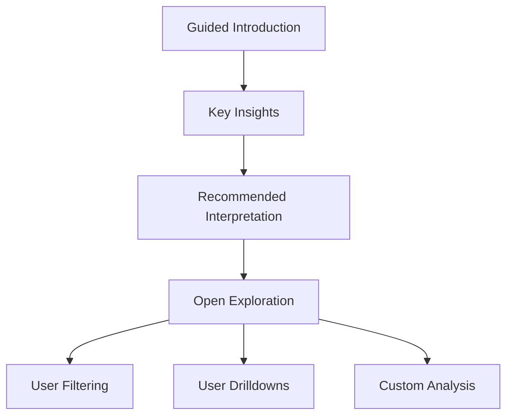

# 1. Martini Glass Structure

The Martini Glass is one of the most important storytelling patterns in modern data visualization.

Structure:

- narrow guided beginning
    
- wide exploratory ending
    

The metaphor:

- the stem = tightly controlled narrative
    
- the glass = open exploration
    

