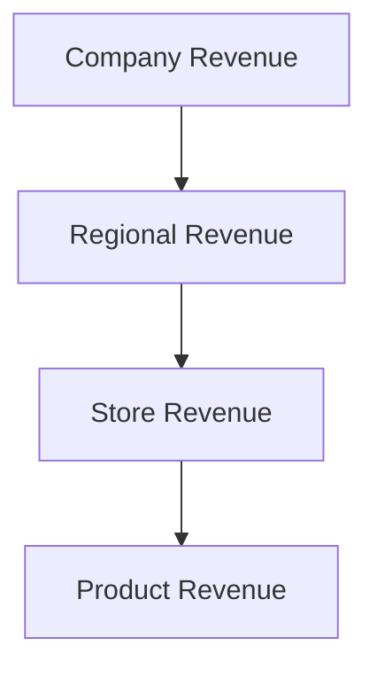

# 2. Drill-Down Interaction

Drill-down allows users to progressively move from:

- summary  
    to
    
- detail
    

Example hierarchy:

This follows an important analytical principle:

> Start broad. Reveal complexity only when needed.

Good drill-down systems:

- reduce clutter
    
- preserve context
    
- support root-cause analysis
    

Bad drill-down systems:

- create navigation dead ends
    
- overwhelm users
    
- break analytical flow
