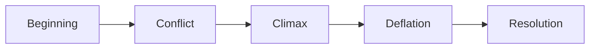

# B. Story Mountain

A simpler narrative structure commonly used in presentations.

Structure:

1. Beginning
    
2. Conflict
    
3. Climax
    
4. Deflation
    
5. Resolution
    

### Business Usage

|Phase|Example|
|---|---|
|Beginning|Company growth was stable|
|Conflict|Customer churn increased|
|Climax|Major revenue impact identified|
|Deflation|Root causes isolated|
|Resolution|Retention strategy implemented|

This structure works especially well for:

- executive presentations
    
- consulting decks
    
- KPI reviews
    
- incident retrospectives
