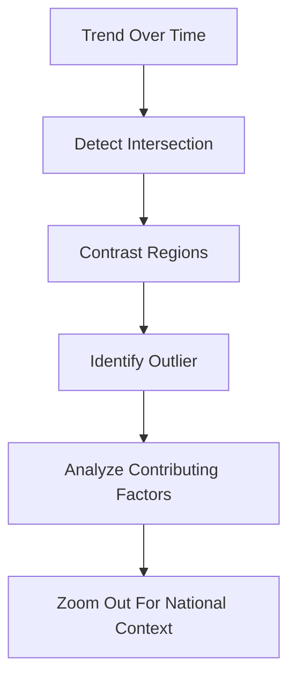

# Relationship Between Story Types

These narrative structures often combine:

|Story Type|Core Question|
|---|---|
|Zooming Out|What broader pattern exists?|
|Contrast|How are groups different?|
|Intersection|When did dominance shift?|
|Factors|What caused the change?|
|Outliers|What deviates from normal?|

Strong analytical storytelling usually layers multiple structures together.

Example:

This multi-layered approach mirrors how real investigations occur.

Analytical maturity is not merely:

- building dashboards
    
- creating charts
    
- calculating KPIs
    

It is understanding:

- which narrative structure fits the problem
    
- which perspective reveals hidden truth
    
- and how to guide people from observation to decision.

Tags: #statistics #machine-learning #data-science #statistical-modelling
