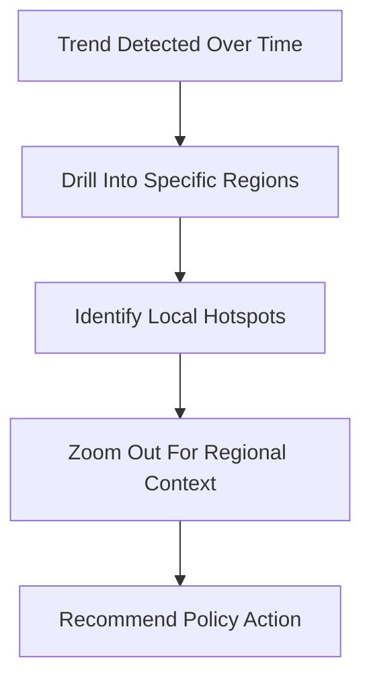

# Relationship Between These Story Types

These three story structures complement each other:

|Story Type|Core Question|
|---|---|
|Change Over Time|What evolved?|
|Drill-Down|Where exactly is the issue?|
|Zooming Out|What larger system explains this?|

Strong analytical storytelling often combines all three.

Example workflow:

This layered storytelling structure is common in:

- epidemiology
    
- fraud detection
    
- financial analysis
    
- supply chain monitoring
    
- business intelligence
    
- public policy analytics
    

The strongest analysts are not the ones who merely create charts.

They are the ones who know:

- when to narrow focus
    
- when to broaden perspective
    
- when to reveal temporal evolution
    
- and how to connect those perspectives into a coherent decision narrative.
