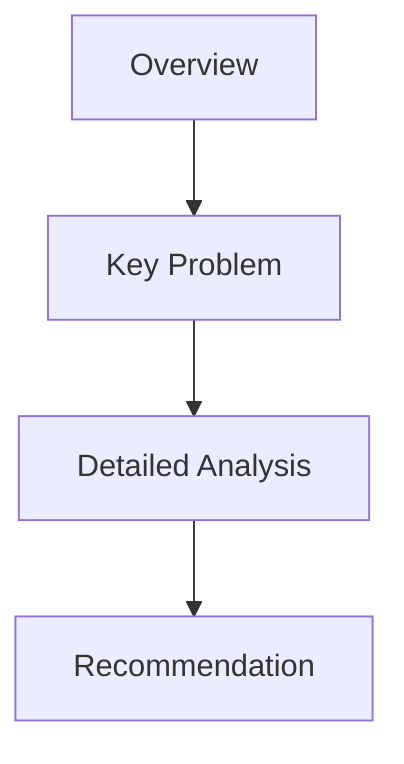
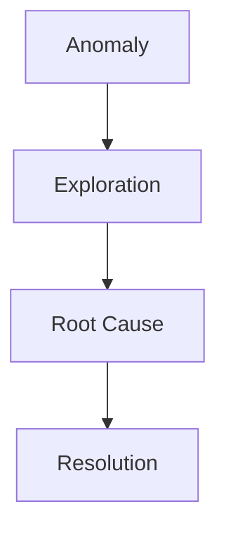

## Types of Narratives in Data Storytelling

Narrative structures in data storytelling differ primarily in one dimension:

> Who controls interpretation?

That control can sit with:

- the author
    
- the reader
    
- or both collaboratively
    

This distinction changes:

- how information is consumed
    
- how much freedom users have
    
- how persuasive the communication becomes
    
- how much analytical discovery is possible
    

## 1. Author-Driven Narratives

Author-driven narratives are:

- linear
    
- structured
    
- tightly controlled
    

The author determines:

- sequence
    
- pacing
    
- emphasis
    
- interpretation path
    

The audience follows the intended storyline.

## Core Characteristics

|Characteristic|Meaning|
|---|---|
|Linear|Fixed progression|
|Static|Limited interaction|
|Controlled|Author guides perception|
|Prescriptive|Intended conclusion is emphasized|

Examples:

- magazine infographics
    
- presentation decks
    
- static reports
    
- explanatory videos
    

These artifacts are designed to:

- stand on their own
    
- communicate a focused message
    
- minimize interpretational ambiguity
    

## Key Insight

Author-driven storytelling is less about exploration and more about:

> narrative persuasion.

The author intentionally shapes:

- attention
    
- emotional emphasis
    
- sequencing
    
- interpretation
    

This is similar to filmmaking.

The audience experiences information in a carefully designed order.

## Why Sequence Matters

Order changes meaning.

Consider two sequences:

### Sequence A

1. Revenue increased
    
2. Customer churn rose
    
3. Profit collapsed
    

### Sequence B

1. Profit collapsed
    
2. Churn rose
    
3. Revenue increased artificially through discounts
    

Both contain similar information.

But emotional interpretation differs dramatically.

Author-driven storytelling exploits this principle intentionally.

## Strengths of Author-Driven Narratives

### 1. Clarity

Reduces interpretational chaos.

### 2. Persuasion

Excellent for:

- executive communication
    
- investor decks
    
- policy messaging
    
- journalism
    

### 3. Cognitive Simplicity

Audiences do not need analytical expertise.

## Weaknesses

### 1. Limited Exploration

Users cannot investigate independently.

### 2. Potential Bias

The author controls:

- framing
    
- omission
    
- emphasis
    

This can unintentionally distort interpretation.

### 3. Reduced Analytical Discovery

Unexpected insights are harder to uncover.

## 2. Reader-Driven Narratives

Reader-driven storytelling reverses the control structure.

Instead of being guided through a predefined narrative, the audience explores independently.

The system enables:

- filtering
    
- drill-down
    
- search
    
- comparison
    
- segmentation
    

The reader constructs meaning dynamically.

## Core Characteristics

|Characteristic|Meaning|
|---|---|
|Exploratory|Multiple investigation paths|
|Interactive|Users manipulate data|
|Flexible|Personalized interpretation|
|Open-ended|No fixed conclusion|

Examples:

- Tableau dashboards
    
- Power BI reports
    
- self-service analytics portals
    
- interactive BI systems
    

## Core Philosophy

Reader-driven systems assume:

> insight emerges through exploration.

The author provides:

- tools
    
- structure
    
- interaction capability
    

The reader provides:

- curiosity
    
- hypothesis generation
    
- interpretation
    

## Example from the Transcript

The transcript references:

- drill-down dashboards
    
- exploratory analysis
    
- user-enabled interaction
    

For example:

- users explore datasets
    
- drill into categories
    
- derive their own findings
    
- build their own narratives
    

This is fundamentally different from:

> “Here is the conclusion.”

Instead, it becomes:

> “Investigate and decide.”

## Strengths of Reader-Driven Systems

### 1. Analytical Flexibility

Different users can answer different questions.

### 2. Deeper Engagement

Users actively participate in interpretation.

### 3. Scalability

One dashboard can support many stakeholder perspectives.

## Weaknesses

### 1. Cognitive Overload

Too much freedom creates confusion.

### 2. Lack of Narrative Focus

Users may miss critical insights entirely.

### 3. Misinterpretation Risk

Without guidance:

- false conclusions increase
    
- statistical misunderstanding becomes common
    

This is why many dashboards fail despite technical sophistication.

## 3. Hybrid / Narrative-Driven Storytelling

Hybrid storytelling combines:

- author guidance
    
- reader exploration
    

This is increasingly dominant in modern analytics systems because purely static and purely exploratory systems both have major limitations.

The transcript refers to this as:

> a framework that “marries both.”

## Core Principle

The author:

- establishes boundaries
    
- highlights key metrics
    
- frames the narrative
    

But the user still gets:

- interactive controls
    
- selective exploration
    
- customized views
    

This creates controlled flexibility.

## Example from the Transcript

The voting-share example demonstrates hybrid storytelling.

The author decides:

- winning percentages are the key story
    
- the visualization structure is fixed
    

But users can:

- change states
    
- interact with the chart
    
- compare regions
    

The narrative is partially constrained but partially exploratory.

## Why Hybrid Systems Work Well

Hybrid storytelling solves a central BI problem:

> Users need guidance before exploration becomes useful.

Without guidance:

- dashboards become overwhelming
    

Without exploration:

- dashboards become rigid
    

Hybrid systems provide:

1. orientation
    
2. narrative framing
    
3. controlled analytical freedom
    

## Typical Hybrid Features

|Feature|Purpose|
|---|---|
|Dropdown filters|Controlled exploration|
|Drill-down|Hierarchical detail|
|Interactive slides|Guided narrative with flexibility|
|Hover insights|Contextual explanation|
|Dynamic segmentation|Personalized analysis|

## The Hidden Design Challenge

Hybrid storytelling is difficult because designers must balance:

- control
    
- freedom
    

Too much control:

- users feel constrained
    

Too much flexibility:

- users get lost
    

The best systems subtly guide users without making the guidance obvious.

## Dimensions of Narrative Storytelling

The transcript introduces additional dimensions beyond narrative type.

These dimensions influence how stories are communicated visually and interactively.

## 1. Genres

Genres describe:

> the format used to communicate the story.

Examples include:

- annotated charts
    
- comic strips
    
- slideshows
    
- videos
    
- flowcharts
    

Each genre changes:

- pacing
    
- emotional tone
    
- cognitive load
    
- audience engagement
    

## Annotated Charts

These combine:

- visualization
    
- explanatory notes
    

They are highly effective because annotations direct attention precisely where needed.

Example:

- highlighting a sudden spike
    
- labeling an outlier
    
- marking a policy change
    

## Flowcharts

Flowcharts communicate:

- processes
    
- sequences
    
- dependencies
    

Example:

Flowcharts are especially useful when explaining:

- business workflows
    
- causal relationships
    
- operational systems
    

## 2. Visual Narrative Tactics

Visual tactics influence how audiences perceive importance.

This includes:

- highlighting
    
- transitions
    
- animations
    
- spatial arrangement
    
- visual hierarchy
    

These elements are not decorative.

They fundamentally shape interpretation.

## Visual Hierarchy

Humans notice:

- large objects first
    
- bright colors first
    
- high contrast first
    
- motion first
    

Therefore storytelling can be controlled visually even without words.

Example:  
A dashboard emphasizing one KPI using:

- size
    
- color
    
- placement
    

implicitly tells viewers:

> “This metric matters most.”

## Transitions and Animation

Transitions create continuity.

Animations:

- direct attention
    
- reveal progression
    
- explain change over time
    

But excessive animation creates:

- distraction
    
- cognitive fatigue
    
- slower comprehension
    

This is why professional dashboards usually use restrained motion.

## Important Strategic Insight

Narrative storytelling is not merely:

- chart selection
    
- dashboard creation
    
- slide design
    

It is fundamentally:

> attention management.

The storyteller decides:

- what users see first
    
- what users remember
    
- what users emotionally prioritize
    
- what users conclude
    

That makes storytelling one of the most powerful layers in analytics.

Poor storytelling can bury excellent analysis.

Strong storytelling can make complex systems understandable and actionable.

## Visual Narrative Tactics in Data Storytelling

Narrative storytelling is not only about:

- what data is shown
    
- or what message is communicated
    

It is also about:

> how attention is controlled.

The transcript emphasizes that storytelling effectiveness changes depending on:

- pauses
    
- highlighting
    
- transitions
    
- animations
    
- text emphasis
    
- sequencing
    

These are called:

> visual narrative tactics.

They influence:

- perception
    
- memory
    
- emotional emphasis
    
- decision-making
    

Even when the underlying data remains identical.

## 1. Highlighting

Highlighting directs attention toward specific information.

Humans naturally prioritize:

- contrast
    
- brightness
    
- size
    
- movement
    
- isolation
    

A highlighted element immediately signals:

> “This matters.”

## Common Highlighting Methods

|Technique|Effect|
|---|---|
|Bold text|Importance|
|Color contrast|Attention capture|
|Increased size|Priority emphasis|
|Annotations|Interpretation guidance|
|Isolation/whitespace|Focus creation|

Example:  
A dashboard with 30 metrics but one KPI in red and enlarged immediately biases interpretation toward that metric.

That is not accidental.

It is narrative control.

## Important Principle

Every dashboard already tells a story:

- intentionally  
    or
    
- accidentally
    

If nothing is emphasized:

- users create their own hierarchy
    

That often leads to:

- confusion
    
- inconsistent interpretation
    
- decision fragmentation
    

## 2. Pauses and Pacing

The transcript references:

- pausing on slides
    
- emphasizing certain moments
    

This reflects an important storytelling principle:

> Timing changes impact.

A presenter who rapidly moves through slides:

- reduces retention
    
- weakens emotional emphasis
    
- prevents reflection
    

Pauses create:

- cognitive processing time
    
- anticipation
    
- emphasis
    

Film directors use pacing constantly.

Strong presenters do the same.

## Example

Consider two presentations:

### Presentation A

- 50 slides
    
- rapid transitions
    
- no emphasis
    

Result:

- information overload
    

### Presentation B

- fewer slides
    
- deliberate pauses
    
- focused emphasis
    

Result:

- stronger narrative retention
    

This is why effective storytelling is partly:

> rhythm design.

## 3. Animations and Transitions

Animations guide sequential attention.

Instead of showing everything simultaneously, information appears progressively.

This controls:

- interpretation order
    
- cognitive load
    
- narrative progression
    

## Why Progressive Revelation Works

Humans process limited information at once.

Progressive disclosure:

- simplifies complexity
    
- prevents visual overload
    
- preserves focus
    

Example:  
Instead of displaying:

- all trends
    
- all labels
    
- all comparisons
    

simultaneously, the presenter gradually introduces them.

This mirrors how humans naturally learn.

## Good Uses of Animation

|Use Case|Benefit|
|---|---|
|Revealing trends gradually|Builds narrative tension|
|Showing causal flow|Improves understanding|
|Highlighting changes|Draws attention effectively|
|Explaining processes|Reduces complexity|

## Bad Uses of Animation

Over-animation creates:

- distraction
    
- fatigue
    
- slower interpretation
    
- reduced professionalism
    

A common beginner mistake:

> using animation for decoration rather than communication.

Good animation clarifies.

Bad animation performs.

## 4. Text Emphasis

The transcript references:

- highlighted formats
    
- plain text variations
    

Text itself carries narrative weight.

Even subtle formatting changes alter interpretation.

## Examples

|Formatting Choice|Psychological Effect|
|---|---|
|ALL CAPS|Urgency/intensity|
|Bold|Importance|
|Italics|Subtle emphasis|
|Color changes|Emotional framing|
|Large typography|Priority|

Example:

### Neutral

“Customer churn increased.”

### Narrative Framing

“Customer churn increased by 42% after onboarding redesign.”

The second statement:

- introduces scale
    
- implies causality
    
- creates urgency
    

Storytelling exists even at sentence level.

## 5. Narrative Frameworks

The transcript identifies three major framework components:

- ordering
    
- interactivity
    
- messaging
    

These collectively define how stories unfold.

## A. Ordering

Ordering determines:

> what the audience sees first.

This is one of the most powerful storytelling decisions.

## Why Ordering Matters

Humans anchor heavily on initial information.

The first chart often becomes:

- the mental model
    
- the framing lens
    
- the interpretive baseline
    

Example:

### Sequence 1

1. Revenue decline
    
2. Market contraction
    
3. Competitor disruption
    

Interpretation:

- external market pressure
    

### Sequence 2

1. Customer complaints
    
2. Delivery failures
    
3. Revenue decline
    

Interpretation:

- operational failure
    

Same data.  
Different order.  
Different story.

## Common Ordering Structures

### Funnel Structure

### Investigative Structure

## B. Interactivity

Interactivity transforms audiences from:

- passive observers  
    into
    
- active participants
    

This is foundational in:

- dashboards
    
- BI systems
    
- exploratory analytics
    

## Common Interactive Elements

|Interaction|Purpose|
|---|---|
|Filters|Narrow focus|
|Drill-down|Reveal detail|
|Hover tooltips|Add context|
|Dropdowns|Change dimensions|
|Zooming|Explore granularity|

The transcript specifically mentions:

- state selection
    
- interactive chart manipulation
    

This creates:

- personalized exploration
    
- engagement
    
- analytical flexibility
    

## Important Tradeoff

Interactivity increases freedom but also increases:

- cognitive demand
    
- design complexity
    
- misinterpretation risk
    

The best systems constrain exploration intelligently.

## C. Messaging

Messaging is the explicit takeaway.

This is where many dashboards fail.

A dashboard may display:

- hundreds of metrics
    
- multiple charts
    
- detailed segmentation
    

Yet communicate no clear message.

## Strong Messaging Answers

1. What matters?
    
2. Why does it matter?
    
3. What changed?
    
4. What action is required?
    

Without messaging:

- dashboards become data repositories
    
- presentations become informational noise
    

## The Key Difference

|Weak Dashboard|Strong Dashboard|
|---|---|
|Shows information|Communicates significance|
|Many metrics|Focused narrative|
|Exploration only|Decision guidance|
|Data-heavy|Insight-heavy|

## Interactive Storytelling in Dashboards

Modern dashboard systems increasingly rely on:

- interactive filtering
    
- dynamic visuals
    
- drill-through analysis
    
- responsive storytelling
    

Because organizations need:

- scalability
    
- personalization
    
- guided interpretation
    

This is why hybrid storytelling dominates modern BI architecture.

## Example Workflow

This structure mirrors real analytical thinking:

1. detect anomaly
    
2. explore patterns
    
3. isolate causes
    
4. recommend action
    

## Final Insight

Narrative storytelling is fundamentally:

> attention engineering.

Charts alone do not persuade.

People remember:

- emphasis
    
- contrast
    
- pacing
    
- sequencing
    
- interaction
    
- emotional framing
    

The strongest storytellers are not merely good designers.

They understand:

- human cognition
    
- perception
    
- decision psychology
    
- analytical structure
    

That is why effective data storytelling sits at the intersection of:

- analytics
    
- design
    
- psychology
    
- communication
    
- systems thinking.

Tags: #statistics #machine-learning #data-science #statistical-modelling
