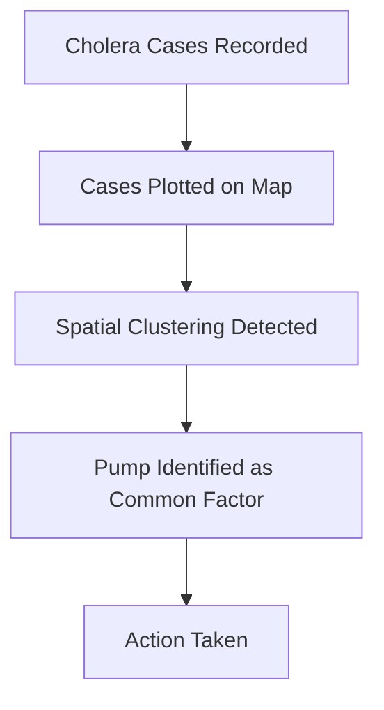
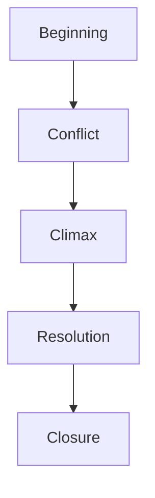
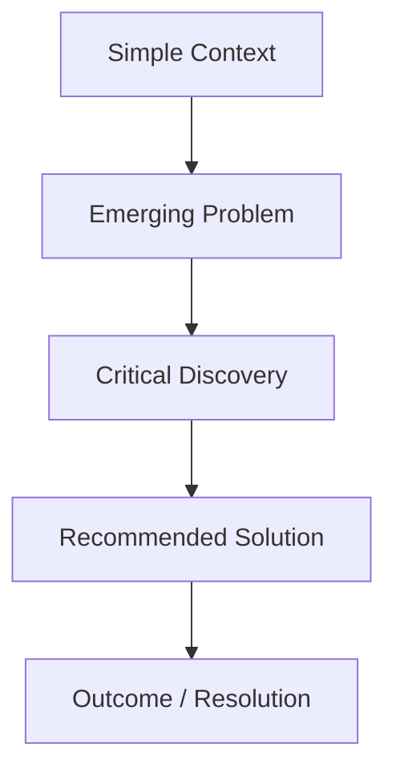
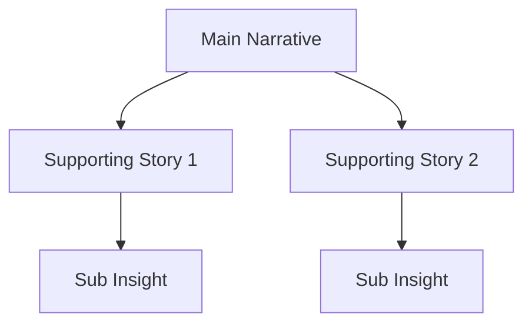

## Various Types of Visual Storytelling Techniques and the Pitfalls of Traditional Presentation Methods

This lecture expands the core idea that:

> Data visualization is not about charts.  
> It is about persuasion, cognition, and decision-making.

Most organizations incorrectly assume:

- data quality alone drives decisions
    
- dashboards automatically create insight
    
- executives behave purely rationally
    

The lecture challenges this directly.

## Business Decisions Are Not Purely Rational

A central argument in the transcript:

> Even in highly objective boardrooms, decisions are emotional.

This is uncomfortable for many analytical teams because they assume:

- evidence alone persuades
    
- logic is sufficient
    
- more data creates better decisions
    

In practice:

- humans interpret data emotionally
    
- executives respond to narrative framing
    
- risk perception dominates decision behavior
    

## Why Emotion Matters in Business

Emotion is not the opposite of logic.

Emotion determines:

- urgency
    
- attention
    
- trust
    
- memorability
    
- willingness to act
    

A dashboard may prove a problem exists.

But storytelling determines whether leaders:

- care enough
    
- prioritize it
    
- allocate resources
    
- change strategy
    

This is why:

> insight without emotional resonance often produces inaction.

## Storytelling Bridges Logic and Emotion

The transcript emphasizes:

- logic creates credibility
    
- storytelling creates persuasion
    

Together they create:

- clarity
    
- alignment
    
- actionability
    

## The Cognitive Reality

Humans do not naturally think in:

- spreadsheets
    
- SQL queries
    
- KPI tables
    

Humans think in:

- cause and effect
    
- conflict
    
- stakes
    
- consequences
    
- stories
    

That is why storytelling works.

It converts abstract information into:

- understandable mental models
    
- emotionally meaningful narratives
    

## Example

### Raw Metric

“Customer retention declined 11%.”

### Story

“Customers are abandoning onboarding because pricing complexity creates distrust during activation.”

The second version:

- implies causality
    
- creates urgency
    
- suggests action
    

That is what decision-makers respond to.

## What Is Data Storytelling?

The lecture defines data storytelling as:

> Assimilating data into efficient visuals that communicate a persuasive narrative within a specific context for a target audience.

This definition contains three essential pillars:

|Element|Purpose|
|---|---|
|Data Visualization|Makes patterns visible|
|Narrative|Explains meaning|
|Context|Makes insights relevant|

All three are required.

## Why Most Dashboards Fail

Most dashboards focus only on:

- metrics
    
- visuals
    
- interactivity
    

But ignore:

- narrative structure
    
- audience psychology
    
- contextual framing
    

This creates:

> informational density without persuasive clarity.

Users see data.  
But they do not know:

- what matters
    
- why it matters
    
- what changed
    
- what action should follow
    

## Narrative as the Core Layer

The transcript repeatedly emphasizes:

> narrative determines whether the story “lands.”

Narrative answers:

- What is happening?
    
- Why is it happening?
    
- Why should the audience care?
    
- What should happen next?
    

Without narrative:

- charts become decorative
    
- dashboards become archives
    
- presentations become disconnected observations
    

## The Hidden Role of Context

The same visualization can communicate completely different meanings depending on context.

Example:

|Metric|Context A|Context B|
|---|---|---|
|Sales up 5%|Strong performance|Weak if market grew 20%|
|Churn stable|Positive|Dangerous if competitors improved|
|Costs increased|Problematic|Acceptable during scaling phase|

Context determines interpretation.

## Elite Examples of Data Storytelling

The lecture references publications like:

- The Wall Street Journal
    
- The Economist
    

These organizations are important because they do not merely display information.

They:

- sequence insights carefully
    
- use visual hierarchy intentionally
    
- annotate strategically
    
- frame interpretation
    
- create emotional progression
    

## Why Their Visuals Feel Powerful

Strong editorial storytelling uses:

- contrast
    
- pacing
    
- annotations
    
- restrained design
    
- guided interpretation
    

Every element serves:

> narrative clarity.

Nothing is accidental.

This is fundamentally different from many corporate dashboards, which often:

- overload information
    
- lack hierarchy
    
- confuse importance with quantity
    

## The First Great Data Story: London Cholera Map

The transcript transitions into one of the most important examples in the history of data storytelling:  
the cholera map of London.

This refers to the work of John Snow during the 1854 cholera outbreak.

## Why This Visualization Was Revolutionary

At the time, many believed disease spread through:

- “bad air”
    
- miasma theories
    

Snow mapped cholera deaths geographically.

The visualization revealed:

- strong clustering around the Broad Street water pump
    

This transformed:

- scattered incidents  
    into
    
- visible causal structure
    

## Why the Story Worked

The map succeeded because it combined:

|Element|Role|
|---|---|
|Data|Cholera death locations|
|Visualization|Spatial clustering|
|Narrative|Contaminated water source hypothesis|
|Context|Public health crisis|

The visualization did not merely display data.

It:

- challenged prevailing assumptions
    
- revealed hidden relationships
    
- supported intervention
    

Eventually:

- the pump handle was removed
    
- outbreak spread declined
    

This is one of the earliest examples of:

> visualization driving action through narrative.

## Visual Storytelling Techniques

The lecture introduces the idea that storytelling effectiveness depends heavily on:

- how visuals are structured
    
- how narrative unfolds
    
- how attention is guided
    

This includes:

- sequencing
    
- pacing
    
- hierarchy
    
- annotations
    
- interaction
    

## Key Techniques in Visual Storytelling

## 1. Visual Hierarchy

Humans naturally notice:

- large objects first
    
- bright colors first
    
- high contrast first
    
- isolated objects first
    

Therefore dashboards should intentionally prioritize:

- the most important insight
    
- the key anomaly
    
- the required action
    

Without hierarchy:

- everything competes equally
    
- users become cognitively overloaded
    

## 2. Narrative Sequencing

Ordering changes interpretation.

Strong storytelling controls:

- reveal timing
    
- progression
    
- escalation
    
- resolution
    

This mirrors:

- cinema
    
- journalism
    
- investigative storytelling
    

## 3. Annotation

Annotations convert visuals into explanations.

Examples:

- arrows
    
- labels
    
- highlighted spikes
    
- explanatory notes
    

Without annotations:  
users may notice patterns but misunderstand significance.

## 4. Progressive Disclosure

Do not show all complexity simultaneously.

Reveal information incrementally.

This reduces:

- overload
    
- confusion
    
- attentional fragmentation
    

Modern dashboards increasingly use:

- drill-down
    
- expandable sections
    
- hover interactions
    
- guided navigation
    

## The Pitfalls of Traditional Presentation Methods

Traditional business presentations often fail because they:

- prioritize information dumping
    
- overload slides
    
- lack narrative continuity
    
- ignore audience cognition
    

## Common Failures

### 1. Slide Density

Too much:

- text
    
- charts
    
- metrics
    
- clutter
    

causes comprehension collapse.

### 2. No Narrative Arc

Many presentations are:

- collections of unrelated observations  
    rather than
    
- coherent stories
    

### 3. Equal Visual Weight

Everything appears equally important.

Result:

- audiences cannot identify priorities
    

### 4. Data Without Interpretation

Showing charts without explaining:

- why they matter
    
- what changed
    
- what action follows
    

creates passive consumption rather than decisions.

## The Core Strategic Insight

The strongest analytical communicators are not necessarily:

- the best statisticians
    
- the best SQL developers
    
- the best dashboard builders
    

They are the people who understand:

- human cognition
    
- perception
    
- emotional framing
    
- attention management
    
- narrative structure
    

Because in business:

> decisions happen in human brains, not inside dashboards.

That is why storytelling is not a cosmetic layer added after analysis.

It is part of the analytical system itself.

## The 1854 Cholera Map: One of the First Great Data Stories

The lecture revisits the famous cholera outbreak in London during 1854 to demonstrate a foundational principle:

> A visualization becomes powerful when it transforms confusion into actionable understanding.

At the time:

- cholera outbreaks were devastating
    
- people did not fully understand transmission mechanisms
    
- many ineffective countermeasures were being attempted
    

The environment was characterized by:

- uncertainty
    
- fear
    
- fragmented explanations
    

This is important because storytelling becomes most valuable when systems are:

- complex
    
- chaotic
    
- poorly understood
    

## The Visualization

Physician John Snow plotted cholera deaths spatially on a city map.

The visualization showed:

- black bars representing affected households
    
- dense clustering around a central water pump
    

The closer to the pump:

- the greater the concentration of cholera cases
    

The farther away:

- the density reduced significantly
    

This created a visible spatial relationship.

## Why the Visualization Was Revolutionary

Before the map:

- cholera cases appeared disconnected
    
- theories were speculative
    
- causality was unclear
    

After the map:

- a geographic concentration pattern became obvious
    

The map effectively communicated:

> “The pump is likely the source.”

This was an enormous conceptual breakthrough.

## The Key Analytical Principle: Clustering

The insight depended on spatial clustering.

Humans are extremely good at visually detecting:

- density
    
- proximity
    
- concentration
    
- spatial anomalies
    

The map converted:

- abstract incidents  
    into
    
- visible structure
    

This is one reason maps are so powerful in analytics.

They expose patterns that tables often conceal.

## Simplified Interpretation Flow

## Why This Was a True Data Story

The lecture emphasizes that the visualization alone was not enough.

The success emerged because three elements aligned:

|Element|Role|
|---|---|
|Visualization|Showed spatial clustering|
|Context|Public health emergency|
|Narrative|Contaminated water source hypothesis|

Without narrative:  
the map is merely geography.

Without context:  
the clustering lacks urgency.

Without visualization:  
the causal pattern remains hidden.

Together:  
they created action.

## Actionability: The Most Important Goal

The transcript repeatedly emphasizes:

> storytelling must convert insight into action.

This is the difference between:

- informational analytics  
    and
    
- operational analytics
    

The cholera story succeeded because:

- the insight was understandable
    
- the implication was clear
    
- a concrete intervention followed
    

The pump handle was removed.

That intervention reduced spread.

This is arguably one of the earliest examples of:

- data-driven public policy
    
- evidence-based intervention
    
- analytical storytelling influencing real-world outcomes
    

## Important Modern Parallel

Most modern dashboards fail at exactly this point.

They provide:

- metrics
    
- charts
    
- filters
    
- interactions
    

But fail to answer:

> “What action should happen?”

The cholera map worked because the narrative naturally implied intervention.

Modern BI systems often stop before reaching that stage.

## Storytelling Frameworks

The lecture then transitions into formal storytelling structures.

These frameworks are important because:

- humans process information sequentially
    
- narrative structure influences persuasion
    
- emotional pacing affects retention
    

The three frameworks discussed are:

1. Monomyth
    
2. Story Mountain
    
3. Nested Loops
    

## 1. Monomyth (Hero’s Journey)

The Monomyth framework originates from mythological storytelling and was heavily popularized by Joseph Campbell.

Core structure:

- problem emerges
    
- hero confronts challenge
    
- solution is discovered
    
- transformation occurs
    

## Business Translation

In business storytelling:  
the “hero” is often:

- a team
    
- a strategy
    
- an analyst
    
- a transformation initiative
    
- sometimes the customer
    

The “villain” is usually:

- inefficiency
    
- declining revenue
    
- customer churn
    
- operational failure
    
- market disruption
    

## How It Applies to Data Storytelling

The lecture frames the structure as:

1. Identify business problem
    
2. Visualize the problem
    
3. Introduce intervention
    
4. Demonstrate solution effectiveness
    

This creates narrative progression.

## Example

### Business Transformation Narrative

Example:

- declining customer retention identified
    
- onboarding friction visualized
    
- redesign implemented
    
- retention improves
    

The audience experiences:

- tension
    
- investigation
    
- resolution
    

That emotional arc improves persuasion dramatically.

## Why Monomyth Works

Humans instinctively understand:

- struggle
    
- transformation
    
- resolution
    

This makes the framework highly persuasive for:

- change management
    
- executive communication
    
- strategic transformation decks
    
- consulting presentations
    

## Hidden Risk

The danger:

- oversimplification
    

Real business systems are rarely:

- linear
    
- hero-centric
    
- single-cause systems
    

Poor storytelling often forces:

- overly neat narratives  
    onto
    
- messy reality
    

## 2. Story Mountain Framework

Story Mountain follows a different emotional structure.

Core sequence:

1. Beginning
    
2. Conflict
    
3. Climax
    
4. Resolution decline
    
5. Closure
    

## Why Story Mountain Is Effective

This structure is extremely common in:

- persuasive reports
    
- presentations
    
- journalism
    
- documentaries
    

Because it creates:

- anticipation
    
- escalation
    
- emotional momentum
    

## Business Example

### Beginning

Company performance stable.

### Conflict

Customer churn rises sharply.

### Climax

Major financial risk identified.

### Resolution

Strategic intervention implemented.

### Closure

Recovery and lessons learned.

This structure keeps audiences cognitively engaged because:

- tension increases progressively
    
- stakes become clearer over time
    

## Visualizations in Story Mountain

The lecture notes that visualizations themselves follow the emotional arc.

Early visuals:

- establish context
    

Middle visuals:

- reveal contradiction or anomaly
    

Climax visuals:

- expose critical insight
    

Final visuals:

- demonstrate resolution
    

This is an important insight:

> charts themselves participate in narrative pacing.

## Why Traditional Presentations Often Fail

Many corporate presentations fail because:

- all charts have equal emotional intensity
    
- no escalation exists
    
- no climax exists
    
- no narrative release exists
    

Everything becomes:

- flat
    
- informational
    
- forgettable
    

Good storytelling intentionally controls:

- emotional progression
    
- analytical tension
    
- information reveal timing
    

## The Strategic Lesson

The lecture is ultimately arguing that:

> data storytelling is structured persuasion.

Not manipulation.  
Not decoration.

But carefully designed communication that:

- aligns cognition
    
- reduces ambiguity
    
- increases clarity
    
- drives action
    

The strongest analysts understand:

- data
    
- narrative structure
    
- audience psychology
    
- visual cognition
    

Because insight alone is not enough.

People must:

- understand it
    
- remember it
    
- believe it
    
- act on it.

## Story Mountain Framework: Narrative Escalation Through Visualization

The transcript continues explaining how the Story Mountain framework operates in presentations and visual storytelling.

Core principle:

> Complexity and tension should evolve progressively.

The structure begins:

- simple
    
- understandable
    
- low cognitive load
    

Then gradually:

- introduces conflict
    
- increases complexity
    
- reveals contradictions
    
- builds toward a climax
    

Finally:

- tension resolves
    
- insights stabilize
    
- conclusions become clear
    

## Narrative Escalation

The lecture describes how visualizations:

- begin with basic presentations
    
- become increasingly complex
    
- culminate in a key insight
    
- then “peter off” into resolution
    

This mirrors dramatic storytelling structures used in:

- cinema
    
- journalism
    
- documentaries
    
- persuasive speeches
    

## Why Escalation Works

Humans are naturally attention-driven creatures.

If everything is equally important:

- nothing feels important
    

Narrative escalation creates:

- anticipation
    
- curiosity
    
- cognitive momentum
    

This keeps audiences engaged.

## Example Structure in Business Analytics

## Beginning Phase

Simple overview metrics:

- revenue trends
    
- KPI summaries
    
- baseline conditions
    

Goal:

- orient the audience
    

## Conflict Phase

Contradictions emerge:

- churn increases
    
- margins decline
    
- customer complaints rise
    

Goal:

- create analytical tension
    

## Climax Phase

Critical insight appears:

- root cause identified
    
- strategic risk exposed
    
- hidden relationship discovered
    

Goal:

- maximize interpretive impact
    

## Resolution Phase

Final visuals show:

- intervention
    
- projected improvement
    
- recommended action
    

Goal:

- create closure and actionability
    

## Simplified Narrative Flow

## Why This Works Better Than Traditional Dashboards

Traditional dashboards often fail because:

- all information appears simultaneously
    
- no pacing exists
    
- no hierarchy exists
    
- no emotional progression exists
    

The audience experiences:

- information saturation  
    instead of
    
- narrative understanding
    

Story Mountain avoids this by controlling:

- reveal timing
    
- information density
    
- analytical intensity
    

## Nested Loops Framework

The final framework discussed in the lecture is:

> Nested Loops.

This is structurally more sophisticated than:

- Monomyth
    
- Story Mountain
    

because it contains:

> stories within stories.

## Core Idea

A larger narrative contains smaller supporting narratives.

Each smaller story:

- reinforces the main message
    
- adds depth
    
- increases engagement
    
- strengthens persuasion
    

## Structure

## Why Nested Loops Are Powerful

Nested storytelling creates:

- layered engagement
    
- sustained curiosity
    
- emotional reinforcement
    
- multidimensional understanding
    

The lecture describes this as:

> “story within story.”

This structure keeps audiences psychologically engaged because:

- each layer introduces new insight
    
- curiosity compounds progressively
    

## Example in Business Context

Imagine a digital transformation presentation.

## Main Story

The company modernized operations.

Inside this larger story:

- customer onboarding improvements
    
- supply chain automation
    
- employee productivity gains
    
- cloud migration efficiency
    

Each becomes a smaller narrative supporting the larger transformation story.

## Iterative Analysis and Audience Interaction

The lecture links nested loops with:

- iterative analysis
    
- audience interaction
    

This is important.

Nested storytelling often becomes interactive because:

- audiences ask questions
    
- sub-stories emerge dynamically
    
- additional evidence is introduced progressively
    

This is common in:

- consulting workshops
    
- executive reviews
    
- investigative journalism
    
- strategic planning sessions
    

## Why Audience Engagement Matters

The lecture ends with a critical insight:

> The storytelling framework should depend on the audience.

This is one of the most important principles in all business communication.

## Audience-Centered Storytelling

Different audiences require different:

- complexity levels
    
- pacing
    
- emotional framing
    
- interactivity
    
- technical depth
    

## Example

|Audience|Preferred Style|
|---|---|
|Executives|High-level narrative clarity|
|Analysts|Exploratory drill-down|
|Technical Teams|Detailed causal structure|
|Customers|Simplicity and emotion|
|Investors|Strategic progression and confidence|

A presentation optimized for engineers may fail completely with executives.

A narrative optimized for executives may frustrate analysts.

## Choosing the Right Framework

## Monomyth Works Best When:

- transformation is central
    
- a clear problem-solution arc exists
    
- persuasion is important
    

Examples:

- turnaround stories
    
- product launches
    
- organizational transformation
    

## Story Mountain Works Best When:

- tension escalation matters
    
- persuasive communication is needed
    
- sequential reveal improves impact
    

Examples:

- board presentations
    
- investigative reports
    
- strategic reviews
    

## Nested Loops Work Best When:

- systems are complex
    
- multiple dimensions exist
    
- layered understanding is required
    

Examples:

- enterprise transformation
    
- policy analysis
    
- ecosystem storytelling
    

## The Deeper Principle Behind All Frameworks

All storytelling frameworks ultimately manage:

- attention
    
- cognition
    
- emotional progression
    
- interpretive sequencing
    

The strongest storytellers understand:

> humans do not absorb information linearly.

People:

- anchor on emotion
    
- remember conflict
    
- seek causality
    
- respond to structure
    
- retain stories more than statistics
    

## Final Strategic Insight

The lecture progressively builds toward a larger conclusion:

> Visualization alone is insufficient.

A dashboard is not a story.

A chart is not a narrative.

A KPI is not persuasion.

The real power emerges when:

- visuals
    
- narrative structure
    
- audience psychology
    
- contextual framing
    
- sequencing
    
- interaction
    

all work together as a unified communication system.

That is what transforms:

- information into understanding
    
- understanding into conviction
    
- conviction into action.

Tags: #statistics #machine-learning #data-science #statistical-modelling