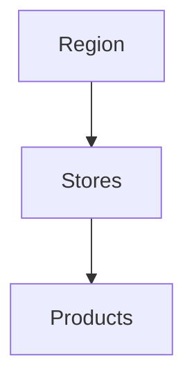

# Business Example

The lecture translates this into business hierarchy:

```mermaid
flowchart TD
    A[Region] --> B[Stores]
    B --> C[Products]
```

Performance can differ dramatically depending on:

- aggregation level
    
- grouping sequence
    
- drill-down path
